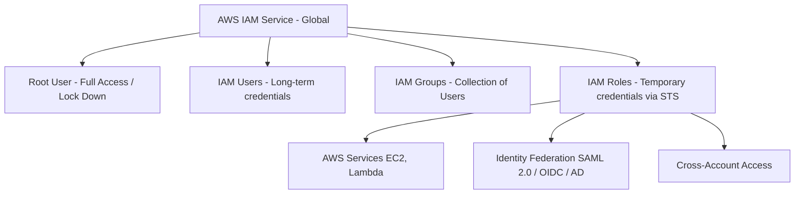
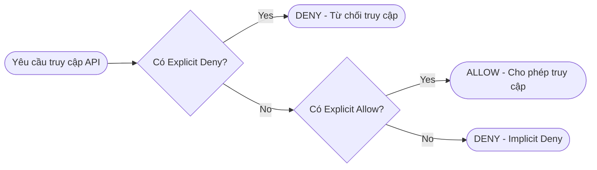

# Design Secure Access to AWS Resources (Domain 1 - SAA-C03)

## 1. Tổng quan & Trọng tâm Thiết kế Bảo mật (Security First)
- Bảo mật là yếu tố xem xét quan trọng và sớm nhất khi thiết kế kiến trúc đám mây.
- Bao gồm xác định **ai/cái gì** có quyền truy cập, **khi nào & bằng cách nào** được cấp quyền, cùng với quyền vận hành dịch vụ và gọi AWS APIs.
- Nắm vững kiến trúc truy cập an toàn cho các mô hình: **Public, Private, Hybrid và Multi-Cloud**.

---

## 2. AWS Account & Root User Security
- **AWS Account:** Đơn vị biên bảo mật cơ bản nhất.
- **Root User:**
  - Khởi tạo mặc định khi tạo Account, sở hữu toàn quyền (*Full Administrator Permissions*) và **không thể bị giới hạn/thay đổi quyền** bằng IAM policy thông thường trong chính tài khoản đó.
  - **Rủi ro:** Nếu Root User bị xâm nhập, toàn bộ môi trường AWS sẽ bị kiểm soát hoàn toàn.
  - **Best Practices:**
    1. Bật **Multi-Factor Authentication (MFA)** ngay lập tức (ưu tiên Hardware Token hoặc Virtual Authenticator).
    2. Khóa/không tạo Root Access Keys.
    3. Không dùng Root User cho các tác vụ hàng ngày; tạo IAM User/Role với quyền hạn chế theo nguyên tắc **Least Privilege** để sử dụng.

---

## 3. IAM Architecture & Cơ chế Danh tính (Identities)

> **Cấp độ dịch vụ:** AWS IAM là một **Global Service** (Dữ liệu IAM được đồng bộ toàn cầu trên mọi AWS Regions).

### 3.1. Các loại IAM Identities
| Thành phần | Đặc điểm & Quyền hạn | Best Practice / Use Cases |
| :--- | :--- | :--- |
| **IAM User** | - Danh tính đại diện cho một người hoặc ứng dụng cụ thể. - Mặc định **không có quyền nào** (Implicit Deny). | Dành cho người dùng nội bộ cần truy cập Console/CLI khi chưa triển khai SSO/Federation. |
| **IAM Group** | - Tập hợp các IAM Users. - Gán policy cho group để kế thừa quyền cho tất cả thành viên. | **Lưu ý:** Group **không phải** là một identity có thể assume hoặc nhận credentials. |
| **IAM Role** | - Danh tính không gắn với mật khẩu hay access key cố định. - Cung cấp **Temporary Security Credentials** thông qua dịch vụ **AWS STS (Security Token Service)**. | - Gán cho AWS Services (EC2 Instance Profile, Lambda Execution Role). - Cross-Account Access. - Identity Federation. |

### 3.2. Quản lý Credentials & Nguyên tắc Blast Radius
- **Không bao giờ hard-code credentials** vào mã nguồn ứng dụng.
- Sử dụng IAM Roles + Instance Profiles cho ứng dụng chạy trên EC2/ECS/EKS/Lambda.
- Áp dụng **Principle of Least Privilege** để giới hạn tối đa phạm vi ảnh hưởng (*Blast Radius*) nếu có sự cố lộ danh tính.

---

## 4. Identity Federation & Quản lý Truy cập Doanh nghiệp
- Tích hợp tài khoản AWS với hệ thống thư mục bên ngoài (Corporate Directory như Microsoft Active Directory, Okta, Azure AD / Entra ID).
- **Cơ chế:** Sử dụng chuẩn **SAML 2.0** hoặc **OIDC (OpenID Connect)** kết hợp với IAM Role để cấp phát phiên làm việc tạm thời (`AssumeRoleWithSAML` / `AssumeRoleWithWebIdentity`).
- Người dùng đăng nhập bằng tài khoản doanh nghiệp (SSO) mà không cần tạo riêng từng IAM User trong AWS.

---

## 5. IAM Policies & Logic Đánh giá Quyền (Decision Logic)

### 5.1. Phân loại Policies
1. **Identity-Based Policies:** Gắn trực tiếp vào User, Group, hoặc Role để định nghĩa *Danh tính này được phép làm gì trên tài nguyên nào*.
2. **Resource-Based Policies:** Gắn trực tiếp vào tài nguyên (S3 Bucket Policy, SQS Queue Policy, KMS Key Policy, Secrets Manager, VPC Endpoint Policy) để định nghĩa *Ai/Principal nào được phép thao tác trên tài nguyên này*.
   - **Khác biệt cấu trúc:** Resource Policy **bắt buộc có trường `Principal`** để chỉ định danh tính được cấp quyền.

### 5.2. Cấu trúc chuẩn của một IAM Policy Statement (JSON)
- **Effect:** `Allow` hoặc `Deny`.
- **Principal:** (Bắt buộc trong Resource Policies) Chỉ định đối tượng nhận quyền.
- **Action:** Danh sách API calls được phép/cấm (ví dụ: `s3:GetObject`, `ec2:DescribeInstances`).
- **Resource:** ARN của tài nguyên áp dụng.
- **Condition (Optional):** Điều kiện bổ sung (IP nguồn `aws:SourceIp`, bắt buộc MFA `aws:MultiFactorAuthPresent`, SSL/TLS `aws:SecureTransport`).

---

## 6. Khả năng Giám sát & Quản trị Multi-Account (Traceability & Governance)
- **Traceability (Khả năng truy vết):**
  - **AWS CloudTrail:** Ghi vết mọi API calls trong tài khoản (Ai gọi, khi nào, từ IP nào, hành động gì) phục vụ audit và điều tra sự cố.
  - **Amazon CloudWatch:** Thu thập metrics, logs và kích hoạt cảnh báo (Alarms / EventBridge) để tự động phản ứng khi có vi phạm bảo mật.
- **Quản trị Multi-Account:**
  - **AWS Organizations:** Quản lý tập trung nhiều tài khoản AWS theo cây thư mục OU (Organizational Units).
  - **Service Control Policies (SCPs):** Thiết lập ranh giới quyền hạn tối đa (*Permission Boundaries*) cho toàn bộ các tài khoản bên dưới (kể cả Root User của account con cũng bị giới hạn bởi SCP).
  - **AWS Control Tower:** Dịch vụ tự động thiết lập và quản trị môi trường multi-account an toàn, tuân thủ chuẩn (*Landing Zone*) với các Guardrails có sẵn.
