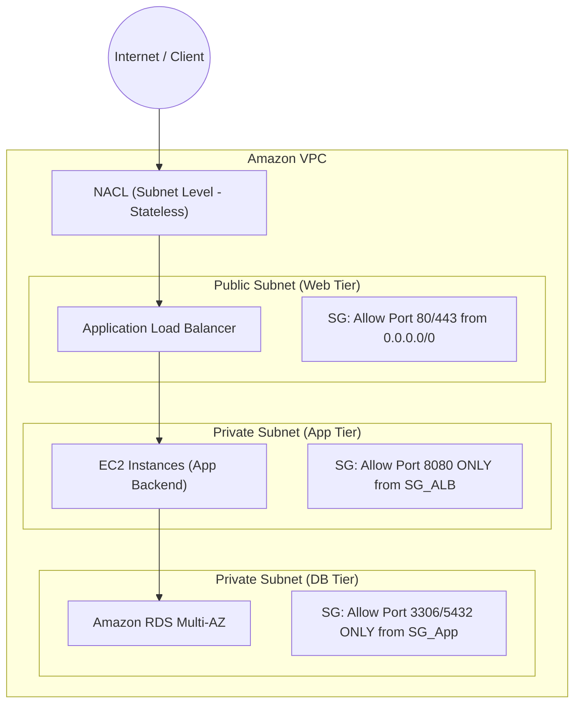
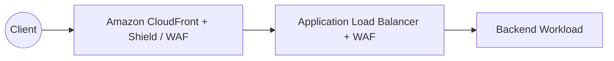

# Design Secure Workloads and Applications (Domain 1 - SAA-C03)

## 1. VPC Architecture & Network Fundamentals
- **Amazon VPC Resiliency:** **Regional Service** (gắn liền với 1 AWS Region và 1 AWS Account).
- **Subnet Resiliency:** **AZ-Resilient** (mỗi Subnet nằm trọn vẹn trong 1 Availability Zone duy nhất).
- **Phân loại Subnets:**
  - **Public Subnet:** Có route trực tiếp ra Internet qua **Internet Gateway (IGW)** (`0.0.0.0/0 -> igw-xxxx`).
  - **Private Subnet:** Không có route trực tiếp ra IGW. Muốn ra Internet (chỉ outbound để tải bản vá/updates) cần đi qua **NAT Gateway** đặt tại Public Subnet.

---

## 2. Multi-Tier Network Security: Security Groups vs NACLs

### Bảng So sánh Security Groups & NACLs
| Đặc điểm | Security Groups (SG) | Network ACLs (NACL) |
| :--- | :--- | :--- |
| **Cấp độ áp dụng** | Instance level (EC2, ENI, RDS, ALB) | Subnet level (toàn bộ tài nguyên trong subnet) |
| **Loại trạng thái (State)** | **Stateful** (Nếu Inbound cho phép, Outbound response tự động được mở) | **Stateless** (Cần mở tường minh cả chiều Inbound và Outbound rules) |
| **Quy tắc (Rules)** | Chỉ có **Allow rules** (Mặc định Deny all nếu không match) | Hỗ trợ cả **Allow và Deny rules** |
| **Thứ tự đánh giá** | Đánh giá toàn bộ rules trước khi quyết định | Đánh giá tuần tự theo **số thứ tự Rule Number** (từ nhỏ đến lớn, gặp match đầu tiên là dừng) |
| **Tham chiếu (Chaining)** | Cho phép tham chiếu ID của Security Group khác (`sg-xxxx`) | Chỉ hỗ trợ dải IP CIDR block |

---

## 3. Secure Private Connectivity (VPC Endpoints & Hybrid Network)

### 3.1. AWS VPC Endpoints (AWS PrivateLink)
- Cho phép kết nối an toàn từ VPC tới các AWS Services hoặc Third-party SaaS mà **không cần đi qua Internet Gateway, NAT Gateway, VPN hay Direct Connect**.
- **Gateway Endpoints:** Hỗ trợ miễn phí cho **Amazon S3** và **Amazon DynamoDB** (cấu hình qua Route Table).
- **Interface Endpoints (PrivateLink):** Sử dụng Elastic Network Interface (ENI) với private IP trong subnet, hỗ trợ hầu hết các dịch vụ AWS còn lại (SQS, SNS, Secrets Manager, KMS,...) và custom services.
- **PrivateLink Multi-VPC:** Cho phép expose application giữa hàng trăm VPC/AWS Accounts khác nhau mà không cần cấu hình full VPC Peering (tránh rủi ro lộ toàn bộ dải mạng và giới hạn scale).

### 3.2. Hybrid Network Connectivity
- **AWS Site-to-Site VPN:** Kết nối qua Internet công cộng bằng đường hầm mã hóa IPsec (băng thông giới hạn ~1.25 Gbps mỗi tunnel, triển khai nhanh, chi phí thấp).
- **AWS Direct Connect (DX):** Kết nối vật lý chuyên dụng (Dedicated private fiber) từ On-premises đến AWS, băng thông cao (1 Gbps - 100 Gbps), độ trễ thấp và nhất quán, không đi qua Internet công cộng.
- **AWS Transit Gateway (TGW):** Hub trung tâm kết nối hàng nghìn VPCs, Direct Connect và VPN theo mô hình Hub-and-Spoke.

---

## 4. Dịch vụ Bảo mật Ứng dụng & Lọc Lưu lượng (Firewalls & DDoS)

| Dịch vụ | Mục đích chính | Vị trí triển khai / Điểm thi cần nhớ |
| :--- | :--- | :--- |
| **AWS WAF** | Tường lửa tầng ứng dụng (Layer 7). Chống SQL Injection, XSS, Rate Limiting, Geo-blocking, Bot Control. | Gắn trên: **ALB, Amazon API Gateway, CloudFront, AWS AppSync, Cognito User Pools**. |
| **AWS Shield Standard** | Bảo vệ chống DDoS phổ biến ở Layer 3/4. | **Tự động kích hoạt mặc định (Miễn phí)** cho tất cả khách hàng AWS. |
| **AWS Shield Advanced** | Bảo vệ DDoS chuyên sâu Layer 3/4/7, hỗ trợ 24/7 từ đội ngũ AWS SRT, bồi hoàn chi phí khi bị DDoS tấn công. | Dịch vụ trả phí theo gói hàng tháng. |
| **Amazon GuardDuty** | Phát hiện mối đe dọa (Threat Detection) dựa trên Machine Learning và phân tích hành vi bất thường. | Giám sát ngầm: **VPC Flow Logs, DNS Logs, CloudTrail Logs, S3 Data Events, EKS Audit Logs**. Không làm gián đoạn hay ảnh hưởng hiệu năng hệ thống. |
| **Amazon Macie** | Phát hiện, phân loại và bảo vệ dữ liệu nhạy cảm / PII (Personally Identifiable Information: số thẻ tín dụng, CMND/CCCD, hộ chiếu,...) | **Chuyên quét và bảo vệ dữ liệu lưu trữ trên Amazon S3** bằng Pattern Matching và ML. |

---

## 5. Quản lý Bí mật & Xác thực Người dùng (Secrets & Auth)

### 5.1. AWS Secrets Manager vs SSM Parameter Store
| Tiêu chí | AWS Secrets Manager | AWS Systems Manager Parameter Store |
| :--- | :--- | :--- |
| **Chức năng cốt lõi** | Quản lý Secrets, mật khẩu Database, API Keys với tính năng **Automatic Rotation**. | Lưu trữ cấu hình dạng Key-Value (chuỗi thường hoặc SecureString mã hóa KMS). |
| **Khả năng tự động xoay vòng (Rotation)** | **Tích hợp sẵn (Built-in)** với RDS, Aurora, DocumentDB, Redshift thông qua Lambda function tự động đổi pass định kỳ. | **Không có built-in rotation** (phải tự viết logic và trigger thủ công). |
| **Chi phí** | Có phí theo Secret/tháng + số lượng API request. | Cấp Standard hoàn toàn **miễn phí**; cấp Advanced tính phí rất rẻ. |

### 5.2. Amazon Cognito (User Authentication & Federation)
- **Cognito User Pools (CUP):** Đóng vai trò **Identity Provider (IdP)** để Đăng ký, Đăng nhập, Quản lý tài khoản người dùng ứng dụng web/mobile (hỗ trợ MFA, Social Login Google/FB/Apple, SAML/OIDC Federation). Kết quả trả về: **JWT Tokens**.
- **Cognito Identity Pools (Federated Identities):** Cấp phát **Temporary AWS IAM Credentials** để người dùng (sau khi xác thực qua CUP hoặc IdP bên ngoài) có thể truy cập trực tiếp tài nguyên AWS (như tải file lên S3, đọc ghi DynamoDB).
