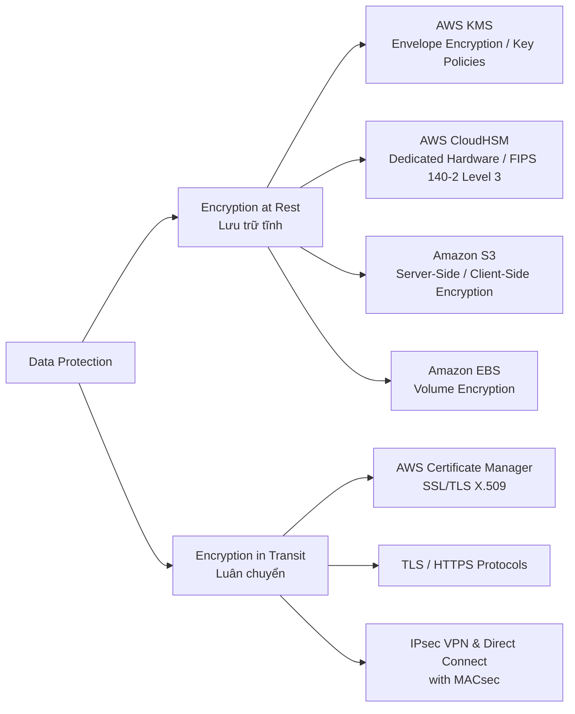
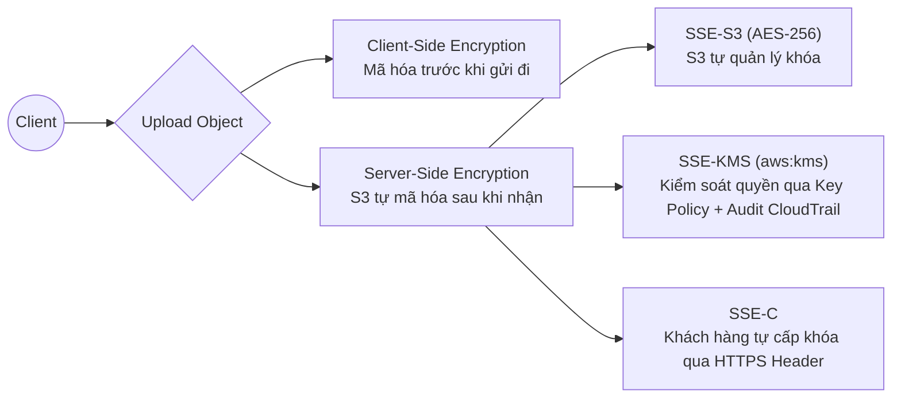
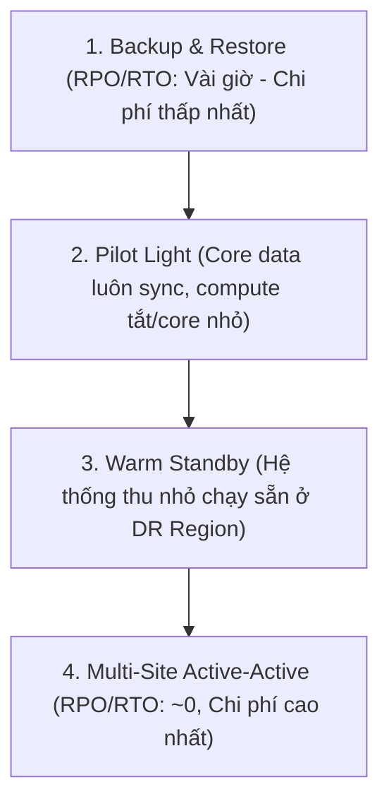

# Determine Appropriate Data Security Controls (Domain 1 - SAA-C03)

## 1. Nguyên lý Mã hóa Dữ liệu (Data Encryption Fundamentals)

### 1.1. Các Khái niệm Cốt lõi
- **Plaintext:** Dữ liệu gốc chưa mã hóa (văn bản, tệp tài liệu, hình ảnh, mã nguồn,...).
- **Ciphertext:** Dữ liệu đã được mã hóa an toàn qua thuật toán và khóa bảo mật.
- **Symmetric Encryption (Đối xứng):** Dùng cùng một bí mật khóa để mã hóa và giải mã (ví dụ: AES-256). AWS KMS và S3 mặc định dùng cơ chế này.
- **Asymmetric Encryption (Bất đối xứng):** Dùng cặp khóa Public Key (để mã hóa / xác thực chữ ký) và Private Key (để giải mã / ký số) như RSA, ECC.

---

## 2. Quản lý Khóa Mã hóa: AWS KMS vs AWS CloudHSM

| Đặc điểm | AWS Key Management Service (KMS) | AWS CloudHSM |
| :--- | :--- | :--- |
| **Mô hình triển khai** | Multi-tenant Managed Service. Tích hợp sẵn với hầu hết các dịch vụ AWS. | Single-tenant Dedicated Hardware Security Module (HSM) trong VPC của khách hàng. |
| **Tiêu chuẩn Tuân thủ** | FIPS 140-2 Level 2 (tổng thể) / Level 3 (cho phần cứng). | **FIPS 140-2 Level 3** (Toàn diện, tuân thủ quy định tài chính/chính phủ nghiêm ngặt). |
| **Quyền kiểm soát Khóa** | AWS quản lý phần cứng, khách hàng quản lý IAM/Key Policies. Khóa không thể export ra ngoài. | Khách hàng sở hữu toàn quyền quản trị HSM, độc lập hoàn toàn với nhân sự AWS. |
| **Rotation (Xoay vòng khóa)** | **Automatic key rotation:** 1 năm (KMS-managed keys) hoặc có thể kích hoạt định kỳ. | Khách hàng tự quản trị và thực hiện xoay vòng khóa bằng scripts/công cụ HSM. |
| **Chi phí** | Rất thấp (tính theo số lượng key và API request). | Cao (trả phí theo giờ cho mỗi HSM instance được kích hoạt). |

---

## 3. Các Cơ chế Mã hóa trên Amazon S3

### 3.1. Phân loại Server-Side Encryption (SSE)
1. **SSE-S3 (`AES256`):** Khóa được quản lý hoàn toàn tự động bởi Amazon S3. Miễn phí và được bật mặc định cho mọi S3 bucket mới.
2. **SSE-KMS (`aws:kms`):** Sử dụng khóa trong AWS KMS. Mang lại 2 lợi ích lớn:
   - Phân quyền chi tiết qua **Key Policy** (tách biệt quyền truy cập S3 bucket và quyền giải mã khóa).
   - Ghi nhận lịch sử giải mã/truy cập khóa vào **AWS CloudTrail** để audit.
3. **SSE-C:** Khách hàng tự quản lý và gửi khóa giải mã trong Header của mỗi HTTPS request. S3 không lưu trữ khóa.
4. **Client-Side Encryption:** Dữ liệu được mã hóa ngay tại ứng dụng client trước khi gửi lên S3.

---

## 4. Bảo vệ Dữ liệu trên EBS, RDS và Storage Services

### 4.1. Amazon EBS Encryption
- Mã hóa toàn bộ dữ liệu tĩnh bên trong volume, snapshot tạo từ volume đó, và lưu lượng I/O giữa instance và EBS volume.
- Quá trình mã hóa/giải mã diễn ra trên phần cứng máy chủ EC2 nên **không ảnh hưởng đáng kể đến hiệu năng (Performance Impact ~ 0%)**.
- **Kịch bản thi:** Nếu có dữ liệu nhạy cảm trên EC2 cần bảo vệ tĩnh với nỗ lực triển khai ít nhất (*least operational effort*), chọn **bật EBS Volume Encryption** thay vì viết logic đẩy dữ liệu sang S3.

### 4.2. Bảo vệ Dữ liệu Di chuyển (In-Transit)
- **AWS Certificate Manager (ACM):** Quản lý và tự động gia hạn chứng chỉ SSL/TLS miễn phí cho **CloudFront, ALB, API Gateway**.
- **Enforce HTTPS:** Cấu hình S3 Bucket Policy từ chối mọi request không qua SSL bằng điều kiện:  
  `"aws:SecureTransport": "false"`.

---

## 5. Phân loại, Tuân thủ & Khắc phục Thảm họa (Compliance & Disaster Recovery)

### 5.1. Công cụ Tuân thủ & Báo cáo
- **AWS Artifact:** Cổng tự phục vụ (Self-service portal) để tải về các báo cáo tuân thủ của AWS (SOC 1/2/3, PCI-DSS, ISO 27001, HIPAA) và ký kết thỏa thuận pháp lý (BAA).
- **Amazon Macie:** Sử dụng ML để tự động phát hiện, đánh dấu và bảo vệ dữ liệu nhạy cảm / PII trên S3.

### 5.2. Chiến lược Khắc phục Thảm họa (Disaster Recovery - DR Strategies)

| Chiến lược DR | Thời gian phục hồi (RTO) / Mất mát dữ liệu (RPO) | Chi phí & Độ phức tạp |
| :--- | :--- | :--- |
| **Backup & Restore** | Hàng giờ đến hàng ngày. | Thấp nhất. Dùng AWS Backup, EBS/RDS Snapshots, S3 Cross-Region Replication (CRR). |
| **Pilot Light** | Hàng chục phút đến vài giờ. | Thấp - Trung bình. Dữ liệu DB được replicate liên tục (RDS Read Replica cross-region); các server compute (EC2/ASG) chỉ dựng lên khi có sự cố. |
| **Warm Standby** | Vài phút. | Trung bình - Cao. Bản sao thu nhỏ (*scaled-down version*) của toàn bộ stack chạy liên tục 24/7 ở Region phụ, sẵn sàng scale up khi kích hoạt failover. |
| **Multi-Site Active-Active** | Thời gian thực (Near Zero). | Cao nhất. Cả 2 Region cùng phục vụ traffic song song (Route 53 latency routing, DynamoDB Global Tables, Aurora Global Database). |

### 5.3. AWS Backup (Quản lý Sao lưu Tập trung)
- Dịch vụ tập trung hóa việc lập lịch, giám sát và bảo vệ dữ liệu tự động cho: **EBS Volumes, EC2 Instances, RDS & Aurora, DynamoDB Tables, EFS File Systems, Storage Gateway Volumes, Amazon FSx**.
- Hỗ trợ tính năng **Cross-Region Backup** và **Cross-Account Backup** độc lập để bảo vệ trước các cuộc tấn công ransomware.

