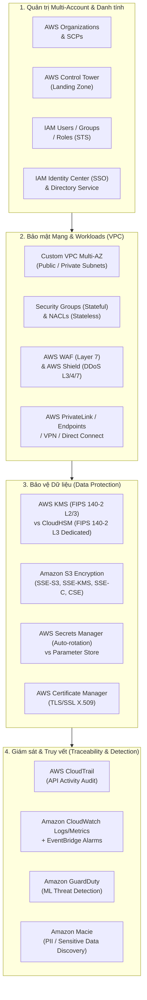

# Domain 1 Wrap-Up: Design Secure Architectures (Cheat Sheet & Exam Checklist)

## 1. Bản đồ Tổng hợp Kiến trúc Bảo mật (Domain 1 Architecture Map)

---

## 2. So sánh & Quyết định Lựa chọn Dịch vụ (Decision Matrix)

| Kịch bản Đề bài (Stem Scenario) | Dịch vụ Khuyên dùng (Best Choice) | Dịch vụ Gây nhiễu (Distractor) & Lý do loại trừ |
| :--- | :--- | :--- |
| **Thiết lập trần quyền hạn tối đa cho nhiều tài khoản** | **AWS Organizations + SCPs** | IAM Policies (chỉ áp dụng nội bộ 1 account, không chặn được root account con). |
| **Đăng nhập SSO dùng Corporate Directory (AD/Okta)** | **IAM Identity Center / IAM Role SAML 2.0** | Tạo hàng loạt IAM Users thủ công (khó quản trị, vi phạm scale). |
| **Ứng dụng EC2/Lambda gọi AWS APIs** | **IAM Role (Instance Profile / Execution Role)** | Hard-code Access Keys vào code/file cấu hình (nguy cơ lộ bí mật). |
| **Bảo mật Multi-tier (Web $\rightarrow$ App $\rightarrow$ DB)** | **Security Group Chaining (`sg-xxxx`)** | Mở IP CIDR tĩnh (thiếu linh hoạt khi Auto Scaling thay đổi IP). |
| **Chia sẻ dịch vụ giữa hàng trăm VPC không lộ dải mạng** | **AWS PrivateLink (VPC Endpoint Services)** | Full VPC Peering (phức tạp quản lý $N(N-1)/2$, dễ trùng lặp CIDR). |
| **Chống tấn công SQL Injection / XSS ở tầng ứng dụng** | **AWS WAF** (gắn ALB / CloudFront / API GW) | Security Groups / NACLs (chỉ lọc Layer 3/4 dựa trên IP/Port). |
| **Lưu trữ mật khẩu DB cần tự động đổi mật khẩu định kỳ** | **AWS Secrets Manager** (Built-in Rotation) | SSM Parameter Store (không có built-in rotation cho RDS). |
| **Quản lý khóa mã hóa theo chuẩn FIPS 140-2 Level 3 đơn quyền** | **AWS CloudHSM** (Dedicated hardware HSM) | AWS KMS (Multi-tenant managed service, FIPS level 2 tổng thể). |
| **Tự động quét và phát hiện số thẻ tín dụng/CCCD trên S3** | **Amazon Macie** (Sử dụng ML phát hiện PII) | Amazon GuardDuty (chỉ phân tích logs tìm mã độc/xâm nhập). |
| **Phát hiện truy cập bất thường từ IP lạ đào coin/xâm nhập** | **Amazon GuardDuty** (VPC Flow Logs, CloudTrail, DNS) | CloudWatch đơn thuần (không có ML phân tích hành vi tấn công). |

---

## 3. Checklist Tự Đánh giá Kiến thức (Self-Assessment Checklist)

- [x] **IAM Decision Logic:** Hiểu rõ thứ tự đánh giá: `Explicit Deny` luôn thắng `Explicit Allow`; nếu không có Allow thì mặc định là `Implicit Deny`.
- [x] **Policy Differences:** Phân biệt rõ **Identity-based Policies** (*ai làm được gì*) vs **Resource-based Policies** (*tài nguyên cho phép ai - bắt buộc có `Principal`*).
- [x] **Root User Hardening:** Kích hoạt MFA ngay lập tức, không tạo/xóa Root Access Keys, không dùng cho công việc hàng ngày.
- [x] **VPC Security Stack:** Nắm vững tính chất **Stateful của Security Groups** và **Stateless của NACLs** (phải mở cả inbound/outbound ephemeral ports 1024-65535).
- [x] **S3 Data Security:** Nắm vững cấu hình mã hóa tĩnh (SSE-S3, SSE-KMS, SSE-C) và mã hóa truyền dẫn (Bucket Policy enforce HTTPS `"aws:SecureTransport": "false"`).
- [x] **Audit & Traceability:** Phân biệt **CloudTrail** (ghi lịch sử gọi API) vs **CloudWatch** (theo dõi số liệu hiệu năng/logs) vs **VPC Flow Logs** (ghi thông tin IP/Port mạng).

