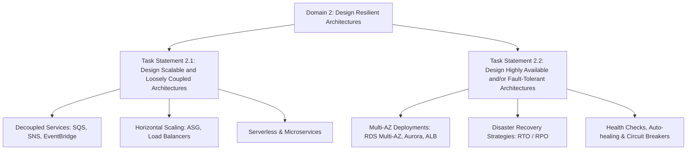

# Domain 2: Design Resilient Architectures - Overview & Introduction (SAA-C03)

## 1. Định nghĩa Khả năng Phục hồi (Resilience) theo AWS Well-Architected Framework
Một workload có tính phục hồi (**Resilient Workload**) được định nghĩa là hệ thống có khả năng tự phục hồi và duy trì hoạt động khi chịu áp lực từ:
- **Tải tăng đột biến (Load/Traffic spikes):** Yêu cầu tính co giãn (Scalability & Elasticity).
- **Các cuộc tấn công hoặc sự cố phần mềm (Attacks/Bugs):** Do vô tình (accidental bug) hoặc cố ý (deliberate attack).
- **Hỏng hóc hạ tầng/phần cứng (Component failures):** Bất kỳ thành phần nào trong hệ thống gặp sự cố (Server crash, Network outage, AZ failure).

---

## 2. Các Trụ Cột Kỹ Thuật Trọng Tâm trong Domain 2
Trong Domain 2, trọng tâm thiết kế xoay quanh các khái niệm cốt lõi:
- **High Availability (HA):** Tính sẵn sàng cao, đảm bảo hệ thống luôn phục vụ liên tục thông qua kiến trúc Multi-AZ / Multi-Region.
- **Fault Tolerance (FT):** Khả năng chịu lỗi, tiếp tục hoạt động không gián đoạn ngay cả khi một số thành phần phần cứng/phần mềm bị hỏng hoàn toàn.
- **Disaster Recovery (DR):** Chiến lược khắc phục thảm họa (RTO, RPO, Backup/Restore, Pilot Light, Warm Standby, Multi-Region Active-Active).
- **Elasticity & Scalability:** 
  - *Scalability:* Khả năng mở rộng theo chiều ngang (Scale-out) hoặc chiều dọc (Scale-up) để đáp ứng tải tăng.
  - *Elasticity:* Khả năng tự động tăng/giảm tài nguyên phù hợp với nhu cầu thực tế theo thời gian thực (Auto Scaling).

---

## 3. Cấu trúc Task Statements của Domain 2
Domain 2 chiếm tỷ trọng lớn trong kỳ thi SAA-C03, được chia thành **2 Task Statements** chính:

| Task Statement | Trọng tâm Kiến trúc & Dịch vụ AWS |
| :--- | :--- |
| **Task Statement 2.1** Design scalable and loosely coupled architectures | - Tách rời các thành phần (*Loose Coupling*) qua message queues/events: **SQS, SNS, EventBridge**. - Tự động co giãn theo tải: **Auto Scaling Groups (ASG), Elastic Load Balancing (ALB/NLB)**. - Bộ nhớ đệm phân tán và CDN: **ElastiCache, CloudFront**. - Kiến trúc phi máy chủ (Serverless): **AWS Lambda, Step Functions, API Gateway**. |
| **Task Statement 2.2** Design highly available and/or fault-tolerant architectures | - Triển khai dự phòng đa vùng (**Multi-AZ Deployment**) cho Database & Compute. - Chiến lược sao lưu và phục hồi thảm họa (**DR Strategies**): Backup & Restore, Pilot Light, Warm Standby, Active-Active. - Giám sát và tự phục hồi (**Auto-healing**): Route 53 Health Checks & Failover Routing, CloudWatch Alarms. - Quản lý lưu trữ bền vững: **S3 Cross-Region Replication, EFS Multi-AZ, EBS Snapshots**. |

---

## 4. Nguyên Tắc Thiết Kế Cần Nhớ (Exam Mindset)
1. **Kiểm tra kỹ lưỡng yêu cầu kiến trúc (Thorough Examination):** Luôn phân tích rõ ràng các chỉ số RTO/RPO, SLA và tính chất của workload trước khi chọn giải pháp.
2. **Không có chủ đề nào hoạt động độc lập (No Topic Stands Alone):** Tính sẵn sàng cao (HA), khả năng chịu lỗi (FT), khả năng mở rộng (Scalability) và chi phí luôn có mối quan hệ đánh đổi (*trade-offs*) cần cân bằng trong thiết kế.
