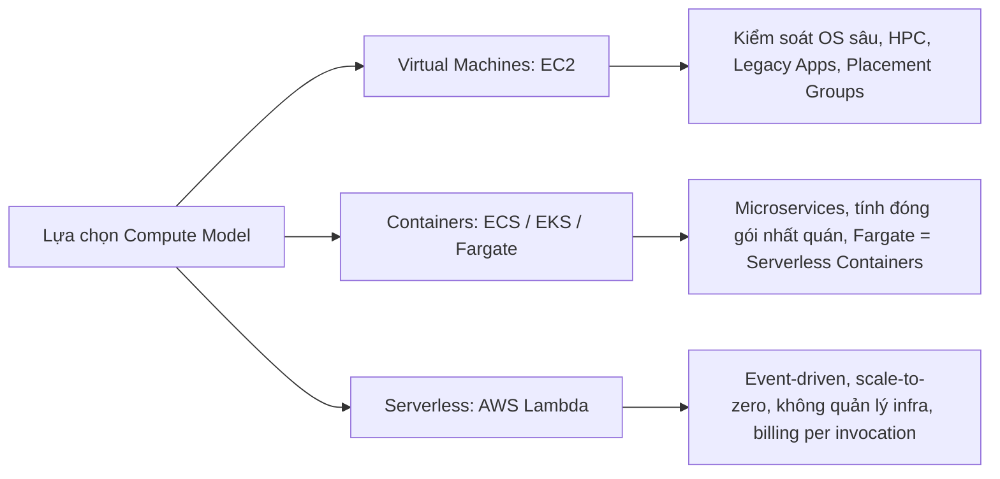
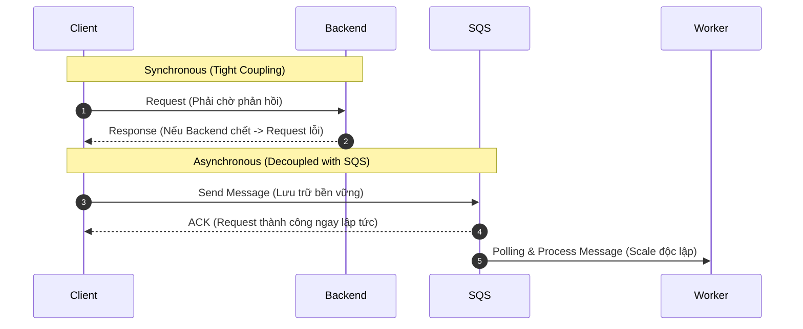

# Task Statement 2.1: Design Scalable and Loosely Coupled Architectures (SAA-C03)

## 1. Nguyên Lý Mở Rộng & Co Giãn (Scaling & Elasticity)

### 1.1. Vertical Scaling vs. Horizontal Scaling
| Tiêu chí | Vertical Scaling (Scale Up / Down) | Horizontal Scaling (Scale Out / In) |
| :--- | :--- | :--- |
| **Bản chất** | Thay đổi kích thước/cấu hình của instance hiện tại (VD: tăng RAM, CPU từ `t3.medium` lên `c5.4xlarge`). | Thêm hoặc bớt số lượng instance/nodes phục vụ tải (VD: từ 2 instances lên 10 instances). |
| **Gián đoạn** | Thường yêu cầu downtime / restart để đổi instance type. | Không downtime, hệ thống tự động phân phối tải. |
| **Giới hạn** | Bị chặn bởi giới hạn phần cứng tối đa của một server. | Về mặt lý thuyết là không giới hạn (*near-infinite scale*). |
| **Chi phí & Dự phòng** | Dễ gây lãng phí tài nguyên khi tải thấp; Single Point of Failure (SPOF). | Tối ưu hóa chi phí với Auto Scaling; tăng tính sẵn sàng (HA). |

### 1.2. Tính Co Giãn (Elasticity)
- Sử dụng **Automation** kết hợp với **Horizontal Scaling** để tự động điều chỉnh dung lượng (*capacity*) khớp với nhu cầu thực tế (*demand*) theo thời gian thực.
- Cân bằng các trụ cột Well-Architected: **Performance Efficiency, Operational Excellence, và Cost Optimization**.
- Dịch vụ cốt lõi: **Amazon EC2 Auto Scaling** (Target Tracking, Step Scaling, Simple Scaling, Scheduled Scaling) kết hợp **Elastic Load Balancing (ALB/NLB)**.

---

## 2. Compute Workload Selection: EC2, Containers & Serverless

- **HPC (High Performance Computing):** Sử dụng EC2 Compute-optimized (`C` family), **Cluster Placement Groups** (đặt trong 1 AZ với độ trễ mạng cực thấp), và **Enhanced Networking (ENA / EFA)**.
- **Serverless Compute (AWS Lambda):**
  - Tự động co giãn theo số lượng request/event.
  - Quản lý **Concurrency Limits** (Reserved Concurrency, Provisioned Concurrency) để xử lý spike traffic mà không bị cold start hay nghẽn downstream.

---

## 3. Database Scaling & Caching Architecture

### 3.1. So Sánh Scaling & Resiliency Trong CSDL
| Dịch vụ | Cơ chế mở rộng (Scaling) | Tính sẵn sàng & Dự phòng (HA & Resiliency) |
| :--- | :--- | :--- |
| **Amazon RDS** | **Read Replicas:** Mở rộng năng lực đọc (*Read scale* - Asynchronous). *(Lưu ý: Query Read Replica vẫn tốn overhead kết nối, authentication, SQL parsing).* | **Multi-AZ Deployment:** Dự phòng nóng (Synchronous standby), tự động failover. **Không** tăng hiệu năng đọc. |
| **Amazon Aurora** | Auto-scaling Read Replicas (lên tới 15 replicas chia sẻ chung storage distributed layer). | Multi-AZ Storage (sao lưu 6 bản trên 3 AZs), failover dưới 30s. |
| **Amazon DynamoDB** | NoSQL scale phân tán với Auto Scaling throughput (RCU/WCU) hoặc chế độ **On-Demand Capacity**. | Multi-AZ mặc định, Global Tables (Multi-Region Active-Active). |
| **Amazon Redshift** | Mở rộng phân tích Data Warehouse bằng **Concurrency Scaling** và RA3 nodes tách biệt Compute & Storage. | Multi-AZ deployments, Redshift Serverless. |

### 3.2. RDS Proxy & Caching Strategy
- **Amazon RDS Proxy:**
  - Connection pooling giúp ứng dụng serverless (Lambda) không làm kiệt quệ DB connections.
  - Giảm thời gian failover của Multi-AZ database lên tới **66%**, duy trì kết nối ứng dụng khi có sự cố.
- **Caching Layer (Giảm tải triệt để cho DB & Server):**
  - **Amazon CloudFront:** Edge caching cho static & dynamic content.
  - **Amazon ElastiCache (Redis / Memcached):** In-memory cache cho session và kết quả truy vấn SQL.
  - **DynamoDB Accelerator (DAX):** In-memory cache chuyên dụng cho DynamoDB, giảm latency từ milliseconds xuống microsecond.

---

## 4. Edge Networking & Managed Ingestion Services

- **Edge Services:**
  - **CloudFront:** Caching nội dung tại Edge Locations.
  - **AWS Global Accelerator:** Tăng tốc lưu lượng TCP/UDP bằng mạng trục riêng của AWS (*Anycast IP*), giảm network hops, tăng độ ổn định và khả năng failover giữa các Region.
  - **Amazon Route 53:** DNS quản lý độ trễ (*Latency Routing*), *Geolocation Routing*, và *Failover Routing*.
- **AWS Transfer Family:**
  - Dịch vụ Fully-managed hỗ trợ SFTP, FTPS, FTP chuyển file trực tiếp vào Amazon S3 hoặc Amazon EFS.
  - Tích hợp sẵn High Availability trên tối đa **3 AZs**, tự động co giãn không cần bảo trì hạ tầng hay patch server.

---

## 5. Tách Rời Kiến Trúc (Decoupling & Loose Coupling)

### 5.1. Định nghĩa Decoupling
> **Decoupling (Khớp nối lỏng):** Các thành phần trong hệ thống hoạt động độc lập, tự chủ (*autonomous*) và không phụ thuộc trực tiếp vào trạng thái hoạt động tức thời của các thành phần khác. Một thành phần lỗi không làm sụp đổ toàn bộ hệ thống (*Blast Radius isolation*).

### 5.2. Synchronous vs. Asynchronous Integration

- **Synchronous Integration:** Yêu cầu các thành phần phải luôn online cùng lúc (VD: API Gateway gọi trực tiếp synchronous downstream).
- **Asynchronous Integration:** Sử dụng hàng đợi/hệ thống lưu trữ bền vững để tách rời việc tiếp nhận yêu cầu (*ingestion*) và xử lý yêu cầu (*processing*).

### 5.3. Các Dịch Vụ Cốt Lõi Cho Asynchronous Decoupling
1. **Amazon SQS (Simple Queue Service):**
   - Hàng đợi tin nhắn phân tán, cho phép producer và consumer scale độc lập theo tốc độ riêng.
   - Xử lý bài toán chênh lệch tốc độ: Frontend nhận request cực nhanh gửi vào SQS, Backend workers scale theo độ dài hàng đợi (`ApproximateNumberOfMessagesVisible`).
2. **Amazon SNS (Simple Notification Service):**
   - Mô hình Publish/Subscribe (Pub/Sub) gửi tin nhắn theo dạng 1-to-many (*Fan-out pattern* tới nhiều SQS queues, Lambda, Email).
3. **Amazon EventBridge:**
   - Serverless Event Bus định tuyến sự kiện từ các AWS services, SaaS apps, và custom apps dựa trên rules và filtering.

---

## 6. Exam Checklist: Designing Scalable & Loosely Coupled Systems
- [ ] Phân biệt rõ khi nào dùng **RDS Read Replicas** (Scale read) vs **RDS Multi-AZ** (Chỉ làm HA/Failover).
- [ ] Nhận diện giải pháp dùng **SQS + ASG** để xử lý nghẽn buffer/burst load giữa frontend và backend.
- [ ] Áp dụng **RDS Proxy** khi có hàng trăm/nghìn Lambda functions truy vấn đồng thời vào RDS/Aurora.
- [ ] Sử dụng **AWS Transfer Family** khi đề bài yêu cầu truyền nhận file SFTP/FTPS không muốn quản trị server.
- [ ] Phối hợp **CloudFront / Global Accelerator / ElastiCache** để giảm tải tầng tính toán và database dưới extreme scale.
