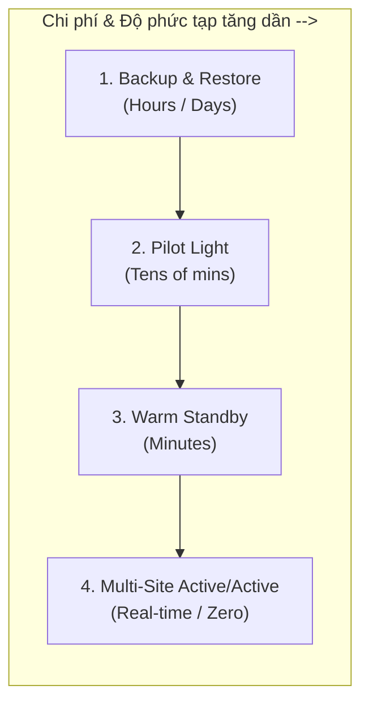
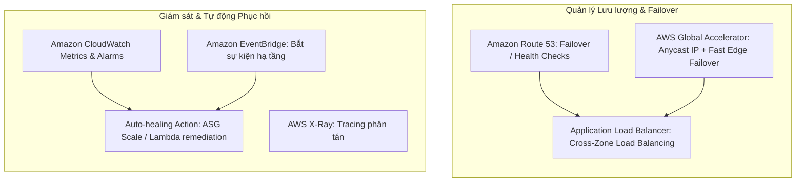

# Task Statement 2.2: Design Highly Available and/or Fault-Tolerant Architectures (SAA-C03)

## 1. Phân Biệt: High Availability, Fault Tolerance & Disaster Recovery

| Khái niệm | Định nghĩa kỹ thuật | Trạng thái Downtime | Chi phí & Độ phức tạp | Ví dụ điển hình |
| :--- | :--- | :--- | :--- | :--- |
| **High Availability (HA)** | Tối đa hóa thời gian uptime của hệ thống. Tự động phát hiện lỗi và phục hồi/thay thế tài nguyên lỗi nhanh nhất có thể. | **Có downtime rất ngắn** (vài giây đến vài phút trong lúc failover). | Trung bình | - Active/Standby instance. - RDS Multi-AZ failover (60-120s). - ASG thay thế instance lỗi. |
| **Fault Tolerance (FT)** | Hệ thống **tiếp tục hoạt động bình thường không gián đoạn** ngay cả khi một hoặc nhiều thành phần bên dưới gặp sự cố hỏng hóc hoàn toàn. | **Zero Downtime** (Người dùng không cảm nhận được lỗi). | Cao (yêu cầu dự phòng nóng đa cụm/đa vùng 100%). | - Multi-AZ Active-Active Web Fleet sau ALB. - Aurora Multi-Master / DynamoDB Global Tables. - S3 tự động sao chép 3 AZs. |
| **Disaster Recovery (DR)** | Quy trình, kế hoạch và công cụ chuẩn bị trước để khôi phục toàn bộ hạ tầng/dữ liệu khi xảy ra thảm họa diện rộng (mất cả Data Center/Region). | Tùy thuộc vào chỉ số **RTO** đã cam kết. | Biến thiên theo chiến lược (Backup < Pilot Light < Warm Standby < Multi-Site). | - AWS Elastic Disaster Recovery. - S3 Cross-Region Replication. - CloudFormation DR spin-up. |

---

## 2. Disaster Recovery: RTO, RPO & 4 Chiến Lược Cốt Lõi

### 2.1. Hai chỉ số vàng trong DR
- **RPO (Recovery Point Objective):** Khoảng thời gian mất mát dữ liệu tối đa chấp nhận được (Đo bằng thời gian giữa điểm backup gần nhất và thời điểm xảy ra sự cố). $\rightarrow$ *Tần suất sao lưu dữ liệu*.
- **RTO (Recovery Time Objective):** Khoảng thời gian gián đoạn dịch vụ tối đa chấp nhận được để khôi phục hệ thống hoạt động trở lại. $\rightarrow$ *Thời gian cần để dựng lại hệ thống*.

### 2.2. So sánh chi tiết 4 mô hình DR
| Chiến lược DR | Cơ chế hoạt động | RPO | RTO | Mức độ chi phí |
| :--- | :--- | :--- | :--- | :--- |
| **Backup & Restore** | Sao lưu data định kỳ sang S3/Glacier ở Region khác. Khi có sự cố, dựng lại toàn bộ hạ tầng bằng IaC (CloudFormation/Terraform). | Cao (Hours) | Cao (Hours / 24h+) | Rẻ nhất (\$) |
| **Pilot Light** | Dữ liệu cốt lõi được đồng bộ liên tục (Core DB chạy phiên bản nhỏ/Replication). Khi có sự cố, scale out compute và network lên full size. | Thấp (Mins) | Trung bình (10-30 mins) | Thấp (\$\$) |
| **Warm Standby** | Một phiên bản thu nhỏ (*scaled-down*) nhưng hoạt động đầy đủ của toàn bộ hệ thống luôn chạy ở Region phụ. Khi sự cố xảy ra, chỉ cần scale-up tài nguyên và chuyển DNS. | Rất thấp (Seconds/Mins) | Thấp (Vài phút) | Trung bình-Cao (\$\$\$) |
| **Multi-Site Active/Active** | Hệ thống chạy song song 100% dung lượng trên $\ge 2$ Regions. Route 53 / Global Accelerator chia tải đều. | Gần 0 (Zero) | Gần 0 (Near-zero) | Đắt nhất (\$\$\$\$) |

---

## 3. Khả Năng Resiliency Trong Các Dịch Vụ Cốt Lõi

### 3.1. Compute & Storage Resiliency
- **Amazon EC2 & ASG:** Trải đều EC2 instances qua nhiều AZs đằng sau ALB. Sử dụng **EC2 Image Builder & AMIs** để chuẩn hóa bản build phục vụ DR.
- **AWS Elastic Disaster Recovery (DRS):** Dịch vụ DR chuyên dụng sao chép block-level liên tục từ On-premises hoặc AWS sang target Region với chi phí tối ưu (chỉ chạy replication server nhỏ cho tới khi cần cutover).
- **Amazon S3:** Độ bền $99.999999999\%$ (11 số 9), sao lưu tối thiểu 3 AZs. Hỗ trợ **Cross-Region Replication (CRR)** và **S3 Versioning**.
- **Amazon EFS:** Multi-AZ file system theo chuẩn POSIX. Hỗ trợ EFS Replication sang Region khác.
- **Amazon FSx:** FSx for Windows File Server / FSx for Lustre / FSx for NetApp ONTAP (hỗ trợ Multi-AZ deployments và automated backups).

### 3.2. Database Resiliency & Failover Times
- **Amazon RDS Multi-AZ:** Sao chép đồng bộ (Synchronous replication) sang Standby instance ở AZ khác. Tự động failover khi Primary lỗi (thời gian failover $\approx 60-120\text{s}$).
- **Amazon RDS Proxy:** Giữ kết nối (Connection Pooling), giảm thời gian failover xuống **dưới 30s** (giảm tới 66%).
- **Amazon Aurora Global Database:** Sao chép Storage-level sang tối đa 5 Secondary Regions với độ trễ $< 1\text{s}$. Khôi phục thảm họa toàn vùng (RTO $< 1\text{ phút}$, RPO $\approx 0$).
- **Amazon DynamoDB Global Tables:** Multi-Region Active-Active NoSQL database, sao chép 2 chiều (Fully managed multi-master).

---

## 4. Mạng Lưới & Tự Động Hóa Giám Sát (Networking & Auto-healing)

- **Amazon Route 53:** 
  - **Health Checks:** Liên tục kiểm tra endpoint; tự động chuyển hướng traffic sang Secondary khi Primary unhealthy (**Failover Routing Policy**).
- **AWS Global Accelerator:**
  - Cung cấp 2 Static Anycast IPs. Khi 1 Region gặp sự cố, Global Accelerator chuyển hướng lưu lượng sang Region khỏe mạnh trong **dưới 10 giây**.
- **VPC Networking Resiliency:** Thiết kế Multi-AZ Subnets, redundant NAT Gateways (mỗi AZ 1 NAT Gateway), kết nối Hybrid qua **AWS Transit Gateway** hoặc dự phòng **Direct Connect + VPN Backup**.
- **Observability:**
  - **CloudWatch Alarms:** Kích hoạt tự phục hồi (Reboot/Recover EC2, trigger ASG, bắn tin sang SNS/Lambda).
  - **AWS X-Ray:** Phân tích điểm nghẽn độ trễ và lỗi distributed trace trong microservices.

---

## 5. Dịch Vụ Hỗ Trợ Đặc Biệt Thường Gặp Trong Đề Thi
- **Amazon Comprehend & Amazon Polly:**
  - *Comprehend:* Sử dụng Natural Language Processing (NLP) để tự động phân loại ticket/yêu cầu hỗ trợ IT đến đúng nhóm kỹ thuật nhanh nhất khi xảy ra sự cố diện rộng.
  - *Polly:* Chuyển đổi văn bản thành giọng nói (Text-to-Speech) tích hợp tổng đài **Amazon Connect** để tự động hóa thông báo khẩn cấp hoặc hỗ trợ tự phục vụ (*Self-service*).

---

## 6. Exam Checklist: Designing HA / Fault-Tolerant Architectures
- [ ] Phân biệt rõ **RTO** (thời gian phục hồi) vs **RPO** (mức độ mất mát dữ liệu) để chọn đúng 1 trong 4 chiến lược DR.
- [ ] Luôn chọn **Multi-AZ ALB + Multi-AZ ASG** để loại bỏ Single Point of Failure (SPOF) ở tầng compute.
- [ ] Nhớ đặt **NAT Gateway riêng cho từng AZ** (nếu 1 AZ sập thì các AZ khác không bị mất kết nối Internet outbound).
- [ ] Chọn **Aurora Global Database** khi cần RTO/RPO cực thấp cho CSDL quan hệ đa vùng.
- [ ] Dùng **AWS Elastic Disaster Recovery (DRS)** cho kịch bản DR từ On-premises lên AWS hoặc giữa các AWS Regions.
- [ ] Tích hợp **RDS Proxy** để giảm tối đa thời gian đứt quãng kết nối CSDL trong lúc failover.
