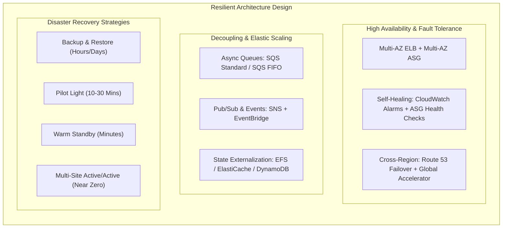

# Domain 2 Wrap Up: Tổng Hợp & Checklist Ôn Thi Resilient Architectures (SAA-C03)

## 1. Tổng Kết Các Khái Niệm Kiến Trúc Cốt Lõi (Core Concepts)

---

## 2. So Sánh & Phân Biệt Các Khái Niệm Thường Gặp Trong Đề Thi

### 2.1. Amazon EC2 Auto Scaling vs. AWS Auto Scaling
| Tiêu chí | Amazon EC2 Auto Scaling | AWS Auto Scaling |
| :--- | :--- | :--- |
| **Phạm vi quản lý** | Chỉ tập trung quản lý mở rộng/thu hẹp số lượng **Amazon EC2 instances** trong Auto Scaling Group (ASG). | Quản lý mở rộng tập trung đa dịch vụ: **EC2 ASG, ECS Tasks, DynamoDB tables/indexes, Aurora Read Replicas**. |
| **Tính năng chính** | Dynamic scaling (Target Tracking, Step, Simple), Scheduled scaling, Predictive scaling, Instance Refresh. | Cung cấp giao diện hợp nhất để thiết lập scaling plans tối ưu theo performance hoặc cost trên toàn bộ stack. |

### 2.2. Stateful vs. Stateless Workloads & Cách Chuyển Đổi Để Scale Ngang (Horizontal Scaling)
- **Vấn đề của Stateful Application:** Nếu lưu session/dữ liệu trực tiếp trên local disk hoặc RAM của 1 server duy nhất, ta không thể tắt/bật server tự do theo tải.
- **Giải pháp chuyển đổi sang Stateless để Scale Out:**
  1. **Lưu trữ Session in-memory:** Đẩy session ra ngoài tập trung vào **Amazon ElastiCache (Redis)** hoặc **Amazon DynamoDB**.
  2. **Lưu trữ File/Data trên đĩa:** Dùng **Amazon EFS** (Elastic File System - hỗ trợ gắn đồng thời hàng trăm EC2/ECS/Fargate qua giao thức NFS) hoặc **Amazon FSx**.
  3. **ALB Sticky Sessions (Session Affinity):** Nếu bắt buộc phải giữ session trên server hiện tại mà chưa chuyển đổi code kịp, bật tính năng Sticky Sessions trên ALB (dùng cookie để cố định request của 1 user về 1 instance cụ thể).

---

## 3. Khả Năng Tự Phục Hồi (Self-Healing) Ở Từng Cấp Độ

| Cấp độ sự cố | Dịch vụ & Cơ chế Tự Phục Hồi (Self-Healing) |
| :--- | :--- |
| **Single EC2 Instance Crash** | - **ASG Health Checks:** Tự động terminate instance lỗi và khởi tạo instance mới. - **CloudWatch EC2 Status Check Alarm:** Tự động kích hoạt hành động Recover/Reboot instance. |
| **Single Availability Zone (AZ) Outage** | - **Multi-AZ ELB (ALB/NLB):** Tự động ngừng định tuyến traffic vào AZ bị lỗi. - **Multi-AZ ASG:** Tự động rebalance và khởi tạo instance thay thế sang các AZs khỏe mạnh còn lại. - **RDS Multi-AZ:** Tự động failover sang Standby DB ở AZ khác. |
| **Region-wide Disaster** | - **Amazon Route 53:** Failover Routing Policy dựa trên Health Checks chuyển DNS sang secondary region. - **AWS Global Accelerator:** Tự động chuyển hướng lưu lượng Anycast IP sang Region phụ trong < 10s. - **Aurora Global Database:** Promote secondary region thành primary với RTO < 1 min. |

---

## 4. Monitoring & Observability: Lựa Chọn Dịch Vụ
- **Amazon CloudWatch:**
  - Thu thập Metrics, Logs, và thiết lập **CloudWatch Alarms** kích hoạt các hành động tự động (ASG Scaling, SNS Alert, EC2 Recovery).
- **AWS X-Ray:**
  - Chuyên dụng cho **Distributed Tracing**, phân tích bản đồ dịch vụ (*Service Map*), phát hiện điểm nghẽn độ trễ (*latency bottlenecks*) và lỗi trong kiến trúc Microservices / Serverless.

---

## 5. Domain 2 Cheat Sheet & Checklist Vàng Cho Kỳ Thi SAA-C03

- [ ] **Khớp nối lỏng (Decoupling):** Luôn dùng **Amazon SQS** để đệm tải giữa tầng web frontend và backend workers; dùng **SQS FIFO** khi cần *Strict Ordering* và *Exactly-Once/Deduplication*.
- [ ] **Mở rộng CSDL (Database Scaling):** Dùng **Read Replicas** để scale đọc; dùng **Multi-AZ** chỉ để High Availability/Failover; dùng **ElastiCache / DAX** để giảm tải query triệt để.
- [ ] **RDS Proxy:** Giải quyết bài toán cạn kiệt Connection Pool của Lambda/Serverless và giảm 66% thời gian DB failover.
- [ ] **Tối ưu Network/Edge:** Dùng **NLB** cho gaming/extreme throughput/TCP/UDP; dùng **Global Accelerator** để failover đa vùng nhanh chóng với Static IP.
- [ ] **Bộ nhớ dùng chung cho Containers:** Sử dụng **ECS + EFS integration** để lưu trữ persistent volume dạng serverless cho containers trên nhiều AZs.
- [ ] **4 Chiến lược DR:** Nắm vững thứ tự chi phí và RTO/RPO: *Backup & Restore* $\rightarrow$ *Pilot Light* $\rightarrow$ *Warm Standby* $\rightarrow$ *Multi-Site Active/Active*.
