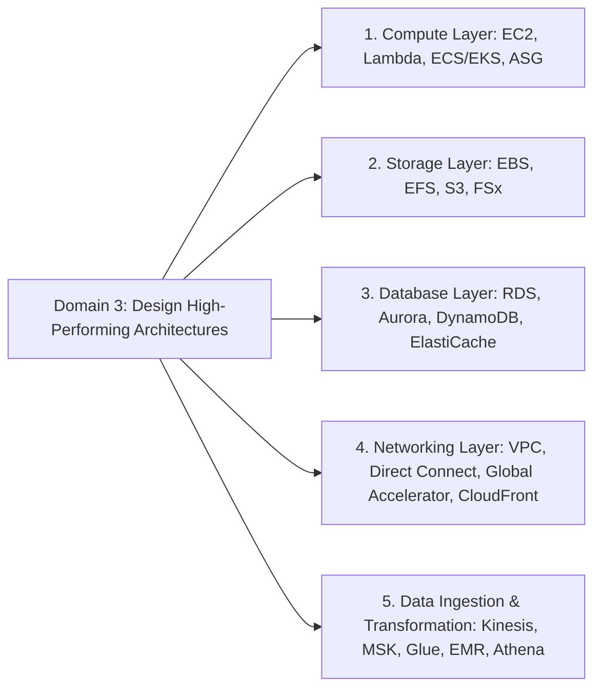

# Domain 3: Design High-Performing Architectures - Overview & Introduction (SAA-C03)

## 1. Tổng quan Domain 3 (Design High-Performing Architectures)
Trong kỳ thi **AWS Certified Solutions Architect - Associate (SAA-C03)**, Domain 3 tập trung vào việc thiết kế các hệ thống có hiệu năng cao, khả năng co giãn linh hoạt và tối ưu hóa tài nguyên dựa trên dữ liệu thực tế (*data-driven approach*).

Một kiến trúc hiệu năng cao trên AWS đòi hỏi tối ưu đồng bộ qua các tầng cốt lõi:
- **Compute Layer:** Năng lực tính toán linh hoạt, co giãn theo nhu cầu (Elasticity & High Performance).
- **Storage Layer:** Giải pháp lưu trữ dữ liệu truy xuất nhanh, IOPS/Throughput phù hợp với workload.
- **Database Layer:** Lựa chọn đúng loại CSDL (Relational, NoSQL, In-Memory, Key-Value) và tối ưu độ trễ đọc/ghi.
- **Networking Layer:** Định tuyến, băng thông mạng, kết nối lai (Hybrid) và phân phối nội dung toàn cầu (Edge/CDN).
- **Data Ingestion & Transformation:** Thu nạp và chuyển đổi dữ liệu luồng/lô với thông lượng cao và độ trễ thấp.

---

## 2. Các Trụ Cột Kỹ Thuật Trọng Tâm trong Domain 3

---

## 3. Cấu trúc 5 Task Statements của Domain 3

Domain 3 được phân rã thành **5 Task Statements** chi tiết:

| Task Statement | Trọng tâm Kiến trúc & Dịch vụ AWS liên quan |
| :--- | :--- |
| **Task Statement 3.1** Determine high-performing and/or scalable storage solutions | - Lựa chọn loại lưu trữ phù hợp (Block: **EBS**, File: **EFS / FSx**, Object: **S3**). - Tối ưu IOPS, Throughput (gp3, io2 Block Express, Provisioned IOPS, EBS-Optimized). - Cấu hình S3 Multi-part Upload, S3 Transfer Acceleration, S3 Byte-Range Fetches. - Sử dụng **FSx for Lustre** cho xử lý tính toán hiệu năng cao (HPC/ML). |
| **Task Statement 3.2** Design high-performing and elastic compute solutions | - Lựa chọn đúng Compute Family & Instance Type (Compute / Memory / Storage / Accelerated). - Co giãn tải tính toán với **Auto Scaling Groups (ASG)** và các chính sách Target Tracking / Step Scaling. - Điện toán phi máy chủ và vùng chứa: **AWS Lambda** (Memory/Concurrency tuning), **ECS/EKS on Fargate/EC2**. - Tận dụng **AWS Graviton Processors** để tối ưu P/P (Price-Performance). |
| **Task Statement 3.3** Determine high-performing database solutions | - Lựa chọn công nghệ CSDL phù hợp (**RDS, Aurora, DynamoDB, Redshift, DocumentDB**). - Phân tải đọc bằng **Read Replicas**, Sharding, Partitioning. - Tăng tốc độ truy vấn với Caching: **ElastiCache (Redis/Memcached)**, **DynamoDB Accelerator (DAX)**. - Tối ưu kết nối CSDL thông qua **Amazon RDS Proxy**. |
| **Task Statement 3.4** Determine high-performing and/or scalable network architecture | - Thiết kế mạng VPC hiệu năng cao: **Enhanced Networking (ENA/SR-IOV)**, **Elastic Fabric Adapter (EFA)** cho HPC. - Tối ưu độ trễ với **Placement Groups** (Cluster, Spread, Partition). - Kết nối lai băng thông cao, ổn định: **AWS Direct Connect (DX)**, **AWS Transit Gateway**. - Tăng tốc truyền tải toàn cầu: **CloudFront**, **AWS Global Accelerator**, Route 53 Latency-based / Geolocation Routing. |
| **Task Statement 3.5** Determine high-performing data ingestion and transformation solutions | - Thu nạp dữ liệu thời gian thực (Real-time Streaming): **Amazon Kinesis (Data Streams, Data Firehose)**, **Amazon MSK (Managed Kafka)**. - Xử lý/chuyển đổi dữ liệu quy mô lớn: **AWS Glue (ETL)**, **Amazon EMR (Spark/Hadoop)**, **AWS Batch**. - Truy vấn trực tiếp không cần máy chủ (Serverless Querying): **Amazon Athena**. |

---

## 4. Nguyên Tắc Thiết Kế Cần Nhớ (Exam Mindset)

1. **Data-Driven & Benchmarking:** Lựa chọn giải pháp kiến trúc dựa trên số liệu đo kiểm tải và benchmarking thực tế, không dựa trên phỏng đoán.
2. **Right-Sizing & Multi-Solution Pattern:** Một hệ thống Well-Architected thường kết hợp nhiều dịch vụ chuyên biệt cho từng tầng thay vì ép một dịch vụ giải quyết mọi bài toán.
3. **Continuous Optimization:** Thường xuyên đánh giá và cập nhật cấu hình hiệu năng khi khối lượng tải hoặc tính năng mới của AWS thay đổi.
