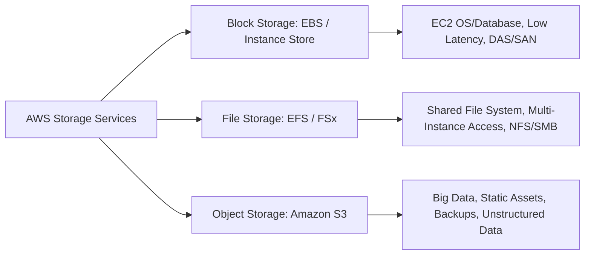

# Determine High-Performing and/or Scalable Storage Solutions (Domain 3 - SAA-C03)

## 1. Phân loại 3 hình thức lưu trữ trên AWS (Storage Types)
Khi lựa chọn giải pháp lưu trữ cho hệ thống hoặc câu hỏi thi SAA-C03, cần căn cứ vào: phương thức truy cập (*access method*), thông lượng yêu cầu (*throughput*), tần suất truy xuất/cập nhật (*frequency*), độ trễ (*latency*), cùng yêu cầu về tính sẵn sàng (*availability*) và độ bền vững (*durability*).

---

## 2. So sánh chi tiết 3 loại hình lưu trữ

### 2.1. Block Storage: Amazon EBS & EC2 Instance Store
- **EC2 Instance Store:**
  - Lưu trữ cục bộ (gắn trực tiếp vào host vật lý).
  - Tốc độ cực cao, độ trễ cực thấp (phù hợp cache, buffer, temp data).
  - **Nhược điểm:** Dữ liệu tạm thời (*ephemeral/non-persistent*), mất dữ liệu khi stop/terminate instance.
- **Amazon EBS (Elastic Block Store):**
  - Lưu trữ dạng khối bền vững (*persistent block storage*) gắn qua mạng cho EC2 trong cùng 1 AZ.
  - Phù hợp cho Database, OS Boot volume, hệ thống yêu cầu độ trễ dưới mili-giây (*sub-millisecond latency*).
  - **Cơ chế Scaling:** Cần thay đổi thủ công/script thông số (Size, IOPS, Volume Type) qua *Elastic Volumes* mà không làm gián đoạn hệ thống (live configuration changes).
  - **Backup & DR:** Sử dụng **EBS Snapshots** (được lưu trữ trên Amazon S3 - có tính Region-resilient, chịu được sự cố hỏng AZ).
  - **Keywords trong đề thi:** `DAS`, `SAN`, `Persistent storage for EC2`, `IOPS`, `Low latency`.

---

### 2.2. File Storage: Amazon EFS & Amazon FSx
- **Amazon EFS (Elastic File System):**
  - Hệ thống tệp chia sẻ dạng quản lý hoàn toàn (*fully-managed shared file system*), chuẩn **NFSv4**.
  - Dành cho **Linux instances**, hỗ trợ hàng nghìn EC2/on-premises truy cập đồng thời.
  - **Cơ chế Scaling:** **Tự động co giãn (Auto-scaling)** khi thêm/xóa file mà không cần can thiệp vận hành (*least operational overhead*).
  - Phân vùng đa AZ (*Multi-AZ resilience*).
  - **Performance modes:** *General Purpose* (độ trễ thấp nhất) vs *Max I/O* (thông lượng quy mô lớn).
  - **Keywords trong đề thi:** `NFS`, `Linux shared storage`, `Network-based file system`, `Auto-scaling storage`, `Hybrid access via Direct Connect/VPN`.

- **Amazon FSx Series:**
  - **FSx for Windows File Server:** Fully-managed Windows native share, giao thức **SMB**, hỗ trợ **NTFS**, tích hợp **Active Directory (AD)**.
  - **FSx for Lustre:** Hệ thống tệp hiệu năng siêu cao (*High-Performance File System*) tối ưu cho tính toán khoa học, **HPC, Machine Learning, Media processing** (tích hợp trực tiếp đọc/ghi với S3).
  - **Keywords trong đề thi:** `Windows SMB/NTFS`, `Active Directory integration`, `Lustre HPC / ML`.

---

### 2.3. Object Storage: Amazon S3
- Lưu trữ đối tượng không giới hạn dung lượng với độ bền 99.999999999% (11 số 9 durability).
- Lưu trữ theo Region và tự động nhân bản qua tối thiểu 3 Availability Zones trong Region đó.
- Phù hợp cho Data Lake, Big Data analytics, Static website assets, Backup & Disaster Recovery.
- **Keywords trong đề thi:** `Object storage`, `Unlimited capacity`, `11 9s durability`, `Data lake`, `Static files`.

---

## 3. Tối ưu Hiệu năng Lưu trữ (Storage Performance Optimization)

| Nhu cầu tối ưu | Dịch vụ / Tính năng AWS áp dụng | Cơ chế hoạt động |
| :--- | :--- | :--- |
| **Upload file lớn lên S3 (> 100MB)** | **S3 Multipart Upload** | Chia file thành nhiều phần nhỏ và upload song song, tự động thử lại phần bị lỗi, tăng tốc độ và độ tin cậy. Bắt buộc cho file > 5GB. |
| **Upload từ khoảng cách địa lý xa** | **S3 Transfer Acceleration** | Sử dụng mạng lưới Edge Locations toàn cầu của CloudFront để định tuyến dữ liệu vào AWS backbone network nhanh hơn. |
| **Tăng tốc tải dữ liệu tĩnh từ S3** | **Amazon CloudFront** | Caching các đối tượng S3 tại Edge Locations gần người dùng cuối, giảm tải cho S3 bucket và giảm latency. |
| **Đọc từng phần dữ liệu lớn** | **S3 Byte-Range Fetches** | Truy xuất song song các đoạn byte cụ thể từ đối tượng lớn, giúp tăng tốc download hoặc dừng đọc sớm khi chỉ cần header/metadata. |
| **Tối ưu chi phí theo vòng đời** | **S3 Lifecycle Policies** | Tự động chuyển đổi dữ liệu qua các tầng lưu trữ (Standard $\rightarrow$ Standard-IA $\rightarrow$ Glacier Instant/Flexible $\rightarrow$ Deep Archive) hoặc xóa tự động. |
| **Tăng tốc xử lý dữ liệu Big Data/HPC** | **FSx for Lustre + S3** | Tải dữ liệu từ S3 vào FSx for Lustre để xử lý tính toán tốc độ cao (hàng triệu IOPS), sau đó ghi kết quả ngược lại S3. |

---

## 4. Bảng So sánh Chiến lược Lựa chọn (Exam Cheat Sheet)

| Tiêu chí | Amazon EBS | Amazon EFS | Amazon FSx for Windows | Amazon S3 |
| :--- | :--- | :--- | :--- | :--- |
| **Storage Type** | Block Storage | File Storage (NFS) | File Storage (SMB) | Object Storage |
| **Phạm vi (Scope)** | Single AZ | Multi-AZ (Region) | Single AZ / Multi-AZ | Regional (Multi-AZ) |
| **Hệ điều hành hỗ trợ** | Linux & Windows | Linux | Windows & Linux (qua SMB) | Bất kỳ (qua REST API/HTTPS) |
| **Khả năng Scaling** | Thủ công qua Elastic Volumes | Tự động hoàn toàn (Auto-scale) | Cấu hình dung lượng & throughput | Tự động mở rộng không giới hạn |
| **Độ trễ (Latency)** | Cực thấp (sub-ms) | Thấp (vài ms) | Thấp (vài ms) | Vừa phải (vài chục ms) |
| **Workload điển hình** | Databases, Boot OS | Shared repositories, CMS, Apps | Windows enterprise apps, AD | Data lake, static web, backups |
