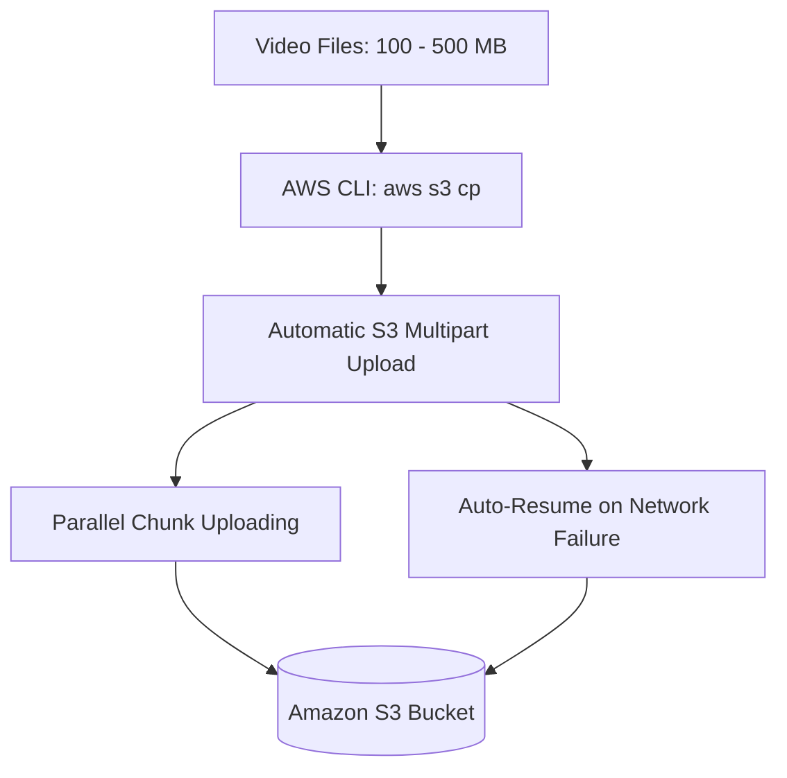

# Walkthrough Question 3.1: Resuming S3 Uploads for Large Files (SAA-C03)

## 1. Phương pháp làm bài thi Multiple-Choice (Exam Strategy)
1. **Phân tích Question Stem:** Đọc kỹ tình huống, xác định dịch vụ cốt lõi, dung lượng dữ liệu, yêu cầu kỹ thuật và tiêu chí tối ưu (*least amount of time, least operational overhead*).
2. **Xác định Keywords:** Tìm các từ khóa mang tính kỹ thuật then chốt để loại trừ và khoanh vùng giải pháp.
3. **Phân tích Distractors (Đáp án gây nhiễu):** Loại trừ các đáp án tốn thời gian, cấu hình thủ công hoặc không hỗ trợ cơ chế tự động khôi phục khi mất kết nối mạng.
4. **Chọn Best Answer:** Lựa chọn giải pháp native, tự động hóa tối đa và tối ưu thời gian/công sức.

---

## 2. Chi tiết Câu hỏi & Phân tích (Walkthrough Question 3.1)

### Đề bài (Stem)
> **A solutions architect needs to upload a large number of video files to an Amazon S3 bucket. The file sizes are 100 to 500 megabytes. The solutions architect wants to easily resume failed upload attempts. How should the solutions architect perform the uploads in the least amount of time?**
> 
> *(Một Kiến trúc sư giải pháp cần tải một lượng lớn tệp video lên bucket Amazon S3. Kích thước các tệp từ 100 đến 500 MB. Kiến trúc sư muốn có thể dễ dàng tiếp tục lại các lần tải lên bị thất bại. Giải pháp nào giúp thực hiện việc tải lên này trong khoảng thời gian ngắn nhất?)*

### Phân tích Từ khóa (Keywords)
- **Upload to Amazon S3:** Dịch vụ lưu trữ đối tượng mục tiêu là S3.
- **File sizes 100 to 500 MB:** File lớn ($\ge 100\text{ MB}$), đây là ngưỡng kích thước chuẩn mà AWS khuyến nghị áp dụng cơ chế **Multipart Upload**.
- **Easily resume failed upload attempts:** Khả năng tự động thử lại/tiếp tục tải các phần bị lỗi do gián đoạn mạng mà không phải upload lại từ đầu toàn bộ file.
- **Least amount of time:** Giải pháp tự động hóa bằng công cụ sẵn có, giảm thiểu thao tác thủ công hoặc viết code tùy biến.

---

### Các lựa chọn (Options)

- **A.** *Split each file into 5 MB parts. Upload the individual parts normally and use S3 multipart upload to merge the parts into a complete object.*
- **B.** **[CORRECT]** *Using the AWS CLI, copy individual objects into the Amazon S3 bucket with the `aws s3 cp` command.*
- **C.** *From the Amazon S3 console, select the Amazon S3 bucket. Open the S3 bucket and drag and drop items into the bucket.*
- **D.** *Upload the files with SFTP and the AWS Transfer Family.*

---

## 3. Giải thích Đáp án & Phân tích Nhiễu (Explanation & Distractor Analysis)

### Đáp án Đúng
- **B (AWS CLI `aws s3 cp`):**
  - Lệnh cao cấp `aws s3` (như `cp`, `sync`, `mv`) trong AWS CLI **tự động kích hoạt cơ chế Multipart Upload** đa luồng (multi-threaded) cho các tệp có dung lượng từ 8 MB trở lên (mặc định ngưỡng có thể tùy chỉnh).
  - Khi gặp sự cố mạng (*network failure*), AWS CLI sẽ chỉ tải lại phần (part) bị lỗi mà không cần tải lại toàn bộ đối tượng từ đầu, đáp ứng hoàn hảo tiêu chí "easily resume failed upload attempts".
  - Đây là giải pháp thực thi bằng một lệnh đơn giản, không cần can thiệp cắt file thủ công nên tốn **ít thời gian nhất (least amount of time)**.

### Phân tích Đáp án Gây nhiễu (Distractors)
- **A SAI:** Việc chủ động cắt file thành các phần nhỏ 5 MB trước khi upload là không cần thiết, làm tăng chi phí vận hành và mất nhiều thời gian chuẩn bị. Ngoài ra, nếu upload thông thường từng phần rời rạc sẽ không tự động ghép đối tượng nếu không gọi API Multipart Upload chuẩn.
- **C SAI:** Kéo thả tệp trực tiếp trên AWS Management Console không có khả năng bảo vệ tốt trước các gián đoạn mạng và không hỗ trợ cơ chế khôi phục tự động (resume) một cách tin cậy cho khối lượng lớn file 100–500 MB.
- **D SAI:** AWS Transfer Family (SFTP) là dịch vụ hỗ trợ giao thức truyền tệp an toàn hướng tới kết nối đối tác/legacy, đòi hỏi nhiều bước thiết lập hạ tầng, không phải là công cụ trực tiếp tối ưu thời gian cho việc tải file cục bộ lên S3 với yêu cầu resume tự động.

---

## 4. Key Takeaways cho kỳ thi SAA-C03
- **S3 Multipart Upload Thresholds:**
  - File từ **$100\text{ MB}$ trở lên**: AWS khuyến nghị sử dụng Multipart Upload để tăng thông lượng và tăng khả năng chịu lỗi.
  - File trên **$5\text{ GB}$**: Bắt buộc phải sử dụng Multipart Upload (kích thước tối đa của 1 object đơn lẻ trên S3 là $5\text{ TB}$).
- **AWS CLI S3 High-Level Commands:**
  - Các lệnh `aws s3 cp`, `aws s3 sync`, `aws s3 mv` đã được tích hợp sẵn cơ chế **Multipart Upload & Download song song** tự động mà người dùng không cần phải chia nhỏ file thủ công.
