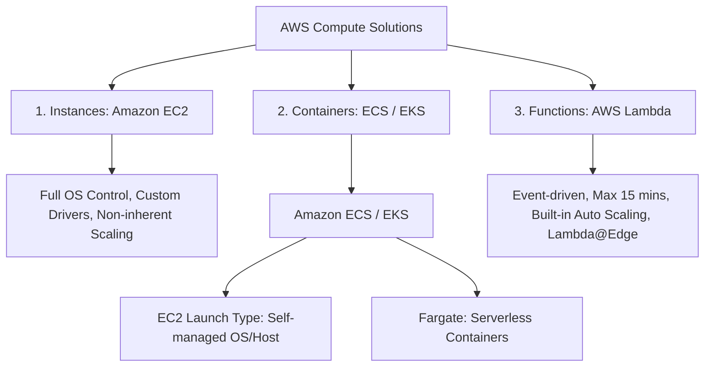
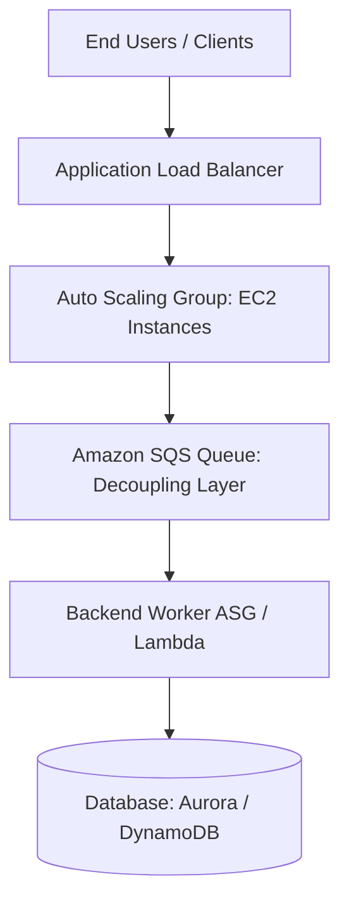

# Design High-Performing and Elastic Compute Solutions (Domain 3 - SAA-C03)

## 1. Tổng quan 3 Hình thức Compute trên AWS
Trên AWS, tài nguyên tính toán (Compute) được cung cấp dưới 3 mô hình cơ bản: **Instances (Máy ảo)**, **Containers (Vùng chứa)**, và **Functions (Điện toán phi máy chủ)**. 

---

## 2. So sánh chi tiết 3 Mô hình Compute

### 2.1. Amazon EC2 (Virtual Servers / Instances)
- **Đặc điểm:** Cung cấp quyền kiểm soát hoàn toàn hệ điều hành (OS), tùy biến cài đặt phần mềm, cấu hình mạng và lưu trữ.
- **Tính co giãn:** EC2 **không tự động co giãn theo bản chất (not inherently scalable)**. Cần kết hợp với **Auto Scaling Groups (ASG)** và **Elastic Load Balancing (ALB/NLB)** để đạt tính co giãn (Elasticity).
- **Phân loại EC2 Instance Families:**
  - **General Purpose (M, T):** Cân bằng CPU, Memory, Storage (Web servers, Dev environments).
  - **Compute Optimized (C):** Tối ưu CPU, hiệu năng tính toán đơn luồng cao (Batch processing, Media transcoding, Gaming servers).
  - **Memory Optimized (R, X, z):** Tối ưu RAM cho dữ liệu lớn trong bộ nhớ (In-memory Caches, High-performance Databases, Real-time Big Data).
  - **Storage Optimized (I, D, H):** Thông lượng đọc/ghi đĩa I/O cực cao với NVMe SSD cục bộ (Data Warehousing, NoSQL, Elasticsearch).
  - **Accelerated Computing (P, G, Inf, Trn):** GPU / AI chip tăng tốc đồ họa, Machine Learning Training & Inference.

---

### 2.2. Containers (Amazon ECS & Amazon EKS)
- **Amazon ECS (Elastic Container Service):** Nền tảng điều phối container quản lý bởi AWS. Hỗ trợ tích hợp mạnh mẽ với ALB để định tuyến động theo cổng (*Dynamic Port Mapping*).
- **Amazon EKS (Elastic Kubernetes Service):** Vận hành các cụm Kubernetes tiêu chuẩn trên AWS mà không cần tự duy trì control plane.
- **Launch Types trong Container:**
  - **Fargate (Serverless):** AWS quản lý toàn bộ hạ tầng máy chủ bên dưới. Người dùng chỉ cần định nghĩa CPU & RAM cho từng task/pod. Giảm thiểu tối đa chi phí vận hành (*least operational overhead*).
  - **EC2 Launch Type:** Tự quản lý cụm EC2 instances chạy container. Phù hợp khi cần kiểm soát sâu cài đặt OS, tùy biến network/storage drivers hoặc tối ưu hóa chi phí với Reserved/Spot Instances cụm lớn.

---

### 2.3. Serverless Functions (AWS Lambda)
- **Đặc điểm:** Chỉ tải code lên (Python, Java, Node.js, Go,...), không cần quản trị máy chủ.
- **Tính co giãn:** **Tự động co giãn theo bản chất (Inherently Scalable & Elastic)** từ 1 đến hàng nghìn invocation/giây theo lượng sự kiện thực tế.
- **Giới hạn kỹ thuật:**
  - **Thời gian thực thi tối đa:** **15 phút** cho mỗi invocation (nếu tác vụ chạy dài hơn $\rightarrow$ dùng **AWS Step Functions** hoặc ECS/Batch/EC2).
  - **Lambda@Edge / CloudFront Functions:** Triển khai code tại các Edge Locations của CloudFront để xử lý logic với độ trễ tối thiểu gần người dùng.

---

## 3. Kiến trúc Co giãn Độc lập (Decoupled & Scalable Architecture)

- **Tách rời tầng xử lý (Decoupling):** Sử dụng **Amazon SQS** làm vùng đệm giữa Web Frontend và Backend Worker giúp các tầng co giãn hoàn toàn độc lập, tránh nghẽn cổ chai khi tải tăng đột biến.
- **Giám sát & Kích hoạt Co giãn với Amazon CloudWatch:**
  - **Default Metrics:** CPUUtilization, NetworkIn/Out, DiskReadOps.
  - **Non-Default Metrics (Cần CloudWatch Agent):** **Memory Utilization**, Disk Space Used.
  - **ELB Metrics:** `HealthyHostCount`, `TargetResponseTime`, `SurgeQueueLength`.
  - **CloudWatch Alarms:** Kích hoạt Scaling Policies (Target Tracking, Step Scaling) khi số liệu vượt ngưỡng định sẵn.

---

## 4. Bảng Ma trận Chọn Lựa Dịch vụ Compute (Exam Cheat Sheet)

| Tình huống / Yêu cầu | Dịch vụ Khuyến nghị | Lý do kiến trúc |
| :--- | :--- | :--- |
| Cần kiểm soát hoàn toàn OS, kernel module, custom hardware driver | **Amazon EC2** | Cung cấp quyền root, cấu hình sâu môi trường hệ điều hành. |
| Microservices, đóng gói chuẩn Docker, không muốn quản lý máy chủ | **ECS / EKS on Fargate** | Vận hành serverless, tự động co giãn task mà không cần vá lỗi/bảo trì OS. |
| Xử lý sự kiện thời gian thực ngắn hạn (< 15 phút), chi phí trả theo ms | **AWS Lambda** | Co giãn tức thì theo tải, chi phí tối ưu khi không có tải cố định. |
| Tác vụ xử lý theo luồng công việc phức tạp kéo dài nhiều bước | **AWS Step Functions + Lambda** | Điều phối trạng thái (state machine) và xử lý các tác vụ vượt quá 15 phút. |
| Ứng dụng Web tải biến thiên lớn trong ngày, yêu cầu HA & Elasticity | **ALB + EC2 Auto Scaling (ASG)** | Cân bằng tải tự động phân bổ traffic và ASG tự điều chỉnh số lượng instance theo metrics. |
