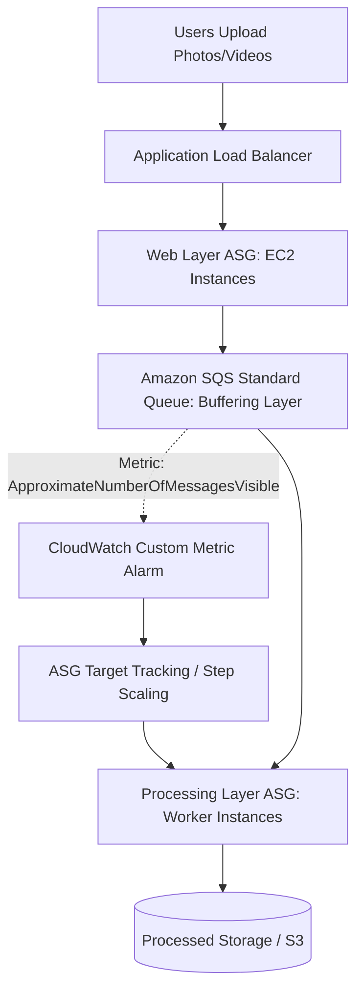

# Walkthrough Question 3.2: Decoupled & Cost-Effective Processing Architecture (SAA-C03)

## 1. Phương pháp làm bài thi Multiple-Choice (Exam Strategy)
1. **Phân tích Question Stem:** Xác định workload, thời gian thực thi của tác vụ, các điểm nghẽn hiệu năng trong kiến trúc hiện tại, và tiêu chí cốt lõi (*cost-effective, process all jobs*).
2. **Xác định Keywords:** Tìm các manh mối kỹ thuật (ví dụ: thời lượng job, hành vi hệ thống lúc cao điểm vs lúc rảnh rỗi, hiện tượng drop requests).
3. **Phân tích Distractors (Đáp án gây nhiễu):** Loại trừ các đáp án vi phạm giới hạn kỹ thuật (hard limits), tăng chi phí vô lý trong giờ thấp điểm hoặc không giải quyết tận gốc vấn đề nghẽn tải.
4. **Chọn Best Answer:** Lựa chọn giải pháp kiến trúc phân tách (*decoupled*), bền vững và có chi phí tối ưu nhất.

---

## 2. Chi tiết Câu hỏi & Phân tích (Walkthrough Question 3.2)

### Đề bài (Stem)
> **A company has developed an application that processes photos and videos. When users upload photos and videos, a job processes the files. The job can take up to 1 hour to process long videos. The company is using Amazon EC2 On-Demand Instances to run web servers and processing jobs. The web layer and the processing layer have instances that run in an Auto Scaling group behind an Application Load Balancer.**
> 
> **During peak hours, users report that the application is slow and that the application does not process some requests at all. During evening hours, the systems are idle. What should a solutions architect do so that the application will process all jobs in the most cost-effective manner?**
> 
> *(Một công ty phát triển ứng dụng xử lý ảnh và video. Khi người dùng tải ảnh/video lên, một tác vụ sẽ xử lý tệp. Tác vụ có thể mất tối đa 1 giờ đối với video dài. Công ty đang dùng EC2 On-Demand Instances cho tầng web và tầng xử lý, cả 2 tầng đều chạy trong Auto Scaling Group phía sau Application Load Balancer.*
> 
> *Vào giờ cao điểm, người dùng phản ánh ứng dụng bị chậm và một số yêu cầu không được xử lý (bị drop). Vào ban đêm, hệ thống rảnh rỗi. Kiến trúc sư giải pháp nên làm gì để ứng dụng xử lý toàn bộ tác vụ theo cách tối ưu chi phí nhất?)*

### Phân tích Từ khóa (Keywords)
- **Job can take up to 1 hour:** Tác vụ chạy kéo dài đến 60 phút $\rightarrow$ **Loại trừ ngay AWS Lambda** (giới hạn cứng tối đa 15 phút).
- **Peak hours: slow & does not process some requests (drop requests):** Hệ thống bị nghẽn cổ chai, ASG không kịp scale-out hoặc coupling quá chặt chẽ khiến request bị mất khi tải dồn dập.
- **Evening hours: systems are idle:** Hệ thống rảnh vào ban đêm $\rightarrow$ Không nên tăng kích thước instance cố định (lãng phí tiền khi idle).
- **Most cost-effective manner & process all jobs:** Đảm bảo không mất dữ liệu/request và tối ưu chi phí theo nhu cầu thực tế.

---

### Các lựa chọn (Options)

- **A.** *Use a larger instance size in the Auto Scaling groups of the web layer and the processing layer.*
- **B.** *Use Spot Instances for the Auto Scaling group of the web layer and the processing layer.*
- **C.** **[CORRECT]** *Use an Amazon SQS standard queue between the web layer and the processing layer. Use a custom queue metric to scale the Auto Scaling group in the processing layer.*
- **D.** *Use AWS Lambda functions instead of EC2 instances and Auto Scaling groups. Increase the service quota so that sufficient concurrent functions can run at the same time.*

---

## 3. Giải thích Đáp án & Phân tích Nhiễu (Explanation & Distractor Analysis)

### Đáp án Đúng
- **C (Amazon SQS Standard Queue + Custom Queue Metric):**
  - **Tách rời kiến trúc (Decoupling):** Đặt SQS làm vùng đệm (*buffer*) giữa tầng Web và tầng Xử lý đảm bảo không bao giờ bị mất request (*no dropped requests*), kể cả khi worker chưa kịp scale-out.
  - **Co giãn theo độ sâu hàng đợi (Backlog-based Scaling):** Dùng Custom Metric đo số lượng thông điệp chờ xử lý trên mỗi worker instance (`BacklogPerInstance = QueueLength / NumberOfInstances`) giúp tầng xử lý scale-out nhanh chóng và chính xác theo tải thực tế.
  - **Tối ưu chi phí (*Cost-effective*):** Ban đêm hàng đợi rỗng, ASG có thể tự động co cụm về số lượng tối thiểu (`MinInstances`), tiết kiệm tối đa chi phí.

### Phân tích Đáp án Gây nhiễu (Distractors)
- **A SAI:** Đổi sang instance lớn hơn (*Scale-up*) làm chi phí tăng vọt liên tục, đặc biệt vào ban đêm khi hệ thống rảnh rỗi vẫn phải trả tiền cho instance lớn không dùng đến. Ngoài ra không giải quyết được vấn đề mất request nếu tải vượt ngưỡng.
- **B SAI:** Spot Instances chỉ giảm giá đơn giá mỗi giờ nhưng không giải quyết được vấn đề kiến trúc bị nghẽn tải. Spot instances vẫn mất thời gian khởi động tương đương On-Demand và có thể bị AWS thu hồi bất kỳ lúc nào với cảnh báo trước 2 phút, dẫn đến gián đoạn các job đang chạy dài 1 giờ.
- **D SAI:** AWS Lambda có **giới hạn thực thi cứng là 15 phút (900 giây)**. Đề bài nêu rõ job xử lý video dài có thể kéo dài tới **1 giờ (60 phút)**, do đó Lambda không thể chạy hoàn tất các tác vụ này.

---

## 4. Key Takeaways cho kỳ thi SAA-C03
- **AWS Lambda Execution Limit:** Luôn nhớ con số **15 phút**. Tác vụ $\ge 15\text{ phút}$ $\rightarrow$ Phải dùng **EC2 / ECS / AWS Batch / Step Functions**.
- **Decoupling Pattern with SQS:** Khi có tình huống "Drop requests", "Traffic spikes", "Back-pressure" $\rightarrow$ Nghĩ ngay đến **Amazon SQS** để làm buffer trung gian.
- **Scaling EC2 with SQS:** Dùng metric `ApproximateNumberOfMessagesVisible` kết hợp số lượng instance hiện tại để cấu hình Target Tracking Scaling policy hiệu quả nhất.
