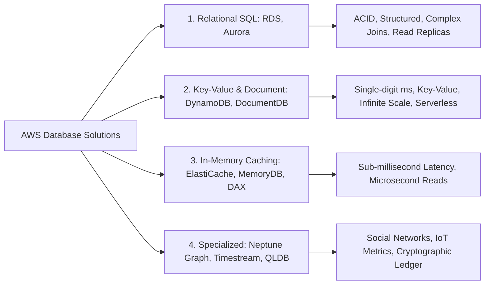
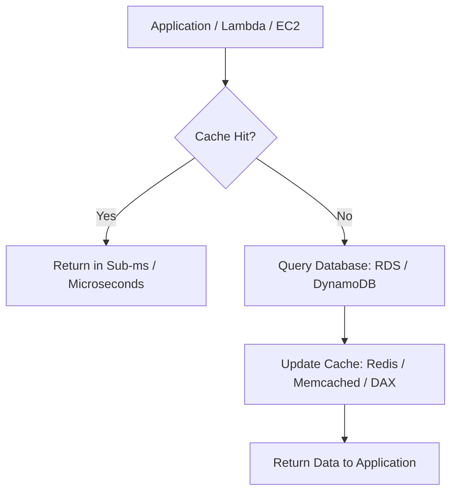

# Determine High-Performing Database Solutions (Domain 3 - SAA-C03)

## 1. Tổng quan Database Engines trên AWS (Purpose-Built Databases)
AWS cung cấp các dịch vụ cơ sở dữ liệu chuyên biệt hóa (*purpose-built databases*) đáp ứng từng mô hình dữ liệu và yêu cầu hiệu năng khác nhau:

---

## 2. Deep-dive: Kiến trúc CSDL Quan hệ (Relational DB - RDS vs Aurora)

### 2.1. So sánh Amazon RDS và Amazon Aurora

| Tiêu chí so sánh | Amazon RDS (MySQL, Postgres, etc.) | Amazon Aurora |
| :--- | :--- | :--- |
| **Kiến trúc Lưu trữ (Storage)** | Gắn qua EBS Volume (mỗi instance có storage riêng). | **Shared Cluster Storage** dùng chung cho toàn bộ cluster. Tự động nhân bản **6 bản sao trên 3 AZs**. |
| **Read Replicas** | Tối đa **5 Read Replicas**. Sao chép bất đồng bộ (*asynchronous*), có độ trễ sao chép (*replication lag*). | Tối đa **15 Aurora Replicas**. Tốc độ sao chép cực nhanh (< 10ms) vì dùng chung cluster storage. |
| **Tính sẵn sàng & Failover** | Multi-AZ Standby riêng biệt (chỉ dùng failover, không phục vụ đọc). | Replicas vừa phục vụ **Scale đọc**, vừa tự động thăng cấp thành **Primary Writer** khi có sự cố (*Multi-AZ Failover*). |
| **Mở rộng toàn cầu (Global)** | Cross-Region Read Replicas (thủ công thăng cấp). | **Aurora Global Database**: Nhân bản qua nhiều Regions với độ trễ < 1 giây, RPO < 1s, RTO < 1 phút. |
| **Tự động Co giãn Compute** | Phải đổi Instance Class thủ công / schedule. | **Aurora Serverless (ACUs)**: Tự động co giãn theo tải từ Min ACU đến Max ACU, có thể pause về 0 ACU khi rảnh rỗi. |

---

### 2.2. Amazon RDS Proxy (Connection Pooling)
- **Vấn đề:** Ứng dụng Serverless (như AWS Lambda) mở hàng trăm/hàng nghìn kết nối đồng thời đến CSDL, gây cạn kiệt CPU/RAM và kết nối (*Connection Exhaustion*).
- **Giải pháp:** **RDS Proxy** duy trì một pool các kết nối đã mở sẵn đến RDS/Aurora, chia sẻ và tái sử dụng kết nối hiệu quả.
- **Lợi ích bổ sung:** Giảm thời gian chuyển đổi dự phòng (*failover time*) của Aurora/RDS lên tới **66%** mà không làm đứt kết nối ứng dụng.

---

## 3. Deep-dive: Amazon DynamoDB & Caching Solutions

### 3.1. Amazon DynamoDB (NoSQL Key-Value & Document)
- Cung cấp hiệu năng phản hồi ổn định ở mức **vài mili-giây (single-digit milliseconds)** bất kể dung lượng dữ liệu hay khối lượng truy vấn.
- Tự động nhân bản dữ liệu trên 3 AZs; lưu trữ trên ổ đĩa SSD.
- Tính năng cao cấp: **Point-in-Time Recovery (PITR)**, **DynamoDB Streams** (bắt sự kiện thay đổi dữ liệu theo thời gian thực), **Global Tables** (Active-Active Multi-Region).

### 3.2. Caching Solutions: Tối ưu độ trễ xuống mức Micro-giây ($\mu\text{s}$)

- **Amazon ElastiCache:**
  - **Redis:** Hỗ trợ cấu trúc dữ liệu phức tạp (Lists, Sets, Hashes, Sorted Sets), Multi-AZ Failover, Read Replicas, Data Persistence, Pub/Sub.
  - **Memcached:** Hệ thống cache thuần túy (pure cache), đa luồng (multi-threaded), đơn giản, không hỗ trợ persistence hay failover nâng cao.
- **DynamoDB Accelerator (DAX):**
  - Cụm In-memory Cache chuyên biệt cho DynamoDB.
  - Tăng tốc độ đọc từ vài mili-giây xuống **dưới 1 mili-giây (microsecond latency)**.
  - Tích hợp liền mạch qua SDK (Seamless integration - không cần thay đổi logic truy vấn ứng dụng).
  - Gồm 2 tầng cache: *Item Cache* và *Query Cache*.

---

## 4. Bảng Ma trận Chọn CSDL cho kỳ thi SAA-C03 (Exam Cheat Sheet)

| Yêu cầu đề bài / Use Case | CSDL & Tính năng Khuyến nghị | Lý do kiến trúc |
| :--- | :--- | :--- |
| Quan hệ (SQL), OLTP, tải biến thiên lớn hoặc không đoán trước | **Aurora Serverless** | Tự động tăng giảm dung lượng theo ACU, giảm về 0 khi không dùng để tiết kiệm chi phí. |
| SQL Database cần khả năng chịu lỗi toàn cầu và failover liên Region < 1 phút | **Aurora Global Database** | Sao chép tầng storage cross-region độ trễ < 1s, failover cực nhanh. |
| Serverless / Lambda gọi liên tục làm quá tải kết nối CSDL RDS | **Amazon RDS Proxy** | Connection pooling giúp giảm tải RAM/CPU cho database instance. |
| Key-value store, tốc độ đọc/ghi single-digit ms, co giãn vô hạn | **Amazon DynamoDB** | Fully-managed NoSQL, tự động phân vùng và scale throughput. |
| Yêu cầu độ trễ đọc cho DynamoDB ở mức micro-giây ($\mu\text{s}$) | **DynamoDB Accelerator (DAX)** | Caching chuyên biệt trong RAM cho DynamoDB, không cần sửa logic ứng dụng. |
| Cache dữ liệu quan hệ, bảng xếp hạng (leaderboard), pub/sub message | **Amazon ElastiCache for Redis** | In-memory data store hỗ trợ sorted sets và dữ liệu cấu trúc cao cấp. |
