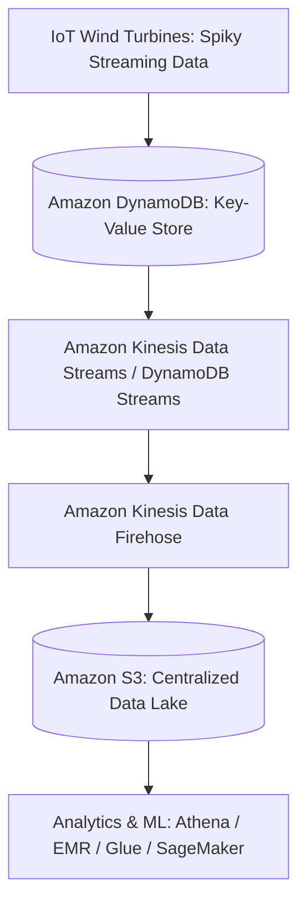

# Walkthrough Question 3.3: Streaming IoT Data to Key-Value DB & Data Lake (SAA-C03)

## 1. Phương pháp làm bài thi Multiple-Choice (Exam Strategy)
1. **Phân tích Question Stem:** Xác định nguồn phát sinh dữ liệu (IoT Sensors), tính chất lưu lượng (*spiky traffic*), yêu cầu lưu trữ (*Key-Value Database*), đích đến trung tâm (*Centralized Data Lake*) và tiêu chí ràng buộc (*minimal operational overhead, Select TWO*).
2. **Xác định Keywords:** Tìm các từ khóa kỹ thuật: `spiky data`, `key-value database`, `centralized data lake`, `minimal operational overhead`.
3. **Phân tích Distractors (Đáp án gây nhiễu):** Loại trừ các công nghệ sai loại hình lưu trữ (Document DB thay vì Key-Value) hoặc đòi hỏi tự viết code tùy biến (Custom Lambda code) làm tăng chi phí bảo trì/vận hành.
4. **Chọn Best Answers:** Chọn cặp giải pháp native, tự động co giãn và tích hợp sẵn liền mạch của AWS.

---

## 2. Chi tiết Câu hỏi & Phân tích (Walkthrough Question 3.3)

### Đề bài (Stem)
> **A company is building a distributed application which will send sensor IoT data, including weather conditions and wind speed, from wind turbines to AWS for further processing. As the nature of the data is spiky, the application needs to be able to scale. It is important to store the streaming data in a key-value database and then send it to a centralized data lake, where it can be transformed, analyzed, and combined with diverse organizational datasets to derive meaningful insights and make predictions. Which combination of solutions would accomplish the business need with minimal operational overhead? (Select TWO.)**
> 
> *(Một công ty đang xây dựng ứng dụng phân tán để gửi dữ liệu cảm biến IoT bao gồm điều kiện thời tiết và tốc độ gió từ các tuabin gió lên AWS để xử lý tiếp. Do tính chất dữ liệu có các đợt tăng đột biến (spiky), ứng dụng cần có khả năng co giãn. Yêu cầu quan trọng là phải lưu trữ dữ liệu luồng này trong một Cơ sở dữ liệu Key-Value và sau đó gửi nó đến một Data Lake tập trung, nơi dữ liệu có thể được chuyển đổi, phân tích và kết hợp với nhiều tập dữ liệu khác của tổ chức để rút ra thông tin hữu ích và đưa ra dự đoán. Sự kết hợp giải pháp nào đáp ứng nhu cầu nghiệp vụ với chi phí vận hành tối thiểu? Chọn 2 đáp án).*

### Phân tích Từ khóa (Keywords)
- **Spiky data & Scale automatically:** Dữ liệu cảm biến tăng giảm đột biến $\rightarrow$ Cần dịch vụ serverless tự co giãn.
- **Key-Value database:** Yêu cầu CSDL dạng khóa-giá trị $\rightarrow$ Nhắm trực tiếp đến **Amazon DynamoDB**.
- **Centralized data lake for transformation & analysis:** Nơi lưu trữ tập trung dữ liệu phi cấu trúc/đa nguồn chuẩn trên AWS $\rightarrow$ **Amazon S3 Data Lake**.
- **Minimal operational overhead:** Ưu tiên cấu hình dịch vụ có sẵn (Managed/Native Integration) thay vì viết/duy trì mã nguồn tùy biến.

---

### Các lựa chọn (Options)

- **A.** **[CORRECT]** *Configure Amazon Kinesis to deliver streaming data to an Amazon S3 data lake.*
- **B.** *Use Amazon DocumentDB to store IoT sensor data.*
- **C.** *Write Lambda functions to deliver streaming data to Amazon S3.*
- **D.** **[CORRECT]** *Use Amazon DynamoDB to store the IoT sensor data and turn on Kinesis Data Streams.*
- **E.** *Use Amazon Kinesis to deliver streaming data to Amazon Redshift and turn on Redshift Spectrum.*

---

## 3. Giải thích Đáp án & Phân tích Nhiễu (Explanation & Distractor Analysis)

### Đáp án Đúng
- **D (Amazon DynamoDB + Kinesis Data Streams):**
  - **DynamoDB** là CSDL Key-Value được quản lý hoàn toàn, tự động co giãn throughput để xử lý dữ liệu tăng đột biến (*spiky workload*) mà không tốn công quản trị hạ tầng.
  - Bật tính năng **Amazon Kinesis Data Streams for DynamoDB** cho phép bắt trực tiếp các thay đổi dữ liệu cấp độ bản ghi (item-level changes) và đưa vào luồng dữ liệu thời gian thực mà không cần viết code.
- **A (Amazon Kinesis to Amazon S3 Data Lake):**
  - Kinesis (thông qua Kinesis Data Firehose) tích hợp sẵn cơ chế nạp dữ liệu luồng trực tiếp vào **Amazon S3** (chuẩn Data Lake của AWS) một cách tự động, hỗ trợ nén, chuyển định dạng (Parquet/ORC) với **tối thiểu công sức vận hành (minimal operational overhead)**.

### Phân tích Đáp án Gây nhiễu (Distractors)
- **B SAI:** Amazon DocumentDB là CSDL hướng tài liệu (Document Database - tương thích MongoDB), không phải là CSDL Key-Value theo đúng yêu cầu bài toán.
- **C SAI:** Dù có thể viết AWS Lambda để đọc DynamoDB Streams rồi đẩy vào S3, nhưng phương án này đòi hỏi viết, kiểm thử, giám sát và bảo trì custom code $\rightarrow$ Vi phạm tiêu chí *minimal operational overhead*.
- **E SAI:** Amazon Redshift là CSDL Data Warehouse (chuyên phục vụ truy vấn OLAP phức tạp), không phải là giải pháp tiêu chuẩn để đóng vai trò "Centralized Data Lake" đa mục đích lưu trữ mọi định dạng dữ liệu như Amazon S3.

---

## 4. Key Takeaways cho kỳ thi SAA-C03
- **DynamoDB Streaming Integration:**
  - **DynamoDB Streams:** Phù hợp cho xử lý sự kiện nội bộ theo thứ tự 24h.
  - **Kinesis Data Streams for DynamoDB:** Phù hợp khi muốn lưu trữ luồng dữ liệu lâu hơn (tới 365 ngày), nhiều consumer đồng thời hoặc đẩy trực tiếp vào Data Lake/Firehose.
- **Data Lake Destination Standard:**
  - Trong kiến trúc AWS, **Amazon S3** luôn là lựa chọn hàng đầu cho **Centralized Data Lake** nhờ dung lượng không giới hạn, độ bền 11 số 9, chi phí tối ưu và khả năng tích hợp trực tiếp với mọi dịch vụ Analytics (Athena, Glue, EMR, Redshift Spectrum).
