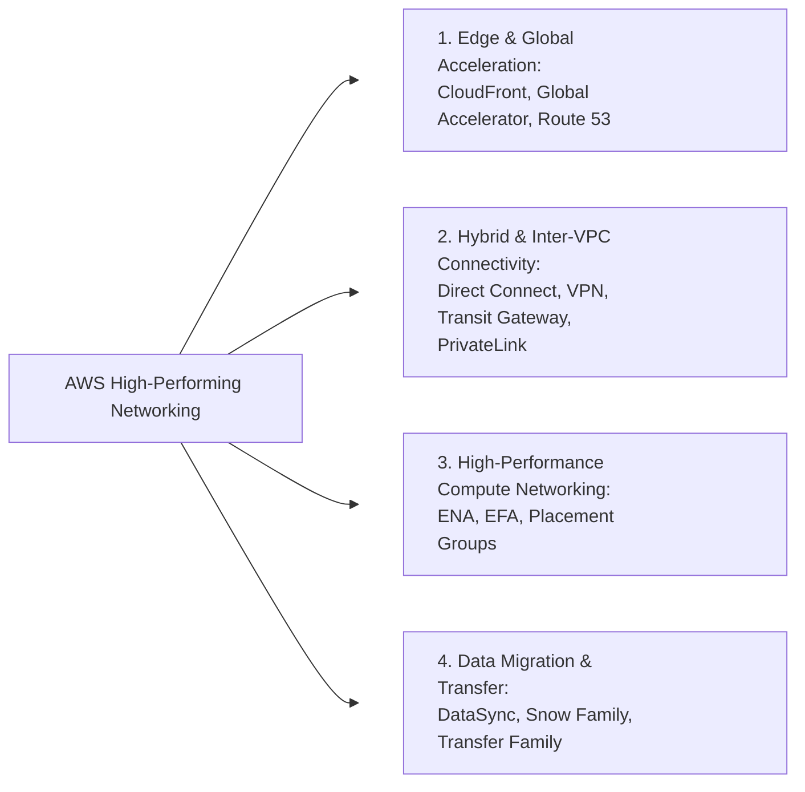
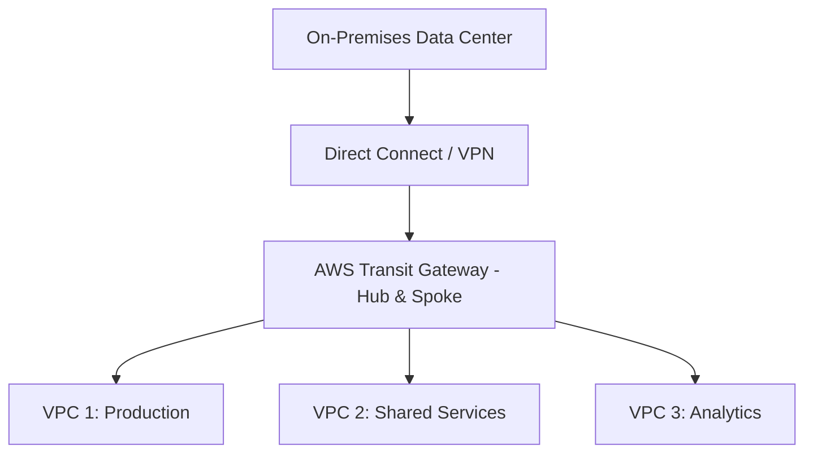
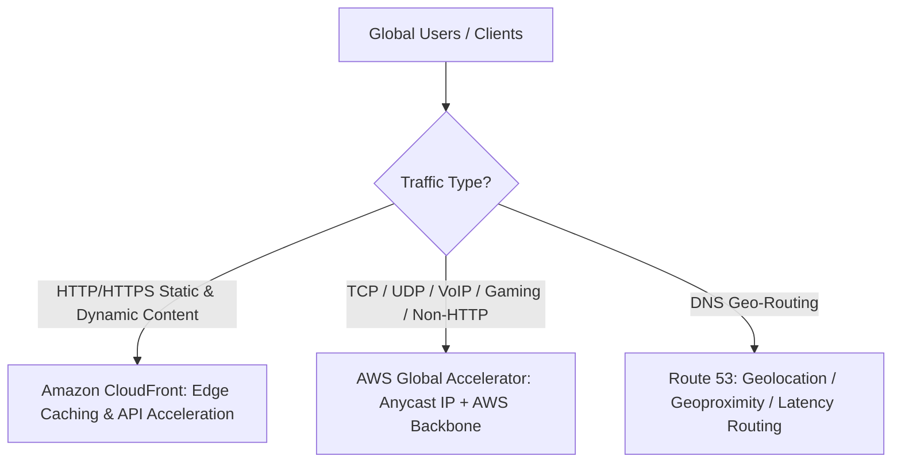

# Determine High-Performing and/or Scalable Network Architecture (Domain 3 - SAA-C03)

## 1. Tổng quan Kiến trúc Mạng Hiệu năng cao trên AWS
Hạ tầng mạng trên AWS được ảo hóa và cung cấp nhiều dịch vụ, tính năng chuyên biệt nhằm tối ưu hóa 4 yếu tố then chốt: **Băng thông (Bandwidth)**, **Độ trễ (Latency)**, **Độ biến thiên trễ (Jitter)** và **Thông lượng (Throughput)**.

---

## 2. Kết nối Lai (Hybrid) & Liên kết Mạng VPC

### 2.1. AWS Direct Connect (DX) vs AWS Site-to-Site VPN

| Tiêu chí | AWS Site-to-Site VPN | AWS Direct Connect (DX) |
| :--- | :--- | :--- |
| **Đường truyền vật lý** | Chạy qua mạng Internet công cộng (mã hóa IPsec). | Đường truyền vật lý chuyên dụng riêng biệt (*Dedicated Fiber*). |
| **Hiệu năng & Băng thông** | Băng thông phụ thuộc Internet, độ trễ và jitter biến động. | Băng thông cao (1 Gbps, 10 Gbps, 100 Gbps), độ trễ cực thấp và ổn định. |
| **Thời gian triển khai** | Nhanh chóng (vài phút/giờ). | Mất nhiều tuần/tháng (cần phối hợp với nhà mạng/Telco partner). |
| **Use Case tối ưu** | Setup nhanh, backup cho Direct Connect, lưu lượng vừa phải. | Dữ liệu khổng lồ liên tục, yêu cầu SLA mạng nghiêm ngặt, chi phí data transfer out rẻ hơn. |

---

### 2.2. Kiến trúc Mạng Đa VPC: Transit Gateway vs VPC Peering vs PrivateLink

- **AWS Transit Gateway (TGW):**
  - Mô hình **Hub-and-Spoke** trung tâm, kết nối hàng nghìn VPCs và on-premises qua 1 gateway duy nhất.
  - Loại bỏ hoàn toàn sự phức tạp của mạng lưới kết nối điểm-điểm (*Mesh Peering*), hỗ trợ định tuyến IP Multicast và Transit VPC.
- **VPC Peering:**
  - Kết nối điểm-điểm (1-1) giữa 2 VPCs trong cùng hoặc khác Region/Account.
  - Không hỗ trợ truyền bắc cầu (*No Transitive Routing*).
- **AWS PrivateLink / VPC Endpoints:**
  - **Interface Endpoints (PrivateLink):** Dùng ENI với Private IP bên trong subnet để truy cập các dịch vụ AWS hoặc custom services an toàn mà không cần qua Internet, IGW hay NAT Gateway.
  - **Gateway Endpoints:** Cấu hình trực tiếp trong Route Table, áp dụng độc quyền cho **Amazon S3** và **Amazon DynamoDB** (miễn phí).

---

## 3. Tăng tốc Truyền tải & Định tuyến Toàn cầu (Global & Edge Acceleration)

### 3.1. Amazon CloudFront vs AWS Global Accelerator

| Tiêu chí | Amazon CloudFront | AWS Global Accelerator |
| :--- | :--- | :--- |
| **Giao thức hỗ trợ** | HTTP / HTTPS / WebSockets (Layer 7). | Mọi giao thức **TCP / UDP** (Layer 4) + HTTP/HTTPS. |
| **Cơ chế hoạt động** | Caching dữ liệu tĩnh/động tại Edge Locations. | Sử dụng **2 Static Anycast IPs**, định tuyến traffic vào mạng trục AWS Backbone tại Edge Location gần user nhất. |
| **Use Cases điển hình** | Website, video streaming, API caching. | Game servers (UDP), VoIP, IoT, ứng dụng tài chính non-HTTP, Multi-Region IP Failover tức thì (< 1 phút). |

---

### 3.2. Amazon Route 53 Routing Policies cốt lõi
- **Latency-based Routing:** Điều hướng user đến AWS Region có độ trễ thấp nhất.
- **Geolocation Routing:** Điều hướng theo vị trí địa lý của user (quốc gia, bang, lục địa).
- **Geoproximity Routing:** Điều hướng dựa trên khoảng cách địa lý giữa user và tài nguyên, hỗ trợ điều chỉnh độ ưu tiên với tham số **Bias**.
- **Failover Routing:** Chuyển hướng dự phòng Active-Passive dựa trên DNS Health Checks.
- **Multi-Value Answer Routing:** Trả về nhiều IP ngẫu nhiên có kiểm tra sức khỏe (*health checked DNS*).

---

## 4. Tối ưu Mạng Tầng Compute (High-Performance Compute Networking)

- **Enhanced Networking:**
  - **Elastic Network Adapter (ENA):** Hỗ trợ tốc độ mạng lên tới 100 Gbps, giảm CPU overhead, tăng packet-per-second (PPS) và giảm jitter.
  - **VF (Virtual Function) / SR-IOV:** Ảo hóa I/O trực tiếp phần cứng mạng.
- **Elastic Fabric Adapter (EFA):**
  - Card mạng chuyên dụng cho **High-Performance Computing (HPC)** và Machine Learning quy mô lớn.
  - Hỗ trợ giao thức truyền tải OS-bypass, cho phép giao tiếp trực tiếp giữa các instance (giao thức MPI, NCCL) với độ trễ cực nhỏ và băng thông cực lớn.
- **Placement Groups:**
  - **Cluster Placement Group:** Đặt các instance trong cùng 1 AZ sát cạnh nhau về mặt vật lý $\rightarrow$ Độ trễ mạng cực thấp, thông lượng mạng cao nhất (HPC, Big Data).
  - **Spread Placement Group:** Phân tán instance trên các giá rack phần cứng khác nhau $\rightarrow$ Giảm thiểu rủi ro sự cố đồng thời (tối đa 7 instances/AZ).
  - **Partition Placement Group:** Chia nhỏ các partitions độc lập, tránh sự cố lan truyền (phù hợp HDFS, Cassandra, Kafka).

---

## 5. Dịch vụ Chuyển đổi & Di chuyển Dữ liệu (Data Transfer & Migration)

- **AWS DataSync:** Tự động hóa truyền dữ liệu tốc độ cao giữa On-Premises (NFS/SMB) và AWS (S3, EFS, FSx) qua mạng (nhanh gấp 10 lần các công cụ mã nguồn mở).
- **AWS Snow Family (Snowball Edge, Snowmobile):** Vận chuyển dữ liệu vật lý quy mô lớn (hàng chục TB đến PB) khi băng thông mạng hạn chế hoặc thời gian truyền qua mạng mất quá nhiều tháng.
- **AWS Transfer Family:** Cung cấp cổng SFTP, FTPS, FTP fully-managed lưu trữ trực tiếp vào Amazon S3 hoặc EFS.
