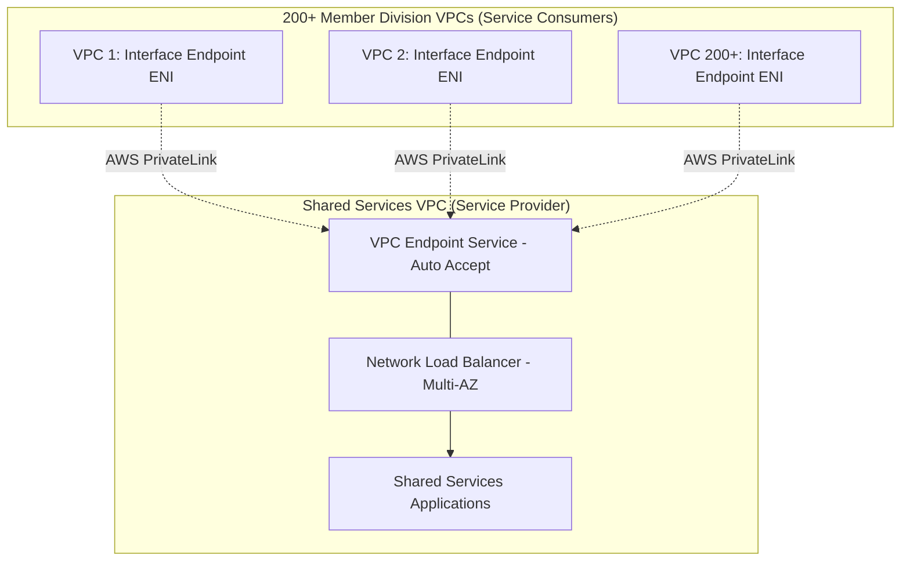

# Walkthrough Question 3.4: Accessing Shared Services VPC in Multi-Account Environment (SAA-C03)

## 1. Phương pháp làm bài thi Multiple-Choice (Exam Strategy)
1. **Phân tích Question Stem:** Đọc kỹ quy mô hệ thống (50+ AWS Accounts, 4+ VPCs mỗi account $\rightarrow$ tổng cộng $> 200$ VPCs), mô hình mạng cần thiết lập (hàng trăm consumer VPCs cần truy cập vào 1 **Shared Services VPC**) và tiêu chí tối ưu (*least operational overhead*).
2. **Xác định Keywords:** `> 50 accounts`, `4 VPCs per account`, `Shared Services VPC`, `least operational overhead`.
3. **Phân tích Hard Limits & Distractors:**
   - VPC Peering có giới hạn cứng: tối đa **125 active peering connections** trên một VPC $\rightarrow$ Không thể dùng Peering cho $> 200$ VPCs.
   - VPN / Custom Routing đòi hỏi gánh nặng vận hành lớn (*high operational overhead*).
4. **Chọn Best Answer:** Lựa chọn giải pháp **AWS PrivateLink (Endpoint Service)** với Network Load Balancer.

---

## 2. Chi tiết Câu hỏi & Phân tích (Walkthrough Question 3.4)

### Đề bài (Stem)
> **A large international company has a management account in AWS Organizations and over 50 individual accounts for each country they operate in. Each of the country accounts has at least 4 VPCs set up for functional divisions. There is a high amount of trust across the accounts, and communication among all of the VPCs should be allowed. Each of the individual VPCs throughout the entire global organization will need to access an account and a VPC that provides shared services to all the other accounts. How can the member accounts access the shared services VPC with the least operational overhead?**
> 
> *(Một công ty đa quốc gia lớn có 1 management account trong AWS Organizations và hơn 50 accounts riêng lẻ cho từng quốc gia hoạt động. Mỗi account quốc gia có ít nhất 4 VPCs cho các bộ phận chức năng (tổng cộng > 200 VPCs). Toàn bộ các VPCs này cần truy cập vào một VPC dịch vụ dùng chung (Shared Services VPC). Giải pháp nào cho phép các member account truy cập vào Shared Services VPC với chi phí vận hành ít nhất?)*

### Phân tích Từ khóa (Keywords)
- **> 50 accounts $\times$ 4 VPCs = > 200 VPCs:** Số lượng kết nối mạng vượt xa giới hạn cứng của VPC Peering (125 connections).
- **Access a Shared Services VPC:** Mô hình One-to-Many (Một nhà cung cấp dịch vụ - Hàng trăm người tiêu dùng).
- **Least Operational Overhead:** Không phải quản lý bảng định tuyến phức tạp, tránh xung đột dải IP (CIDR Overlap) và không cần duy trì đường hầm VPN.

---

### Các lựa chọn (Options)

- **A.** *Create an Application Load Balancer with a target of the private IP address of the shared services VPC. Add a Certification Authority Authorization (CAA) record for the ALB to Route 53. Point all requests for shared services in the VPCs routing tables to that CAA record.*
- **B.** *Create a peering connection between each of the VPCs and the shared services VPC.*
- **C.** **[CORRECT]** *Create a Network Load Balancer across Availability Zones in the shared services VPC. Create service consumer roles in IAM, and set endpoint connection acceptance to automatically accept. Create consumer endpoints in each division VPC and point to the Network Load Balancer.*
- **D.** *Create a VPN connection between each of the VPCs and the shared service VPC.*

---

## 3. Giải thích Đáp án & Phân tích Nhiễu (Explanation & Distractor Analysis)

### Đáp án Đúng
- **C (AWS PrivateLink qua Network Load Balancer & Interface Endpoints):**
  - **Kiến trúc Endpoint Service:** Cấu hình **NLB** phía trước Shared Services $\rightarrow$ Tạo **VPC Endpoint Service** (bật auto-accept cho các tài khoản trong AWS Organization) $\rightarrow$ Tạo **Interface VPC Endpoint** tại từng VPC tiêu dùng.
  - **Ưu điểm vượt trội:**
    - Không giới hạn 125 kết nối như VPC Peering.
    - Không lo xung đột dải mạng IP (*No CIDR overlap issues*).
    - Lưu lượng chạy hoàn toàn trong mạng backbone của AWS, an toàn, không cần cấu hình Route Tables hay Internet Gateway.

### Phân tích Đáp án Gây nhiễu (Distractors)
- **B SAI (Distractor mạnh nhất):** Mỗi VPC chỉ có thể thiết lập **tối đa 125 Peering Connections**. Trong đề bài, số lượng VPC cần kết nối là $> 50 \times 4 = 200\text{ VPCs}$, vượt quá giới hạn cứng của Shared Services VPC.
- **A SAI:** Bản ghi CAA (Certification Authority Authorization) trong Route 53 chỉ dùng để khai báo CA nào được phép cấp chứng chỉ SSL/TLS cho tên miền, hoàn toàn không có chức năng định tuyến lưu lượng mạng giữa các VPC.
- **D SAI:** Thiết lập và duy trì hơn 200 đường hầm Site-to-Site VPN tạo ra gánh nặng quản trị khổng lồ (*huge operational overhead*), tốn kém chi phí và hiệu năng kém hơn PrivateLink.

---

## 4. Key Takeaways cho kỳ thi SAA-C03
- **AWS Peering Hard Limit:** Một VPC chỉ có thể có tối đa **125 active VPC Peering connections**. Khi số lượng VPC vượt qua con số này $\rightarrow$ Luôn chọn **AWS PrivateLink** hoặc **AWS Transit Gateway**.
- **AWS PrivateLink Architecture:** Luôn yêu cầu **Network Load Balancer (NLB)** ở phía Provider VPC và **Interface VPC Endpoint (ENI)** ở phía Consumer VPC.
