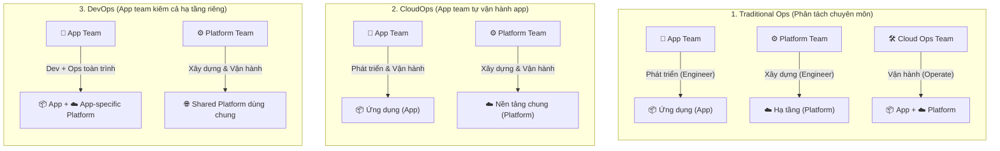

# Multi-Account Strategies Deep Dive (Chiến lược Đa tài khoản Chuyên sâu)

**Khóa học:** Course 4 - Exam Prep - AWS Certified Solutions Architect - Associate  
**Chủ đề:** Multi-Account Strategies  
**Tài liệu tham khảo chính:**  
- [Establishing Your Cloud Foundation on AWS](https://docs.aws.amazon.com/whitepapers/latest/establishing-your-cloud-foundation-on-aws/welcome.html)
- [Organizing Your AWS Environment Using Multiple Accounts](https://docs.aws.amazon.com/whitepapers/latest/organizing-your-aws-environment/organizing-your-aws-environment.html)

---

## 1. Tổng quan & Sự cần thiết của Cloud Foundation

Việc gom toàn bộ hệ thống của nhiều khách hàng/dự án vào 1 AWS Account duy nhất là phản mô hình (anti-pattern) khi quy mô mở rộng. Xây dựng **Cloud Foundation** vững chắc với chiến lược Multi-Account giúp tối ưu 4 trụ cột của **AWS Well-Architected Framework**:
* **Operational Excellence:** Tự động hóa quản trị và phân định rõ trách nhiệm vận hành.
* **Security:** Thiết lập rào chắn an ninh cứng giữa các môi trường và dữ liệu nhạy cảm.
* **Reliability:** Ngăn chặn sự cố lan truyền (isolate blast radius).
* **Cost Optimization:** Minh bạch hóa chi phí đến từng phòng ban, khách hàng và môi trường.

---

## 2. Các Động lực & Lợi ích Kiến trúc Chi tiết

### 🎯 1. Phân nhóm theo Mục đích Kinh doanh & Quyền sở hữu (Business Purpose & Ownership)
* Giúp các đơn vị kinh doanh (Business Units) tự chủ ra quyết định mà không bị phụ thuộc/xung đột với đơn vị khác.
* Áp dụng **Guardrails** (quy tắc quản trị về an ninh, vận hành, tuân thủ) từ cấp tổ chức.
* **Hỗ trợ M&A (Sáp nhập & Tách doanh nghiệp):** Dễ dàng tiếp nhận (import) hoặc bàn giao (divest) toàn bộ một account nguyên vẹn.

### 🛡️ 2. Kiểm soát An ninh Phân hóa theo Môi trường (Distinct Security Controls by Environment)
* Phân tách rạch ròi giữa **Non-Production** (Dev/QA) và **Production**.
* Mặc định tài nguyên và dữ liệu ở các môi trường bị cô lập hoàn toàn, tránh cấu hình nhầm lẫn.

### 🔒 3. Kiểm soát & Giới hạn Dữ liệu Nhạy cảm (Constrain Access to Sensitive Data)
* Cô lập kho dữ liệu quan trọng vào các tài khoản được thiết kế riêng.
* Dễ dàng đạt được nguyên tắc **Đặc quyền tối thiểu (Least-Privilege)** ở cấp độ thô (coarse-grained).
* *Ví dụ:* Chỉ định 1 tài khoản chuyên biệt được phép mở S3 Public, toàn bộ các tài khoản khác bị chặn hoàn toàn qua SCP.

### 🚀 4. Thúc đẩy Sáng tạo & Tính linh hoạt (Promote Innovation & Agility for Builders)
Tạo môi trường độc lập cho đội ngũ kỹ sư (Builders) theo từng giai đoạn vòng đời:

| Loại Account | Đặc điểm & Phạm vi | Cơ chế bảo vệ |
| :--- | :--- | :--- |
| **Sandbox Account** | Ngắt kết nối với dịch vụ doanh nghiệp và dữ liệu nội bộ; tự do thử nghiệm công nghệ mới tối đa. | Rào chắn an ninh cơ bản & ngân sách giới hạn (Budget limits). |
| **Development Account** | Kết nối giới hạn với dịch vụ doanh nghiệp; phục vụ code và test thường nhật. | Guardrails chặn tài nguyên đắt đỏ & kiểm soát truy cập dữ liệu thật. |
| **Test / Prod Account** | Quản lý nghiêm ngặt, chỉ cho phép CI/CD hoặc đội ngũ được cấp phép triển khai. | Giảm thiểu tối đa tác động thay đổi đến hệ thống thực tế. |

### 💥 5. Thu hẹp Vùng ảnh hưởng Sự cố (Limit Blast Radius)
* Mỗi AWS Account là một **Biên giới cô lập logic (Logical Isolation Boundary)** độc lập về bảo mật, truy cập và thanh toán.
* Lỗi cấu hình, sự cố ứng dụng hoặc hành vi phá hoại chỉ bị phong tỏa bên trong 1 account duy nhất, không ảnh hưởng đến các hệ thống khác.

### 👥 6. Hỗ trợ Đa dạng Mô hình Vận hành IT (Multiple IT Operating Models)

| Mô hình | Trách nhiệm App Team | Trách nhiệm Platform Team | Trách nhiệm Cloud Ops Team |
| :--- | :--- | :--- | :--- |
| **Traditional Ops** | Chỉ phát triển ứng dụng (Engineer App) | Chỉ dựng nền tảng (Engineer Platform) | Vận hành cả App lẫn Platform (Operate all) |
| **CloudOps** | Phát triển & Tự vận hành App (Dev + Ops App) | Xây dựng & Vận hành Platform chung | *(Gộp vào Platform/App Team)* |
| **DevOps** | Toàn quyền phát triển, vận hành App & Hạ tầng riêng của App | Xây dựng & Vận hành Shared Platform dùng chung | *(Mô hình phân tán tự chủ)* |

* Multi-Account cho phép gán các nhóm account riêng biệt phù hợp với từng mô hình vận hành và phân định trách nhiệm ITSM rõ ràng.

### 💰 7. Quản lý & Phân bổ Chi phí (Cost Management)
* Account là đơn vị phân bổ chi phí mặc định trên AWS.
* Kết hợp **Consolidated Billing** (gộp hóa đơn để hưởng chiết khấu theo bậc) và **Cost Allocation Tags** để báo cáo chi tiết đến từng tài nguyên.

### ⚙️ 8. Phân bổ Hạn ngạch Dịch vụ & Giới hạn Tốc độ API (Service Quotas & API Rate Limits)
* Mỗi account sở hữu Service Quotas và API Rate Limits độc lập.
* Phân chia tải sang nhiều account giúp loại bỏ nguy cơ **API Throttling** và tránh chạm ngưỡng giới hạn dịch vụ dùng chung.
