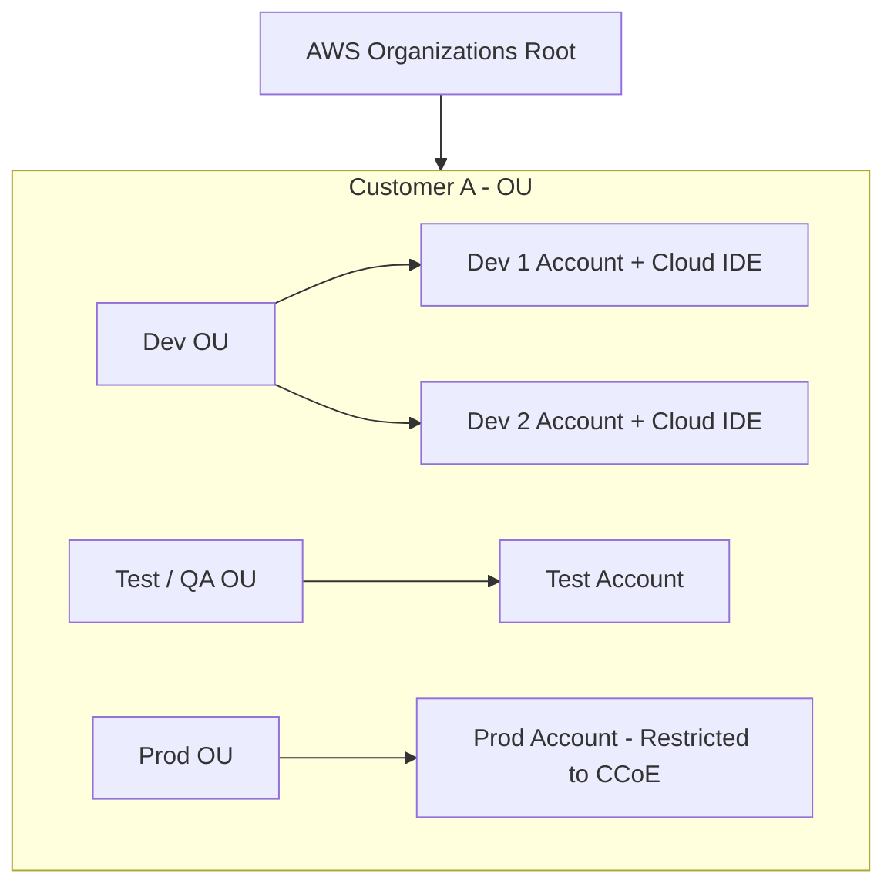

# Why Multi-Account Strategies? (Tại sao cần Chiến lược Đa tài khoản?)

**Khóa học:** Course 4 - Exam Prep - AWS Certified Solutions Architect - Associate  
**Chủ đề:** Why Multi-Account Strategies?  
**Diễn giả:** Raf (Principal Cloud Technologist @ AWS)

---

## 1. Nguyên tắc Thiết kế & Phân đoạn Tài nguyên (Grouping Principles)

Không có một công thức duy nhất cho mọi doanh nghiệp, nhưng chuẩn mực kiến trúc khuyến nghị gom nhóm theo **Mục đích kinh doanh (Business Purpose)** và **Quyền sở hữu (Ownership)**.

### 📌 Cấu trúc Cây Đơn vị Tổ chức (Organizational Units - OUs Model)
Áp dụng mô hình phân tách theo Khách hàng và Môi trường:

* **Dev Accounts:** Mỗi lập trình viên có thể sở hữu một sandbox account riêng với Cloud IDE.
* **Service Control Policies (SCPs):** Ngăn chặn lập trình viên khởi tạo các tài nguyên đắt đỏ (như EC2 instance cỡ lớn `m5.24xlarge`) trên môi trường Dev.
* **Phân quyền truy cập nghiêm ngặt:** Chỉ các kỹ sư kỳ cựu trong nhóm **CCoE** mới có quyền truy cập vào tài khoản Production.

---

## 2. Hai điều kiện tiên quyết khi dùng Multi-Account (2 Must-Have Pillars)

Nếu không có hai yếu tố này, hệ sinh thái đa tài khoản sẽ nhanh chóng rơi vào mất kiểm soát:
1. **Automation (Tự động hóa):** Tự động cấp phát tài khoản, gán baseline an ninh và mạng.
2. **Centralized Credentialing (Định danh tập trung):** Sử dụng IAM Identity Center / SSO để kiểm soát phân quyền xuyên suốt.

---

## 3. 6 Lợi ích Cốt lõi của Chiến lược Đa tài khoản (6 Core Advantages)

| STT | Lợi ích cốt lõi | Ý nghĩa kiến trúc |
| :---: | :--- | :--- |
| **1** | **Group workloads based on business purpose/ownership** | Gom nhóm tải công việc theo nghiệp vụ hoặc nhóm sở hữu, tăng tính tự chủ cho từng team. |
| **2** | **Centralize logging** | Dễ dàng chuyển hướng và tổng hợp toàn bộ audit log về 1 tài khoản trung tâm an toàn. |
| **3** | **Constrain access to sensitive data** | Cô lập dữ liệu nhạy cảm trong tài khoản riêng với chính sách bảo mật nghiêm ngặt. |
| **4** | **Limit blast radius** | Thu hẹp phạm vi ảnh hưởng khi có sự cố kỹ thuật hoặc tấn công bảo mật (chỉ gói gọn trong 1 account). |
| **5** | **Manage costs better** | AWS tính phí tự nhiên theo từng account $\rightarrow$ Minh bạch hóa chi phí, xuất hóa đơn riêng cho từng khách hàng. |
| **6** | **Distribute AWS service quotas & API limits** | Mỗi AWS Account có quota/rate limit riêng biệt, tránh hiện tượng nghẽn API (API Throttling) do dùng chung hạn ngạch. |
