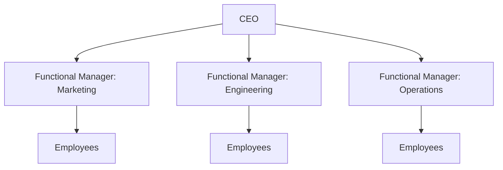
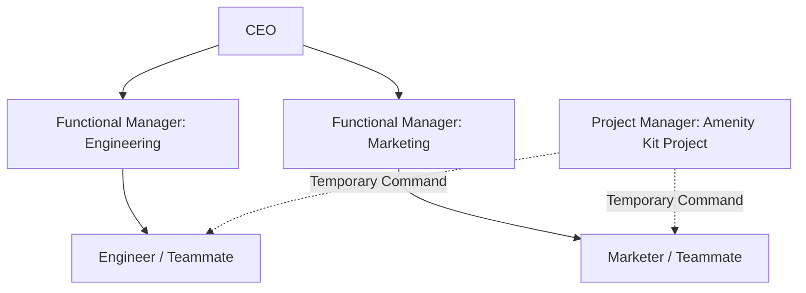

# Vai trò của PM trong các cơ cấu tổ chức khác nhau

Hiểu rõ cơ cấu tổ chức giúp PM biết ai là stakeholders chính, điểm giao tiếp quan trọng, và ai có thẩm quyền quyết định trong từng tình huống.

---

## 1. Cơ cấu tổ chức Cổ điển (Classic Organizational Structure)

Cơ cấu Cổ điển là hệ thống phân cấp từ trên xuống (**Top-down hierarchy**), còn được gọi là **Functional Organization** (tổ chức chức năng) vì công ty được chia theo các phòng ban chức năng (Marketing, HR, Operations...).

### Đặc điểm:
- Quyền lực đi từ đỉnh xuống đáy.
- Nhân viên làm việc chuyên môn hóa cao trong phòng ban của họ và ít khi làm việc chéo trong vận hành hàng ngày.
- Giao tiếp chủ yếu đi theo trục dọc (lên và xuống).

### Vai trò của PM trong Classic Structure:
- **Tập hợp đội ngũ:** PM rút nhân sự từ các phòng ban chức năng hiện có để tạo thành một team dự án tạm thời.
- **Thẩm quyền giới hạn:** Quyền lực của PM bị hạn chế vì các thành viên vẫn thuộc quyền quản lý trực tiếp của Functional Manager (quản lý chức năng). PM phải liên tục thương lượng với các quản lý chức năng về resources và capacity của teammate.

---

## 2. Cơ cấu tổ chức Ma trận (Matrix Organizational Structure)

Cơ cấu Ma trận khác với Cổ điển ở chỗ nhân viên sẽ có **hai hoặc nhiều quản lý** cùng lúc. Các phòng ban chức năng giao nhau thường xuyên hơn.

### Đặc điểm:
- Nhân viên có ít nhất 2 chuỗi quản lý: Quản lý chức năng (cố định) và Project Manager (tạm thời trong dự án).
- Giao thoa chéo giữa các bộ phận diễn ra liên tục.

### Vai trò của PM trong Matrix Structure:
- **PM là quản lý tạm thời:** Đóng vai trò dẫn dắt khi teammate được assign vào dự án.
- **Quyền hạn song song:** Trong nhiều tổ chức ma trận, PM hoặc Lead dự án có quyền hạn tương đương với các quản lý chức năng và vận hành trực tiếp hơn.
- **Yêu cầu giao tiếp chéo:** PM cần cập nhật tiến độ cho cả quản lý trực tiếp và các bộ phận liền kề liên quan.

---

## Bảng so sánh nhanh

| Khía cạnh | Classic Structure | Matrix Structure |
|---|---|---|
| **Thẩm quyền của PM** | Giới hạn, phải qua Functional Manager | Cao hơn, có thể ngang hàng với Functional Manager |
| **Báo cáo của nhân viên** | Báo cáo cho 1 quản lý chức năng duy nhất | Báo cáo cho cả quản lý chức năng & PM |
| **Resource allocation** | Phức tạp hơn do rào cản phòng ban | Linh hoạt hơn, thiết lập để làm việc chéo |

> *Lưu ý: Do nội dung bài học gốc không chứa URL ảnh trực tiếp, các sơ đồ trên được vẽ bằng công nghệ Mermaid để hiển thị trực quan cấu trúc Classic và Matrix.*
