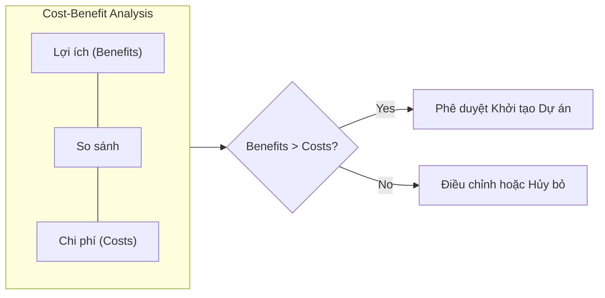

# Course 2: Project Initiation - Starting a Successful Project
## Bài học: Why is Project Initiation Essential?

---

### 1. Vị trí và Tầm quan trọng của Giai đoạn Khởi tạo (Initiation Phase)
- **Vòng đời dự án:** Giai đoạn khởi tạo là bước đầu tiên trong chu trình 4 giai đoạn:
  $$\text{Initiation (Khởi tạo)} \longrightarrow \text{Planning (Lập kế hoạch)} \longrightarrow \text{Executing (Thực thi)} \longrightarrow \text{Closing (Đóng dự án)}$$
- **Tầm quan trọng:** Mọi dự án thuộc bất kỳ phương pháp luận nào đều cần điểm xuất phát. Khởi tạo chuẩn xác tạo nền móng vững chắc, giúp định hướng và giảm thiểu rủi ro cho toàn bộ các giai đoạn sau.

---

### 2. Nguồn gốc Dự án & Vai trò của Project Manager
- **Khởi nguồn:** Dự án bắt đầu khi tổ chức xác định được một **Vấn đề (Problem)** hoặc một **Cơ hội (Opportunity)** (Ví dụ: Ra mắt dòng sản phẩm mới, tối ưu chi phí vận hành, cải thiện chế độ phúc lợi nhân viên).
- **Trách nhiệm của PM trong giai đoạn này:**
  - Dù ý tưởng ban đầu xuất phát từ lãnh đạo/stakeholders, PM có trách nhiệm ghép nối các mảnh ghép để biến ý tưởng thành kế hoạch hành động khả thi.
  - **Đặt câu hỏi đúng trọng tâm** với các bên liên quan.
  - Tiến hành nghiên cứu, xác định nguồn lực cần thiết.
  - Tài liệu hóa rõ ràng các thành phần cốt lõi và thiết lập **Phạm vi dự án (Project Scope / Boundaries)**.

---

### 3. Rủi ro khi Khởi tạo Dự án không đúng cách
Nếu bỏ qua hoặc thực hiện sơ sài giai đoạn khởi tạo, dự án sẽ đối mặt với các nguy cơ:
- **Ước tính sai lệch:** Đánh giá thấp nguồn lực cần thiết hoặc tính toán sai thời gian hoàn thành (Timeline).
- **Lệch pha kỳ vọng (Misaligned Expectations):** PM cho rằng dự án đã hoàn thành tốt, nhưng Stakeholders lại đánh giá thất bại vì không đồng thuận rõ tiêu chuẩn thành công ngay từ đầu.
- **Lãng phí nguồn lực:** Tốn thời gian và phát sinh nhiều công việc sửa đổi ngoài dự kiến (*rework*).

---

### 4. Phân tích Chi phí - Lợi ích (Cost-Benefit Analysis - CBA)
Mục tiêu cốt lõi của giai đoạn khởi tạo là chứng minh: **Lợi ích mang lại phải luôn vượt trội hơn Chi phí đầu tư ($\text{Benefits} > \text{Costs}$)**.

#### Các câu hỏi cốt lõi để đánh giá:

| Nhóm đánh giá | Các câu hỏi trọng tâm |
| :--- | :--- |
| **Lợi ích (Benefits)** | - Dự án tạo ra giá trị gia tăng nào cho doanh nghiệp? - Tiết kiệm được bao nhiêu ngân sách cho tổ chức? - Mang lại thêm bao nhiêu doanh thu từ khách hàng hiện tại/mới? - Tiết kiệm được bao nhiêu thời gian vận hành? - Trải nghiệm người dùng (UX) được cải thiện thế nào? |
| **Chi phí (Costs)** | - Đội ngũ cần đầu tư bao nhiêu thời gian làm việc? - Chi phí phát sinh một lần (*one-time costs*) là bao nhiêu? - Có chi phí duy trì định kỳ (*ongoing costs*) nào không? - Các chi phí vận hành/bảo trì dài hạn (*long-term costs*) là gì? |
