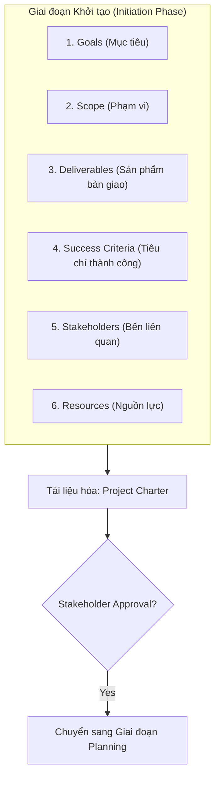

# Course 2: Project Initiation - Starting a Successful Project
## Bài học: Key Components of Project Initiation

---

### 1. 6 Thành phần Cốt lõi của Giai đoạn Khởi tạo
Để một dự án khởi đầu vững chắc và sẵn sàng bước vào giai đoạn lập kế hoạch (*Planning*), Project Manager cần xác định rõ 6 yếu tố nền tảng:

| Thành phần | Định nghĩa & Đặc điểm | Ví dụ minh họa |
| :--- | :--- | :--- |
| **1. Goals (Mục tiêu)** | Là kết quả cụ thể mà dự án được giao phó và cần đạt được. Thường được định hình bởi cấp lãnh đạo với sự hỗ trợ của PM. | Tăng tỷ lệ chuyển đổi khách hàng thêm 15% trong Q3. |
| **2. Scope (Phạm vi)** | Ranh giới xác định toàn bộ công việc bắt buộc phải thực hiện để hoàn tất dự án. | Xây dựng tính năng thanh toán thẻ; loại trừ tích hợp ví điện tử ở phiên bản đầu. |
| **3. Deliverables (Sản phẩm bàn giao)** | Các sản phẩm hoặc dịch vụ tạo ra cho khách hàng, đối tác hoặc nhà tài trợ (*Project Sponsor*) nhằm hiện thực hóa mục tiêu. - **Hữu hình (*Tangible*):** Vật thể, tài liệu, mã nguồn. - **Vô hình (*Intangible*):** Quy trình, khóa đào tạo. | - *Tangible:* Nộp bản thảo một chương sách giáo khoa. - *Intangible:* Tổ chức các buổi đào tạo nhân viên sử dụng hệ thống POS mới. |
| **4. Success Criteria (Tiêu chí thành công)** | Các tiêu chuẩn, chỉ số định lượng dùng để đo lường mức độ đạt được mục tiêu của dự án. | Hệ thống đạt thời gian phản hồi dưới 200ms, tỷ lệ lỗi dưới 0.1%. |
| **5. Stakeholders (Bên liên quan)** | Những người có quyền lợi và chịu ảnh hưởng trực tiếp bởi sự thành bại của dự án. Đóng vai trò quyết định trong việc thống nhất mục tiêu và kỳ vọng. | Project Sponsor, Đội ngũ kỹ thuật, Trưởng phòng nghiệp vụ, Khách hàng cuối. |
| **6. Resources (Nguồn lực)** | Toàn bộ ngân sách (*budget*), nhân sự (*people*), vật tư/công nghệ (*materials/tools*) sẵn có để triển khai. | Ngân sách $50,000, đội ngũ 5 kỹ sư full-time, tài khoản Cloud Platform. |

---

### 2. Tổng hợp vào Project Charter (Hiến chương Dự án)
- **Định nghĩa:** Project Charter là văn bản chính thức tập hợp đầy đủ thông tin chi tiết của 6 thành phần trên.
- **Vai trò:**
  - Định nghĩa rõ ràng dự án, mục tiêu và lộ trình cần thiết để đạt được chúng.
  - Tạo khung làm việc (*framework*) chuẩn mực, giúp tổ chức và truyền thông thông tin minh bạch tới toàn đội ngũ.
- **Cột mốc chuyển giao (*Milestone*):** Sau khi hoàn thiện bản dự thảo Project Charter, PM sẽ tiến hành họp rà soát và xin phê duyệt chính thức (*Stakeholder Approval / Sign-off*) từ các bên liên quan chủ chốt để được cấp quyền chuyển sang **Giai đoạn Lập kế hoạch (Planning Phase)**.
