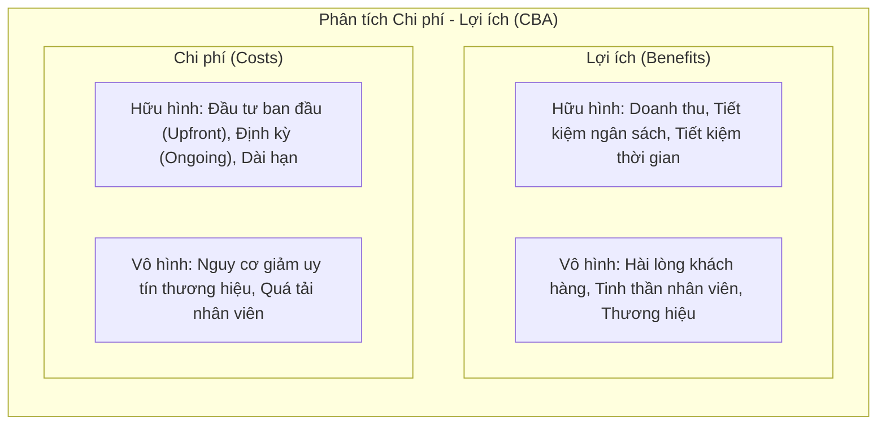

# Course 2: Project Initiation - Starting a Successful Project
## Bài đọc: Performing a Cost-Benefit Analysis (CBA)

---

### 1. Tổng quan & Lợi ích của Phân tích Chi phí - Lợi ích (CBA)
- **Định nghĩa:** Phân tích Chi phí - Lợi ích (*Cost-Benefit Analysis - CBA*) là quá trình tính toán tổng giá trị kỳ vọng của dự án (**Benefits - Lợi ích**) và so sánh đối chiếu với tổng chi phí tài chính (**Costs - Chi phí**).
- **Lợi ích mang lại:**
  - **Giảm thiểu rủi ro & Tối đa hóa lợi nhuận:** Đảm bảo doanh nghiệp chỉ đầu tư vào các dự án có tính khả thi và sinh lời cao nhất.
  - **Minh bạch và giảm định kiến cá nhân:** Sử dụng dữ liệu định lượng khách quan để loại bỏ thiên vị (*biases*) hoặc lợi ích cục bộ của các bên liên quan (*stakeholder self-interest*).
  - **Tạo lập Business Case vững chắc:** Giúp Project Manager thuyết phục các cấp lãnh đạo phê duyệt nguồn lực.

---

### 2. Bộ câu hỏi Hướng dẫn Phân tích CBA (Guiding Questions)

#### A. Lợi ích & Chi phí Hữu hình (Tangible)
- **Lợi ích hữu hình (Tangible Benefits):**
  - Dự án tạo ra thêm bao nhiêu doanh thu từ khách hàng hiện tại và mới?
  - Giúp tổ chức tiết kiệm bao nhiêu chi phí vận hành?
  - Tiết kiệm bao nhiêu thời gian làm việc?
- **Chi phí hữu hình (Tangible Costs):**
  - Chi phí đầu tư một lần ban đầu (*Upfront / One-time costs*) là bao nhiêu?
  - Chi phí vận hành định kỳ (*Ongoing costs*) và chi phí bảo trì dài hạn (*Long-term costs*) là bao nhiêu?
  - Đội ngũ phải bỏ ra bao nhiêu giờ làm việc?

#### B. Lợi ích & Chi phí Vô hình (Intangible)
- **Lợi ích vô hình (Intangible Benefits):**
  - **Customer Satisfaction:** Tăng tỷ lệ giữ chân khách hàng (*retention*), thúc đẩy chi tiêu nhiều hơn.
  - **Employee Satisfaction & Productivity:** Nâng cao tinh thần làm việc, giảm tỷ lệ nghỉ việc (*turnover*), giảm số giờ làm ngoài giờ (*overtime*).
  - **Brand Perception:** Nâng cao uy tín thương hiệu, tạo lợi thế cạnh tranh trên thị trường.
- **Chi phí vô hình (Intangible Costs):** Nguy cơ làm suy giảm trải nghiệm người dùng, xáo trộn tâm lý nhân viên hoặc ảnh hưởng uy tín thương hiệu nếu xảy ra sự cố.
- *Gợi ý định giá:* Tham chiếu số liệu từ các dự án tương tự trong quá khứ, báo cáo ngành hoặc ý kiến chuyên gia.

---

### 3. Công thức tính Tỷ suất Hoàn vốn (Return on Investment - ROI)
Phương pháp phổ biến nhất để lượng hóa CBA là tính toán chỉ số **ROI**:

$$\text{ROI} = \frac{G - C}{C} \times 100\%$$

Trong đó:
- **$G$ (Financial Gains):** Tổng doanh thu hoặc lợi nhuận tài chính dự kiến thu về.
- **$C$ (Costs):** Tổng toàn bộ chi phí đầu tư ban đầu (*upfront*) và chi phí vận hành (*ongoing*).

---

### 4. Ví dụ Tính toán Minh họa Thực tế

**Bài toán:**
- Chi phí đầu tư ban đầu (*Upfront cost*): $\$6,000$
- Chi phí duy trì định kỳ (*Ongoing cost*): $\$25/\text{tháng} \times 12\text{ tháng} = \$300/\text{năm}$
- Doanh thu dự kiến mang về trong 1 năm (*Financial Gains*): $\$10,000$

**Các bước tính:**
1. Xác định tổng chi phí ($C$):
   $$C = 6,000 + 300 = \$6,300$$
2. Xác định tổng lợi nhuận ($G$):
   $$G = \$10,000$$
3. Áp dụng công thức ROI:
   $$\text{ROI} = \frac{10,000 - 6,300}{6,300} = \frac{3,700}{6,300} \approx 0.5873 = 58.7\%$$

**Đánh giá:**
- Thông thường trong doanh nghiệp, mức **ROI $> 10\%$** được xem là một mức sinh lời tốt (*strong ROI*).
- Với ROI đạt **$58.7\%$**, dự án hoàn toàn đủ cơ sở vững chắc để được phê duyệt thực hiện.
