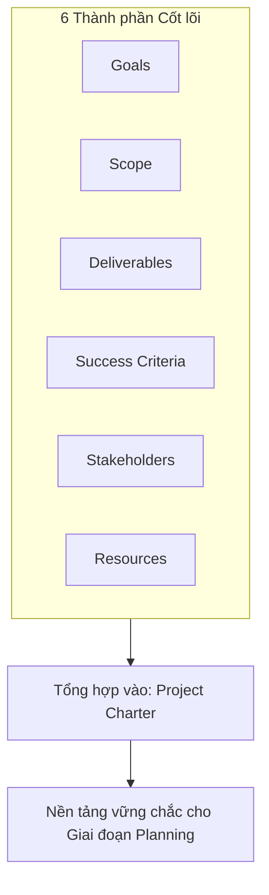

# Course 2: Project Initiation - Starting a Successful Project
## Bài học: Wrap-up (Tổng kết phần Khởi tạo)

---

### 1. Tổng kết Giai đoạn Khởi tạo (Initiation Phase Recap)
- **Tầm quan trọng:** Giai đoạn khởi tạo (*Initiation*) đóng vai trò sống còn đối với sức khỏe và tính khả thi của toàn bộ dự án.
- **Rủi ro khi thiếu chuẩn bị từ sớm:**
  - Thiếu hụt ngân sách tài chính (*Budget shortage*).
  - Trễ tiến độ bàn giao (*Missed deadline*).
  - Thiếu hụt nguồn lực nhân sự để hoàn thành khối lượng công việc (*Resource shortage*).

---

### 2. Chuỗi giá trị 6 Thành phần & Project Charter

- Toàn bộ 6 yếu tố cốt lõi (**Goals, Scope, Deliverables, Success Criteria, Stakeholders, Resources**) được liên kết chặt chẽ và ghi nhận chính thức vào **Project Charter (Hiến chương dự án)** để tạo sự đồng thuận tuyệt đối trước khi bước sang giai đoạn lập kế hoạch.

---

### 3. Định hướng bài học tiếp theo (What's Next)
- Đào sâu chi tiết về cách xác định mục tiêu dự án (**Goals**) và sản phẩm bàn giao (**Deliverables**).
- Phương pháp đo lường và thiết lập bộ tiêu chí đánh giá thành công (**Measurement & Success Criteria**) chuẩn xác.
