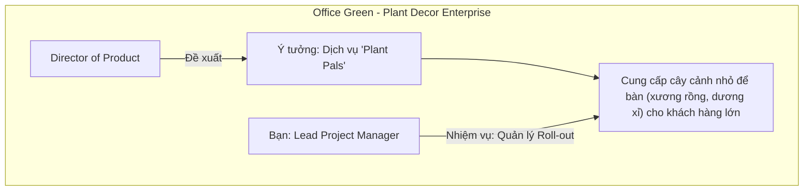

# Course 2: Project Initiation - Starting a Successful Project
## Module 2 - Bài học: Introduction - Defining Project Goals, Scope, and Success Criteria

---

### 1. Mục tiêu & Kỹ năng Trọng tâm
Trong phần học này, học viên sẽ rèn luyện 4 năng lực cốt lõi:
- **Goals & Deliverables:** Thiết lập mục tiêu và sản phẩm bàn giao cụ thể — đóng vai trò là "kim chỉ nam" (*guiding stars*) dẫn đường cho toàn bộ dự án.
- **Project Scope:** Xác định ranh giới dự án rõ ràng, phân định minh bạch những hạng mục thuộc phạm vi (*in-scope*) và nằm ngoài phạm vi (*out-of-scope*).
- **Kiểm soát Scope Creep:** Nhận diện và ngăn chặn hiện tượng "phình to phạm vi" (công việc phát sinh mất kiểm soát làm trễ hạn và đội ngân sách).
- **Success Criteria:** Thiết lập các tiêu chuẩn và phương pháp đo lường cụ thể để đánh giá mức độ thành công khi hoàn thành dự án.

---

### 2. Dự án Case Study Xuyên suốt: "Office Green" & "Plant Pals"

- **Công ty:** **Office Green** – Doanh nghiệp chuyên cung cấp dịch vụ cảnh quan và trang trí cây xanh cho các văn phòng, tòa nhà doanh nghiệp.
- **Ý tưởng dịch vụ mới (Plant Pals):** Được đề xuất bởi Giám đốc Sản phẩm (*Director of Product*), cung cấp các loại cây cảnh để bàn nhỏ gọn, dễ chăm sóc (xương rồng mini, dương xỉ) dành cho các khách hàng đặt số lượng lớn (*high-volume customers*).
- **Vai trò của bạn:** Đảm nhận vị trí **Lead Project Manager** phụ trách toàn bộ quy trình khởi tạo, lập kế hoạch và triển khai dịch vụ *Plant Pals*.
- **Ý nghĩa thực hành:**
  - Áp dụng các khái niệm về Goals, Deliverables, Scope, Success Criteria và tương tác Stakeholders vào bài toán thực tế.
  - Toàn bộ kết quả thực hành sẽ được tổng hợp thành tài liệu dự án hoàn chỉnh để đưa vào **Hồ sơ năng lực (Portfolio)** gửi tới nhà tuyển dụng trong tương lai.
