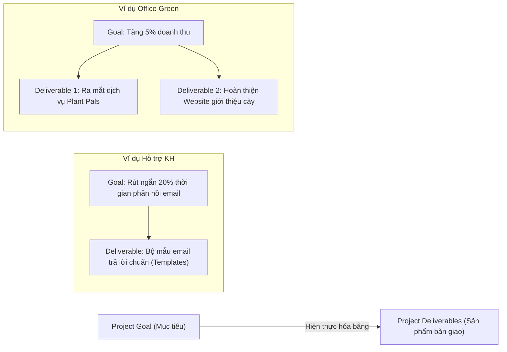

# Course 2: Project Initiation - Starting a Successful Project
## Module 2 - Bài học: Determining Project Goals and Deliverables

---

### 1. Mục tiêu Dự án (Project Goals)

#### A. Định nghĩa & Tầm quan trọng
- **Định nghĩa:** Mục tiêu dự án (*Project Goal*) là kết quả mong muốn cuối cùng (*desired outcome*) mà dự án cần đạt được.
- **Vai trò:** Đóng vai trò như một **bản đồ chỉ đường (Roadmap)**. Nếu không có mục tiêu rõ ràng, đội ngũ sẽ không biết phải đi đâu và làm thế nào để tới đích.

#### B. Thế nào là một Mục tiêu được Định nghĩa Tốt (Well-Defined Goal)?
Một mục tiêu tốt phải đảm bảo tính **Cụ thể (Specific)** và **Đo lường được (Measurable)**:
- Nêu rõ **Cái gì (What):** Kết quả cần đạt.
- Nêu rõ **Cách thức (How):** Phương thức triển khai.
- Nêu rõ **Chỉ số định lượng:** Con số cụ thể để biết chính xác khi nào đã "về đích".

| Tiêu chí | Mục tiêu chưa tốt | Mục tiêu tốt (Well-defined) |
| :--- | :--- | :--- |
| **Ví dụ 1 (Hỗ trợ KH)** | Cải thiện thời gian trả lời email khách hàng. | Cải thiện thời gian phản hồi yêu cầu của khách hàng **qua email** thêm **20%**. |
| **Ví dụ 2 (Office Green)** | Tăng doanh thu bán cây. | Tăng doanh thu của Office Green thêm **5%** thông qua **dịch vụ mới Plant Pals** cung cấp cây để bàn cho khách hàng hàng đầu **trước cuối năm**. |

#### C. Thống nhất Mục tiêu với Stakeholders & Bài học thực tế
- **Đồng thuận từ đầu:** PM cần trao đổi sâu với Stakeholders về tầm nhìn (*vision*) và sự liên kết với mục tiêu chung của tổ chức (*company's mission*).
- **Case study cảnh báo:** Nhóm của giảng viên từng đặt mục tiêu: *"Giao tính năng sớm và thu thập feedback khách hàng"*. Khi giao đúng hạn, phía khách hàng không có người test để gửi feedback. Dù khách hàng hài lòng về tiến độ bàn giao, nội bộ team lại tranh cãi kéo dài xem dự án có hoàn thành mục tiêu hay không.
- $\rightarrow$ **Bài học:** Mục tiêu phải được định nghĩa rõ ràng, không mập mờ để tránh lãng phí thời gian tranh cãi nội bộ.

---

### 2. Sản phẩm Bàn giao (Project Deliverables)

#### A. Định nghĩa
- **Deliverables** là các sản phẩm, dịch vụ hoặc kết quả cụ thể được tạo ra và bàn giao cho khách hàng, đối tác hoặc nhà tài trợ (*Project Sponsor*) khi kết thúc một nhiệm vụ, sự kiện hoặc quy trình.
- Deliverables là bằng chứng hữu hình giúp **lượng hóa và hiện thực hóa tác động (impact)** của mục tiêu.

#### B. Mối quan hệ giữa Goals và Deliverables

#### C. Các dạng Deliverables phổ biến
- **Vật thể / Số hóa:** Báo cáo phân tích (*Reports*), Tài liệu hướng dẫn (*Documentation*), Tính năng phần mềm (*Software features*), Website.
- **Quy trình / Dịch vụ:** Quy trình vận hành mới (*Processes*), Dịch vụ mới (*Service offerings*).

---

### 3. Nguyên tắc Quản lý Deliverables
- Thống nhất chi tiết kỳ vọng về Deliverables với Stakeholders ngay từ giai đoạn khởi tạo (*Upfront agreement*).
- Gắn chặt Deliverables với **Trách nhiệm giải trình (Accountability)** của từng thành viên trong nhóm.
