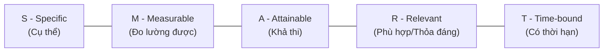

# Course 2: Project Initiation - Starting a Successful Project
## Module 2 - Bài học: How to Set SMART Goals

---

### 1. Khung Phương pháp SMART là gì?
- **Ý nghĩa:** SMART là mô hình chuẩn mực giúp Project Manager và Stakeholders đánh giá, tinh chỉnh và biến các mục tiêu trừu tượng thành những mục tiêu thực tế, có thể theo dõi và thực thi hiệu quả (*Work smarter, not harder*).
- **5 Yếu tố cấu thành:**

---

### 2. Phân tích Chi tiết 5 Yếu tố SMART

#### 1. S - Specific (Cụ thể)
- **Mục đích:** Tránh mục tiêu mơ hồ, giúp định hình rõ khối lượng công việc và ranh giới.
- **Bộ câu hỏi định hướng (cần trả lời ít nhất 2 câu hỏi):**
  - **What:** Tôi muốn hoàn thành điều gì cụ thể?
  - **Why:** Tại sao mục tiêu này lại quan trọng (mục đích, lợi ích mang lại)?
  - **Who:** Những ai tham gia và ai là đối tượng thụ hưởng (nhân viên, khách hàng, cộng đồng)?
  - **Where:** Mục tiêu được triển khai/bàn giao ở đâu?
  - **To what degree:** Các yêu cầu và ràng buộc cụ thể là gì?

#### 2. M - Measurable (Đo lường được)
- **Mục đích:** Cung cấp bằng chứng khách quan để xác định khi nào mục tiêu hoàn thành, giúp theo dõi tiến độ và duy trì động lực cho đội ngũ.
- **Bộ câu hỏi định hướng:** *Bao nhiêu (How much / How many)? Làm sao để biết mục tiêu đã hoàn thành?*
- **Công cụ đo lường:**
  - **Metrics (Chỉ số đo lường):** Số liệu cụ thể như %, USD, số giờ, km,... (Ví dụ: Doanh thu tại Office Green).
  - **Benchmarks (Điểm chuẩn đối sánh):** Dữ liệu lịch sử làm mốc so sánh (Ví dụ: Năm ngoái doanh thu tăng 3% $\rightarrow$ Năm nay đặt mục tiêu tăng 5% là có cơ sở).

#### 3. A - Attainable / Achievable (Tính khả thi)
- **Mục đích:** Cân bằng giữa tính thử thách (để thúc đẩy phát triển) và tính thực tế (tránh thất bại ngay từ đầu).
- **Phương pháp kiểm chứng:** Đặt câu hỏi *"Làm thế nào để hoàn thành?"* $\rightarrow$ **Chia nhỏ mục tiêu (Break down into smaller parts)**:
  - *Ví dụ chạy bộ:* Đang chạy 2.5km $\rightarrow$ Đặt mục tiêu chạy 5km sau 4 tuần (tương ứng mỗi tuần tăng hơn 0.5km) là khả thi.
  - *Ví dụ Office Green:* Tăng 5% doanh thu trong 1 năm (4 quý) $\rightarrow$ Chia nhỏ: Mỗi quý tăng tối thiểu 1.25% doanh thu là hoàn toàn khả thi. Ngược lại, đặt mục tiêu tăng 50% - 100% là phi thực tế nếu không có đột biến lớn.

#### 4. R - Relevant (Tính phù hợp & Thỏa đáng)
- **Mục đích:** Đảm bảo mục tiêu đóng góp trực tiếp vào định hướng, ưu tiên và giá trị cốt lõi của tổ chức.
- **Bộ câu hỏi định hướng:**
  - Nỗ lực bỏ ra có xứng đáng với lợi ích thu lại (*Effort vs. Benefits*)?
  - Có phù hợp với bối cảnh kinh tế, xã hội và năng lực duy trì dài hạn của doanh nghiệp không?
  - Sản phẩm/dịch vụ sau khi bàn giao có người tiếp tục sử dụng không?
- *Lưu ý:* Nếu có bất kỳ sự hoài nghi nào về tính phù hợp, PM cần chủ động trao đổi thẳng thắn với Senior Stakeholders và quản lý trực tiếp.

#### 5. T - Time-bound (Có thời hạn xác định)
- **Mục đích:** Đặt ra Deadline rõ ràng để tạo cam kết, ngăn ngừa sự trì hoãn và phân bổ tiến độ theo thời gian.
- *Ví dụ:* Tăng 5% doanh thu **trước ngày 31/12 (by the end of the year)**.

---

### 3. Bảng Tổng hợp Áp dụng SMART vào Dự án Office Green

| Yếu tố SMART | Phân tích thực tế cho Office Green |
| :--- | :--- |
| **Specific** | Tăng doanh thu thông qua việc ra mắt dịch vụ mới *Plant Pals* cung cấp cây để bàn cho khách hàng lớn. |
| **Measurable** | Doanh thu tăng trưởng thêm **5%** (dùng doanh thu năm trước làm Benchmark). |
| **Attainable** | Tăng 5%/năm $\approx$ tăng **1.25%/quý** $\rightarrow$ Khả thi dựa trên năng lực và thị trường. |
| **Relevant** | Mở rộng dịch vụ cây xanh phù hợp với chuyên môn cốt lõi của Office Green và nhu cầu decor văn phòng. |
| **Time-bound** | Hoàn thành mục tiêu **trước cuối năm nay (by the end of the year)**. |

$\Longrightarrow$ **Mục tiêu SMART hoàn chỉnh:** *"Tăng doanh thu của Office Green thêm 5% thông qua việc ra mắt dịch vụ Plant Pals cung cấp cây để bàn cho các khách hàng lớn trước thời điểm kết thúc năm tài chính."*
