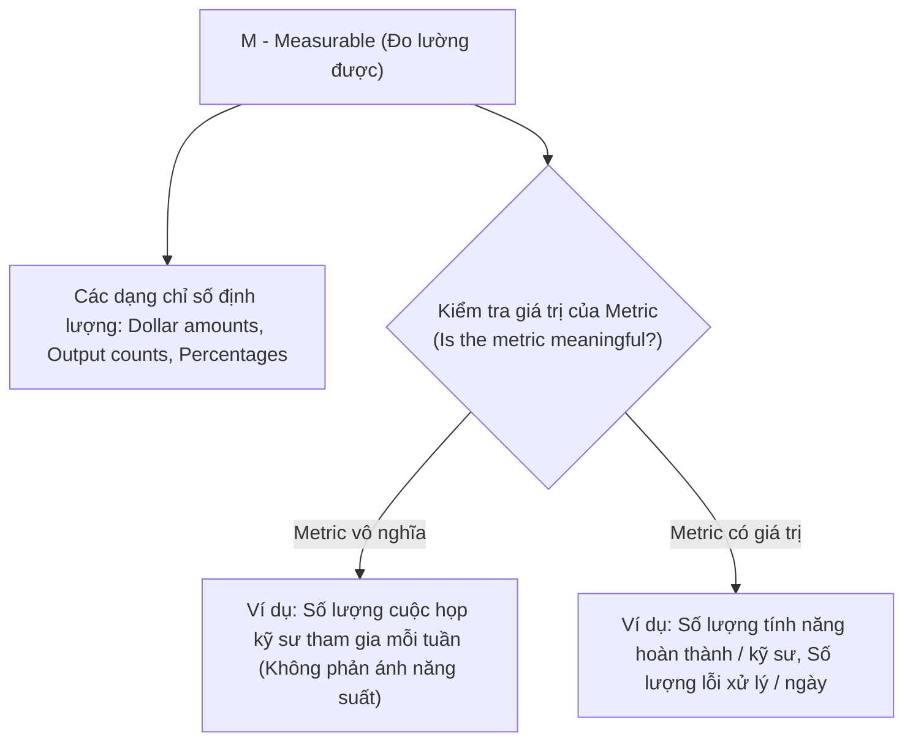

# Course 2: Project Initiation - Starting a Successful Project
## Module 2 - Bài đọc: SMART Goals - Making Goals Meaningful

---

### 1. Ý nghĩa của SMART Goals trong Quản lý Dự án
- Giúp Project Manager nhìn nhận toàn cảnh phạm vi mục tiêu, kiểm chứng tính khả thi và định hình rõ ràng định nghĩa "thành công" bằng các tiêu chí cụ thể (*concrete terms*).
- **Tóm lược 5 tiêu chuẩn cốt lõi:**
  - **Specific (Cụ thể):** Mục tiêu rõ ràng, không có sự mơ hồ (*no ambiguity*) để tránh đội ngũ hiểu sai.
  - **Measurable (Đo lường được):** Có chỉ số cụ thể (*metrics*) giúp xác định chính xác thời điểm hoàn thành.
  - **Attainable (Khả thi):** Toàn bộ đội ngũ đồng thuận rằng mục tiêu mang tính thực tế (*realistic/achievable*).
  - **Relevant (Phù hợp):** Phù hợp với chiến lược tổng thể của tổ chức và hỗ trợ trực tiếp cho Project Charter.
  - **Time-bound (Có thời hạn):** Có mốc thời gian/ngày cụ thể để đạt được kết quả.
- *Lưu ý về các biến thể:* Bạn có thể bắt gặp các từ thay thế như *Actionable/Achievable* (thay cho Attainable) hoặc *Realistic* (thay cho Relevant), nhưng bản chất cốt lõi không thay đổi.

---

### 2. Đào sâu vào chữ "M" - Measurable (Tính Đo lường được)

- **Tầm quan trọng:** Loại bỏ hoàn toàn sự mập mờ giữa kỳ vọng của các bên liên quan (*Stakeholders' expectations*).
- **Lựa chọn Chỉ số có ý nghĩa (Meaningful Metrics):**
  - Không phải mọi số liệu đo được đều mang lại giá trị cho dự án.
  - **Tránh các chỉ số hình thức:** Ví dụ, đo *số cuộc họp* kỹ sư tham gia không chứng minh được năng suất làm việc.
  - **Tập trung vào chỉ số đo lường giá trị thực:** Đo *số lượng tính năng (features)* hoàn thành trên mỗi kỹ sư, hoặc *số lượng sự cố/bugs* được xử lý triệt để mỗi ngày.

---

### 3. Ví dụ Thực hành: Xây dựng Mục tiêu Cá nhân Chuẩn SMART

**Tình huống:** Bạn muốn chuyển hướng sự nghiệp và đặt mục tiêu học chứng chỉ Google Career Certificate.

| Thành phần SMART | Triển khai thực tế |
| :--- | :--- |
| **Specific** | Đạt được chứng chỉ Google Career Certificate. |
| **Measurable** | Kết quả hữu hình kiểm chứng được: Nhận chứng chỉ chính thức sau khi hoàn thành toàn bộ khóa học. |
| **Attainable** | Chia nhỏ lộ trình học tập khả thi: Hoàn thành **1 khóa học mỗi tháng**. |
| **Relevant** | Phục vụ trực tiếp cho mục tiêu chuyển đổi sự nghiệp sang ngành mới. |
| **Time-bound** | Đặt thời hạn hoàn thành trong vòng **6 tháng tới**. |

$\Longrightarrow$ **Phát biểu SMART Goal hoàn chỉnh:**
> *"Obtain a Google Career Certificate by taking one course per month within the next six months."*  
> *(Đạt được Chứng chỉ Google Career Certificate bằng cách hoàn thành 1 khóa học mỗi tháng trong vòng 6 tháng tới).*

---

### 4. Bài học Rút ra (Key Takeaway)
- Xác định đúng các chỉ số đo lường (*metrics*) giúp PM dễ dàng nắm bắt: **Trạng thái dự án (Status), Thành tựu đạt được (Successes), và Cảnh báo sớm rủi ro chậm trễ (Delays)**.
- Một mục tiêu chuẩn SMART giúp toàn đội ngũ biết chính xác: **"Thành công trông như thế nào và làm thế nào để đi tới đó"**.
