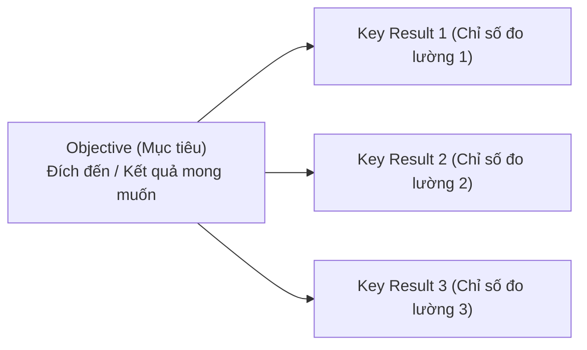
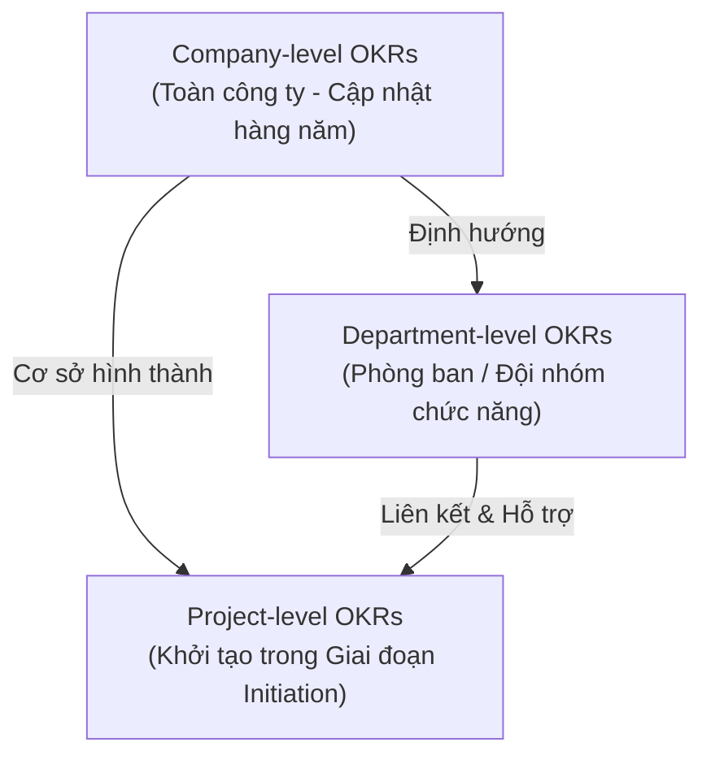

# Course 2: Project Initiation - Starting a Successful Project
## Module 2 - Bài học: Introduction to OKRs (Objectives and Key Results)

---

### 1. Tổng quan về Mô hình OKRs
- **Định nghĩa:** OKR (*Objectives and Key Results*) là khung quản trị mục tiêu nổi tiếng được áp dụng rộng rãi tại Google và các tập đoàn công nghệ hàng đầu thế giới nhằm tập trung thời gian, nguồn lực của đội ngũ vào các hoạt động tạo ra tác động lớn nhất.
- **Cấu tạo 2 thành phần:**
  - **O - Objective (Mục tiêu):** Trả lời câu hỏi *"Tôi muốn đạt được điều gì?" (What needs to be achieved)*. Mô tả đích đến hoặc kết quả mong muốn mang tính định hướng, truyền cảm hứng.
  - **KR - Key Results (Kết quả then chốt):** Trả lời câu hỏi *"Làm thế nào để biết tôi đã đạt được mục tiêu?" (How do we know it's achieved)*. Là các chỉ số định lượng cụ thể để đo lường kết quả.

---

### 2. So sánh OKR và SMART: Khái niệm "Stretch Goals" tại Google
- **Khác biệt cốt lõi:**
  - SMART gom mục tiêu và chỉ số vào một câu hoàn chỉnh, nhấn mạnh tính khả thi (*Attainable - đạt được 100%*).
  - OKR tách biệt rõ ràng giữa *Objective* và *Key Results*, đồng thời khuyến khích thiết lập **Mục tiêu kéo giãn (Stretch Goals)** mang tính tham vọng và thử thách cao.
- **Triết lý tại Google:** OKRs được dùng để thúc đẩy nhân viên vượt qua giới hạn thông thường. Nếu một nhóm hoàn thành đạt $100\%$ tất cả Key Results, điều đó cho thấy OKR đó đã được thiết lập quá an toàn/quá dễ dàng.

---

### 3. Cấu trúc Phân tầng OKRs trong Doanh nghiệp (OKRs Hierarchy)

#### A. Cấp Toàn công ty (Company-level OKRs)
- Định hướng sứ mệnh và chia sẻ minh bạch cho toàn bộ tổ chức (thường rà soát hàng năm).
- **Ví dụ tại Office Green:**
  - **Objective:** Tăng tỷ lệ giữ chân khách hàng bằng cách thích ứng với môi trường làm việc linh hoạt.
  - **Key Results:**
    1. $95\%$ yêu cầu hỗ trợ (phone, chat, email) được giải quyết dứt điểm trong lần liên hệ đầu tiên.
    2. Thử nghiệm (*Pilot*) Top 3 dịch vụ mới cho văn phòng phân tán trước cuối Q2 $\rightarrow$ *(Tiền đề tạo ra dự án Plant Pals)*.
    3. Hệ thống bán hàng và hỗ trợ khách hàng vận hành $24/7$ trước cuối năm.

#### B. Cấp Phòng ban (Department / Team-level OKRs)
- Cụ thể hóa OKRs công ty theo từng chức năng nghiệp vụ riêng biệt.
- **Ví dụ Phòng Kinh doanh (Sales Department):**
  - **Objective:** Mở rộng sự hiện diện của đội ngũ bán hàng trên toàn quốc.
  - **Key Result:** Mở chi nhánh bán hàng mới tại 10 thành phố trước cuối năm.

#### C. Cấp Dự án (Project-level OKRs)
- Thiết lập trong giai đoạn **Khởi tạo (Initiation)** và theo dõi xuyên suốt quá trình **Planning** & **Execution**.
- Phải liên kết trực tiếp và hỗ trợ cho OKRs cấp công ty và phòng ban.
- **Ví dụ cho Dự án Plant Pals:**
  - **Project Objective:** Thu hút khách hàng hiện tại đăng ký sử dụng dịch vụ mới Plant Pals.
  - **Project Key Result:** $25\%$ khách hàng hiện tại đăng ký tham gia chương trình Plant Pals pilot.
