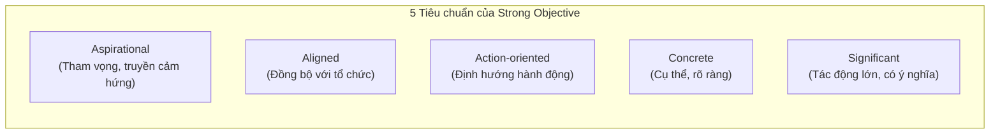

# Course 2: Project Initiation - Starting a Successful Project
## Module 2 - Bài đọc: Creating OKRs for Your Project

---

### 1. Vai trò của OKRs trong Quản lý Dự án
- **Làm rõ mục tiêu & Sản phẩm bàn giao:** Mở rộng từ mục tiêu chung để định hình chi tiết các sản phẩm bàn giao (*Deliverables*).
- **Bảo vệ phạm vi dự án (Scope Protection):** Giúp PM có cơ sở dữ liệu vững chắc để **nói "Không" (Say NO)** trước các yêu cầu phát sinh ngoài lề làm cản trở tiến độ.
- **Tạo động lực bứt phá:** Khuyến khích đội ngũ vượt ra khỏi vùng an toàn với các mục tiêu kéo giãn (*Stretch Goals*).

---

### 2. Hướng dẫn Xây dựng Objectives (Mục tiêu)

- **Khung thời gian chuẩn:** Thường xác định những gì đội ngũ cần đạt được trong **3 – 6 tháng**.
- **Ví dụ tiêu biểu về Objectives:**
  - Xây dựng phần mềm bảo mật dữ liệu an toàn nhất thị trường.
  - Liên tục cải thiện phân tích website và tỷ lệ chuyển đổi (*conversion rates*).
  - Ra mắt ứng dụng có khả năng tương thích toàn diện (*universally-available app*).
  - Đạt vị trí dẫn đầu về doanh số trong khu vực.
- **Bộ câu hỏi định hình Objective:**
  1. *Objective này có đóng góp trực tiếp vào mục tiêu chung của dự án không?*
  2. *Có đồng bộ với OKRs cấp công ty và phòng ban không?*
  3. *Mục tiêu có đủ sức truyền cảm hứng và tạo tác động thực sự lớn (*significant impact*) không?*

---

### 3. Hướng dẫn Xây dựng Key Results (Kết quả then chốt)
Mỗi Objective cần phát triển từ **2 – 3 Key Results**.

- **4 Tiêu chuẩn của Strong Key Results:**
  - **Results-oriented:** Định hướng vào **kết quả đầu ra**, TUYỆT ĐỐI KHÔNG PHẢI là danh sách việc cần làm (*Not a task*).
  - **Measurable & Verifiable:** Đo lường được bằng số liệu và có thể kiểm chứng độc lập.
  - **Specific & Time-bound:** Cụ thể và gắn liền với hạn chót (*Deadline*).
  - **Aggressive yet Realistic:** Đầy tham vọng, có tính thách thức nhưng vẫn nằm trong khả năng thực hiện.
- **Ví dụ tiêu biểu về Key Results:**
  - Tăng $X\%$ lượng đăng ký mới trong quý đầu tiên sau khi ra mắt.
  - Tăng chi tiêu của nhà quảng cáo thêm $X\%$ trong 2 quý đầu năm.
  - Tỷ lệ người dùng chấp nhận tính năng mới đạt tối thiểu $X\%$ trước cuối năm.
  - Tối đa 2 lỗi nghiêm trọng (*critical bugs*) được khách hàng phản ánh mỗi tháng / mỗi Sprint.
  - Duy trì tỷ lệ hủy đăng ký nhận bản tin dưới $X\%$ trong năm nay.
- **Bộ câu hỏi định hình Key Results:**
  1. *Thành công trông như thế nào khi hoàn thành mục tiêu này?*
  2. *Chỉ số (metrics) nào chứng minh chúng ta đã đạt được Objective một cách khách quan nhất?*

---

### 4. Nguyên tắc Vàng (Best Practices)
1. **Phân định ranh giới tư duy:**
   - **Objective:** Mang tính truyền cảm hứng và định hướng — *"Chúng ta muốn làm gì?" (What)*.
   - **Key Results:** Mang tính chiến thuật và định lượng — *"Làm sao chứng minh chúng ta đã hoàn thành?" (How we verify)*.
2. **Số lượng tối ưu:** Giới hạn **2 – 3 Key Results** cho mỗi Objective để tránh phân tán nguồn lực.
3. **Tích hợp vào quản lý:** Luôn lưu trữ tài liệu OKRs và gắn liên kết (*link*) trực tiếp vào **Kế hoạch Dự án (Project Plan)**.
