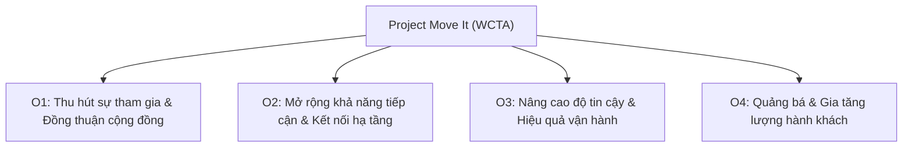

# Course 2: Project Initiation - Starting a Successful Project
## Module 2 - Thực hành: Optional Activity: Create OKRs for Your Project

---

### 1. Tóm tắt Tình huống Dự án "Project Move It"
- **Bối cảnh:** Thành phố Wonder City đang đối mặt với sự gia tăng dân số dự kiến gấp đôi trong 5 năm tới và tăng trưởng việc làm $48\%$, gây áp lực nặng nề lên mạng lưới đường phố, bãi đỗ xe và khả năng di chuyển.
- **Cơ quan chủ quản:** Wonder City Transportation Authority (WCTA).
- **Dự án:** **Project Move It** – Ra mắt **5 tuyến xe buýt mới**.
- **Các ràng buộc và yêu cầu chính:**
  1. Hoàn thành dự án trong vòng **2 năm**.
  2. Cần sự đồng thuận và ủng hộ từ cộng đồng cư dân về vị trí các điểm dừng (*Community buy-in*).
  3. Tuân thủ toàn bộ các quy định pháp lý của chính phủ.
  4. Các trạm dừng phải kết nối vùng ngoại ô với trung tâm thành phố (*downtown*) và các cơ sở công ích (*public resource facilities*).
  5. Phục vụ ít nhất **$50\%$** các khu vực đông dân cư nhất của Wonder City.
  6. Mục tiêu cải thiện thời gian chờ xe (*wait times*) và tăng lượng hành khách (*ridership*).
  7. Triển khai chiến dịch tiếp thị (*marketing campaign*) để quảng bá các tuyến xe mới.

---

### 2. Bộ OKRs Hoàn chỉnh cho "Project Move It" (Mẫu nộp & Portfolio)

#### OKR 1: Community Engagement (Đồng thuận cộng đồng)
- **Objective 1 (O1):** *Actively and meaningfully engage the public to generate buy-in and project support.*  
  *(Chủ động và tích cực thu hút sự tham gia của công chúng để tạo sự đồng thuận và ủng hộ cho dự án).*
- **Key Results:**
  - **KR1:** Tổ chức tối thiểu **10 diễn đàn tiếp thu ý kiến cộng đồng** tại các khu vực ngoại ô trong vòng 6 tháng đầu tiên.
  - **KR2:** Đạt tỷ lệ phê duyệt từ cộng đồng từ **$85\%$ trở lên** đối với các vị trí trạm dừng được đề xuất trước khi chốt lộ trình.
  - **KR3:** Tiếp cận **50,000 cư dân** tham gia khảo sát trực tuyến và đóng góp ý kiến số trước cuối Năm 1.

#### OKR 2: Accessibility & Connectivity (Khả năng tiếp cận & Kết nối)
- **Objective 2 (O2):** *Make it easy to get around the greater Wonder City area via public transportation.*  
  *(Tạo sự thuận tiện tối đa cho việc di chuyển trong toàn khu vực Wonder City thông qua giao thông công cộng).*
- **Key Results:**
  - **KR1:** Kết nối **$100\%$** các khu vực ngoại ô được chỉ định với khu trung tâm (*downtown*) và các cơ sở công ích trọng điểm trong vòng 2 năm.
  - **KR2:** Đảm bảo 5 tuyến xe buýt mới phủ sóng ít nhất **$60\%$** các khu vực mật độ dân số cao nhất thành phố khi đi vào vận hành (vượt chỉ tiêu tối thiểu $50\%$).
  - **KR3:** Hoàn thành lắp đặt nhà chờ xe buýt đạt chuẩn tiếp cận cho người khuyết tật tại **$100\%$** các điểm dừng mới trong vòng 18 tháng.

#### OKR 3: Service Reliability & Efficiency (Độ tin cậy & Hiệu quả dịch vụ)
- **Objective 3 (O3):** *Provide a reliable and consistent public transportation service.*  
  *(Cung cấp dịch vụ vận tải công cộng đáng tin cậy, an toàn và ổn định).*
- **Key Results:**
  - **KR1:** Rút ngắn thời gian chờ xe trung bình của hành khách thêm **$20\%$** trong các khung giờ cao điểm trong 6 tháng đầu sau khi khai trương.
  - **KR2:** Duy trì tỷ lệ đúng giờ (*on-time performance*) đạt từ **$95\%$ trở lên** trên cả 5 tuyến mới trong năm đầu vận hành.
  - **KR3:** Xử lý và khắc phục **$100\%$** các sự cố lịch trình hoặc bảo dưỡng kỹ thuật được báo cáo trong vòng 24 giờ.

#### OKR 4: Promotion & Ridership (Quảng bá & Lượng hành khách)
- **Objective 4 (O4):** *Promote public transportation as a convenient alternative to driving.*  
  *(Quảng bá giao thông công cộng thành giải pháp di chuyển tiện lợi thay thế cho lái xe cá nhân).*
- **Key Results:**
  - **KR1:** Triển khai chiến dịch tiếp thị đa kênh tiếp cận ít nhất **200,000 người đi làm hàng ngày** trong vòng 3 tháng trước ngày ra mắt.
  - **KR2:** Tăng tổng lượng hành khách sử dụng phương tiện công cộng lên **$25\%$** trong năm đầu tiên đưa vào hoạt động.
  - **KR3:** Chuyển đổi thành công **$15\%$** người lái xe cá nhân dọc các hành lang tuyến mới sang sử dụng xe buýt thường xuyên trong vòng 12 tháng sau khi ra mắt.

---

### 3. Hướng dẫn nộp bài trên Coursera
- Đối với câu hỏi trắc nghiệm kiểm tra: *"Have you reviewed or completed this activity?"*
  - Chọn đáp án: **`Yes`**
