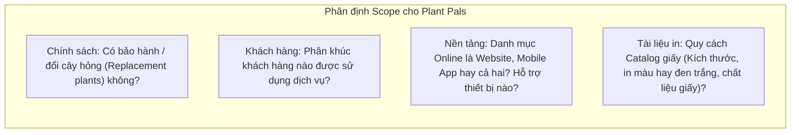

# Course 2: Project Initiation - Starting a Successful Project
## Module 2 - Bài học: Determining a Project's Scope

---

### 1. Định nghĩa Phạm vi Dự án (Project Scope)
- **Khái niệm chuẩn tại Google:**
  > *"An agreed upon understanding as to what is included or excluded from a project."*  
  *(Sự thống nhất và đồng thuận chung về những gì ĐƯỢC BAO GỒM và BỊ LOẠI TRỪ khỏi một dự án).*
- **Bản chất của Scope:** Là **Ranh giới (Boundaries)** giúp định hình rõ ràng khối lượng công việc, đối tượng thụ hưởng và người dùng cuối (*End-users*).
- **Mối liên hệ ràng buộc:** Scope gắn liền với **Timeline (Thời gian)**, **Budget (Ngân sách)** và **Resources (Nguồn lực)**.
- **Rủi ro khi Scope mơ hồ (*Poorly-defined Scope*):** Gây biến động ngân sách, chậm trễ tiến độ hoặc làm sai lệch hoàn toàn kết quả đầu ra cuối cùng.

---

### 2. Ví dụ Phân tích Scope trong Dự án Office Green (Plant Pals)

---

### 3. Phương pháp Xác định Scope Chuẩn xác

Để làm rõ ranh giới dự án, Project Manager cần làm việc trực tiếp với **Project Sponsor** và các **Stakeholders** chủ chốt.

#### Bộ câu hỏi cốt lõi định hình Scope:
1. **Nguồn gốc:** *Dự án này bắt nguồn từ đâu (Where did it come from)?*
2. **Tính cần thiết:** *Tại sao dự án này lại cần thiết cho doanh nghiệp (Why is it needed)?*
3. **Kỳ vọng:** *Dự án được kỳ vọng sẽ đạt được những kết quả cụ thể nào (Expected outcomes)?*
4. **Tầm nhìn của Sponsor:** *Nhà tài trợ dự án đang hình dung điều gì trong đầu (What does the sponsor have in mind)?*
5. **Thẩm quyền nghiệm thu:** *Ai là người có quyền phê duyệt kết quả cuối cùng (Who approves the final results)?*
6. **Ranh giới loại trừ (*Crucial*):** *Những hạng mục nào **KHÔNG** thuộc phạm vi dự án này?*

---

### 4. Thời điểm Thiết lập & Trách nhiệm của PM
- **Thời điểm vàng:** Phải được xác lập ngay từ **giai đoạn đầu (Initiation / Initial Planning)** để toàn bộ các bên cùng đồng thuận trên một hệ quy chuẩn kỳ vọng, giảm thiểu nguy cơ phát sinh thay đổi lớn về sau.
- **Tài liệu hóa:** Mọi chi tiết về Scope phải được ghi chép minh bạch để làm căn cứ đối chiếu trong suốt vòng đời dự án.
- **Trách nhiệm bảo vệ Scope (Scope Defense):** PM có trách nhiệm giám sát để mọi đầu việc và tài nguyên sử dụng đều nằm trong ranh giới đã duyệt, đồng thời định hướng các thành viên tập trung vào các nhiệm vụ quan trọng nhất.
