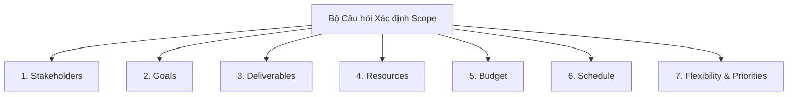

# Course 2: Project Initiation - Starting a Successful Project
## Module 2 - Bài đọc: Gathering Information to Define Scope

---

### 1. Thách thức khi Tiếp nhận Yêu cầu Mơ hồ
- **Tình huống minh họa:** Quản lý tập đoàn nhà hàng gọi điện cho bạn và chỉ nói ngắn gọn: *"Hãy nâng cấp không gian phòng ăn"* rồi cúp máy.
- **Thực tế quản trị:** Đây là kiểu giao việc thường gặp. Nếu bắt tay vào làm ngay mà không làm rõ phạm vi, dự án chắc chắn sẽ thất bại, đội chi phí và phải làm lại từ đầu (*rework*).

---

### 2. Bộ Khung Câu hỏi Thu thập Thông tin để Xác định Scope

Để xác định chính xác ranh giới dự án (*Boundaries*), Project Manager cần chủ động phỏng vấn và thu thập thông tin theo 7 nhóm câu hỏi trọng tâm:

| Nhóm thông tin | Các câu hỏi trọng tâm cần đặt ra |
| :--- | :--- |
| **1. Stakeholders (Bên liên quan)** | - Quyết định nâng cấp bắt nguồn từ đâu (Chủ nhà hàng, phản hồi từ khách hàng hay bộ phận khác)? - Ai là người có thẩm quyền cao nhất phê duyệt Scope của dự án? |
| **2. Goals (Mục tiêu)** | - Lý do cốt lõi của việc nâng cấp là gì? - Không gian hiện tại đang gặp những bất cập gì? - Kết quả mong đợi cuối cùng của dự án là gì? |
| **3. Deliverables (Sản phẩm bàn giao)** | - Chính xác là khu vực phòng ăn nào cần nâng cấp? - Những hạng mục cụ thể nào cần thay đổi (sơn lại tường, thay bàn ghế, sửa ánh sáng)? - Dự án chỉ dừng ở mức chỉnh trang nhẹ hay đại tu cải tạo (*full remodel*)? |
| **4. Resources (Nguồn lực)** | - Cần những vật tư, thiết bị và nhân sự nào? - Có cần thuê nhà thầu ngoài (*contractors*) không? - Có cần xin giấy phép xây dựng (*building permits*) và bản vẽ mặt bằng (*floor plans*) không? |
| **5. Budget (Ngân sách)** | - Tổng ngân sách dự kiến là bao nhiêu? - Ngân sách này là cố định nghiêm ngặt (*fixed*) hay có thể co giãn linh hoạt (*flexible*)? |
| **6. Schedule (Tiến độ)** | - Đội ngũ có bao nhiêu thời gian để hoàn thành? - Hạn chót (*Deadline*) bắt buộc bàn giao là ngày nào? |
| **7. Flexibility & Priorities (Độ linh hoạt & Ưu tiên)** | - Đâu là ưu tiên số 1 của lãnh đạo: **Đúng tiến độ (Deadline)**, **Không vượt ngân sách (Budget)**, hay **Đạt chất lượng tối đa (Quality targets)**? |

---

### 3. Bài học Cốt lõi (Key Takeaway)
- **Tư duy 5W1H:** Luôn đảm bảo bạn đã nắm rõ **Who, What, When, Where, Why, How** liên quan đến phạm vi dự án trước khi lập kế hoạch.
- **Giá trị kinh tế:** Dành thời gian đặt câu hỏi chi tiết ở giai đoạn Khởi tạo (*Initiation*) giúp:
  - Cắt giảm chi phí phát sinh không cần thiết.
  - Ngăn ngừa tình trạng đập đi xây lại (*rework*).
  - Loại bỏ sự thất vọng, mơ hồ và xung đột kỳ vọng giữa các bên liên quan.
