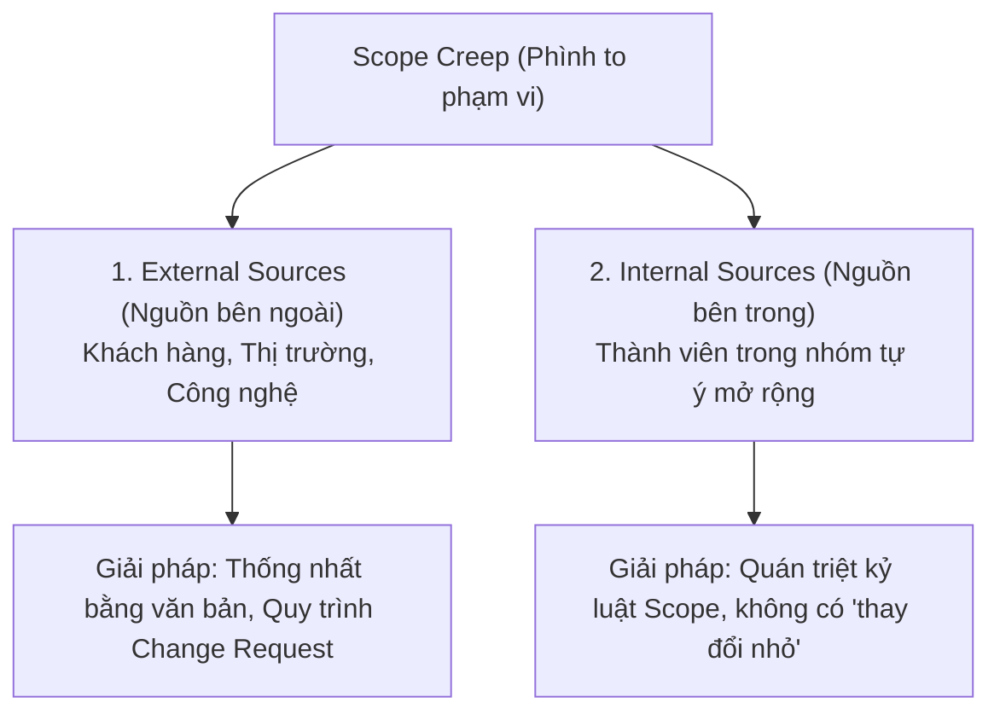

# Course 2: Project Initiation - Starting a Successful Project
## Module 2 - Bài học: Monitoring and Maintaining a Project's Scope

---

### 1. Phân biệt In-Scope và Out-of-Scope
- **In-Scope (Trong phạm vi):** Toàn bộ các nhiệm vụ, tính năng và công việc được phê duyệt chính thức trong kế hoạch nhằm đóng góp trực tiếp vào mục tiêu dự án.
- **Out-of-Scope (Ngoài phạm vi):** Bất kỳ công việc, tính năng hoặc ý tưởng nào không nằm trong kế hoạch ban đầu (Ví dụ: Đội ngũ thiết kế muốn bổ sung thêm các loại cây quý hiếm vào catalog *Plant Pals* mà chưa được duyệt ngân sách).

---

### 2. Hiện tượng Phình to Phạm vi (Scope Creep)

#### A. Định nghĩa chuẩn (In-Video Question)
> **Scope Creep là gì?**  
> **Đáp án chính xác:** *Changes, growth, and uncontrolled factors that affect a project scope at any point after the project begins.*  
> *(Những thay đổi, sự phình to và các yếu tố không được kiểm soát tác động lên phạm vi dự án tại bất kỳ thời điểm nào sau khi dự án đã bắt đầu).*

#### B. Ví dụ Điển hình trong Công nghệ
1. **Ban đầu:** Dự án chỉ yêu cầu cập nhật lại thiết kế *icon chuyển đổi ngôn ngữ* trên bàn phím điện thoại.
2. **Phát sinh nhỏ:** Đội ngũ thấy tiện nên tự ý làm mới luôn *icon tìm kiếm* và *icon nhập giọng nói*.
3. **Lan rộng (Creep):** Stakeholder thấy vậy liền đề xuất thiết kế thêm *bộ layout bàn phím cho nhiều ngôn ngữ mới*.
4. **Hậu quả:** Từ việc sửa 1 icon đơn giản biến thành một đợt phát hành phức tạp, gây trễ hạn bàn giao (*timeline*), làm đội chi phí làm thêm giờ (*overtime budget*), và thiếu hụt nhân sự (*resourcing*).

---

### 3. Hai Nguồn gốc gây ra Scope Creep & Giải pháp Ứng phó

#### 1. Nguồn Bên ngoài (External Sources - Dễ nhận diện)
- **Nguyên nhân:** Khách hàng liên tục đòi hỏi tính năng mới, môi trường kinh doanh thay đổi hoặc công nghệ nền tảng bị nâng cấp. Nguyên nhân gốc rễ thường do yêu cầu (*requirements*) ban đầu không rõ ràng và thiếu cam kết văn bản.
- **Chiến lược kiểm soát:**
  - **Minh bạch hóa (Visibility):** Giúp Stakeholders hiểu rõ tài nguyên, chi phí và thời gian cần thiết.
  - **Cam kết bằng văn bản (*In writing*):** Luôn chốt yêu cầu, quy trình, mốc bàn giao (*milestones*) thành văn bản pháp lý trước khi thực hiện.
  - **Quy trình Quản lý Thay đổi (*Change Request Process*):** Quy định rõ ai là người có thẩm quyền đề xuất thay đổi và cơ chế đánh giá/phê duyệt phát sinh.

#### 2. Nguồn Bên trong (Internal Sources - Khó phát hiện & khó kiểm soát hơn)
- **Nguyên nhân:** Thành viên trong nhóm tự ý "nâng cấp" sản phẩm (*Gold plating*) với suy nghĩ "làm cho sản phẩm tốt hơn" hoặc tự ý đổi quy trình mà không tính đến tác động dây chuyền sang các bộ phận khác.
- **Chiến lược kiểm soát:**
  - Quán triệt nguyên tắc: **Không có tác động nào là nhỏ đối với Scope.**
  - Mọi công việc ngoài kế hoạch đều trực tiếp làm giảm lợi nhuận (*bottom line*), đe dọa tiến độ (*schedule*) và gia tăng rủi ro (*risk*).

---

### 4. Trách nhiệm của Project Manager
- Nắm vững mọi chi tiết của dự án từ trong ra ngoài (*know details in and out*).
- **Bảo vệ phạm vi dự án bằng mọi giá (*Protect scope at all costs*)** để bảo vệ đội ngũ và đảm bảo dự án về đích thành công.
