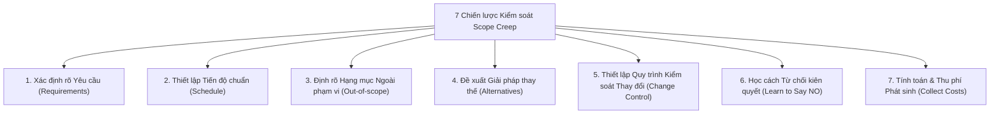

# Course 2: Project Initiation - Starting a Successful Project
## Module 2 - Bài đọc: Strategies for Controlling Scope Creep

---

### 1. Tác hại của Scope Creep đối với Dự án
- **Scope Creep** là hiện tượng khối lượng công việc mở rộng dần vượt ra khỏi các thỏa thuận ban đầu đã ký duyệt trong giai đoạn Khởi tạo (*Initiation*).
- **Hệ quả tiêu cực:** Gây áp lực tâm lý (*stress*) nặng nề lên đội ngũ, trực tiếp đe dọa bộ ba ràng buộc: **Tiến độ (Schedule), Ngân sách (Budget), Nguồn lực (Resources)** và có thể đẩy dự án tới nguy cơ thất bại.

---

### 2. 7 Chiến lược Quản lý & Kiểm soát Scope Creep Chuẩn mực

| Chiến lược | Hành động cụ thể của Project Manager |
| :--- | :--- |
| **1. Define project requirements** | Trao đổi sâu với Stakeholders/Khách hàng để nắm chính xác mong đợi và **văn bản hóa toàn bộ yêu cầu** ngay từ pha Khởi tạo. |
| **2. Set a clear project schedule** | Lập lịch trình chi tiết, liên kết chặt chẽ từng nhiệm vụ (*tasks*) với các yêu cầu bắt buộc của dự án. |
| **3. Determine what is out of scope** | Chỉ rõ ranh giới những gì **KHÔNG LÀM**; thống nhất bằng văn bản về các rủi ro và tác động nếu cố tình thêm vào. |
| **4. Provide alternatives** | Thay vì bác bỏ thẳng thừng, hãy gợi ý các giải pháp thay thế khả thi; thực hiện phân tích Chi phí - Lợi ích (*CBA*) để chứng minh rủi ro. |
| **5. Set up a change control process** | Xây dựng quy trình chuẩn hóa: Cách thức tiếp nhận, hội đồng đánh giá, và tiêu chí phê duyệt/từ chối (*approve/reject*) yêu cầu thay đổi trước khi cập nhật vào kế hoạch. |
| **6. Learn how to say NO** | Kiên quyết từ chối các yêu cầu vô lý bằng cách giải thích dựa trên số liệu thực tế: Cho thấy thay đổi sẽ làm vỡ ngân sách (*Budget*), trễ tiến độ (*Timeline*) hoặc quá tải nhân sự (*Resources*) như thế nào. |
| **7. Collect costs for out-of-scope work** | Nếu bắt buộc phải thực hiện công việc ngoài phạm vi, phải ghi nhận và tính toán đầy đủ toàn bộ chi phí trực tiếp và gián tiếp phát sinh để yêu cầu bổ sung ngân sách. |

---

### 3. Bài học Cốt lõi (Key Takeaway)
- Scope Creep chỉ có thể được kiểm soát chủ động khi:
  1. Toàn bộ các bên liên quan **thấu hiểu và ký duyệt** ranh giới, trách nhiệm và thời hạn bàn giao.
  2. Duy trì kênh giao tiếp minh bạch và liên tục **quản lý kỳ vọng (Expectation Management)**.
  3. Tuân thủ nghiêm ngặt quy trình kiểm soát thay đổi (*Change Control*) thay vì chấp thuận các thỏa thuận miệng ngoài lề.
