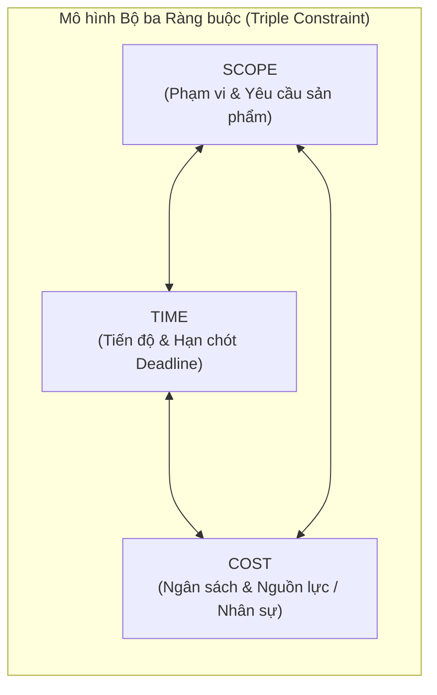

# Course 2: Project Initiation - Starting a Successful Project
## Module 2 - Bài học: Managing Changes to a Project's Scope

---

### 1. Bản chất Quản lý Thay đổi Phạm vi & Sự Đánh đổi (Trade-offs)
- **Mối liên hệ giữa Scope & Goal:** Thay đổi phạm vi sẽ làm thay đổi mục tiêu, và ngược lại.
- **Mục tiêu tối thượng của Project Manager:** Bàn giao sản phẩm đúng với thỏa thuận phạm vi đã cam kết, **đúng hạn (on-time)** và **trong ngân sách được duyệt (within budget)**.
- **Thực tế quản trị:** Thay đổi là điều không thể tránh khỏi. PM phải liên tục cân nhắc các **sự đánh đổi (Trade-offs)** khi xuất hiện các yếu tố bất ngờ.

---

### 2. Mô hình Bộ ba Ràng buộc (The Triple Constraint Model)

Mô hình Tam giác Quản lý Dự án kết hợp 3 ràng buộc quan trọng nhất của mọi dự án:

- **Nguyên lý cốt lõi:** **Cả 3 yếu tố liên kết chặt chẽ — Không thể thay đổi một đỉnh tam giác mà không tác động tới hai đỉnh còn lại.**
  - Muốn **Tăng Scope** $\longrightarrow$ Phải **Tăng Time** (kéo dài lịch) hoặc **Tăng Cost** (thêm tiền/người).
  - Bị **Giảm Cost** $\longrightarrow$ Phải **Cắt giảm Scope** hoặc **Kéo dài Time**.
  - Bị **Rút ngắn Time** (ép deadline) $\longrightarrow$ Phải **Tăng Cost** (làm thêm giờ/thuê ngoài) hoặc **Giảm Scope**.

---

### 3. Phân tích 4 Kịch bản Thực tế (Scenarios)

| Kịch bản | Yêu cầu phát sinh | Yếu tố Cố định | Quyết định Đánh đổi (Trade-off) |
| :--- | :--- | :--- | :--- |
| **Kịch bản 1** | Giám đốc muốn thêm tính năng: Chậu cây có báo hiệu tưới nước (**Tăng Scope**). | **Budget cố định** (Không được tăng tiền). | $\Longrightarrow$ **Kéo dài Timeline** để đội ngũ có đủ thời gian nghiên cứu và sản xuất. |
| **Kịch bản 2** | Công ty yêu cầu cắt giảm chi phí (**Giảm Cost**). | **Scope cố định** (Sản phẩm vẫn phải đủ tính năng như ban đầu). | $\Longrightarrow$ **Kéo dài Timeline** vì nguồn lực và tốc độ làm việc bị thu hẹp. |
| **Kịch bản 3** | Cần hoàn thành sớm hơn dự kiến (**Giảm Time**). | **Budget cố định** (Không thể thuê thêm nhân sự). | $\Longrightarrow$ **Cắt giảm bớt Scope** (Ví dụ: Giảm bớt các tùy chọn vận chuyển để bớt thời gian đàm phán hợp đồng). |
| **Kịch bản 4** | Khách hàng/Lãnh đạo yêu cầu **Deadline là ưu tiên số 1** (Bất khả xâm phạm). | **Time cố định**. | $\Longrightarrow$ **Tăng Budget** (chi thêm tiền) và điều chỉnh Scope linh hoạt để đảm bảo bàn giao đúng ngày. |

---

### 4. Quy tắc Ra Quyết định cho Project Manager
1. **Xác định Ưu tiên Số 1:** Luôn hỏi rõ Stakeholders yếu tố nào là tối quan trọng: **Scope, Time, hay Cost?**
2. **Không tự ý quyết định một mình:** Mọi thay đổi lớn về Scope làm biến động Budget hoặc Timeline phải được **Project Sponsor & Key Stakeholders phê duyệt chính thức**.
3. **Nguyên tắc "Cần thiết vs. Có thể":** Chỉ vì dự án *có thể* thay đổi không có nghĩa là bạn *nên* thay đổi. Hãy bảo vệ ranh giới Scope trừ khi có lý do kinh doanh thực sự thuyết phục.
