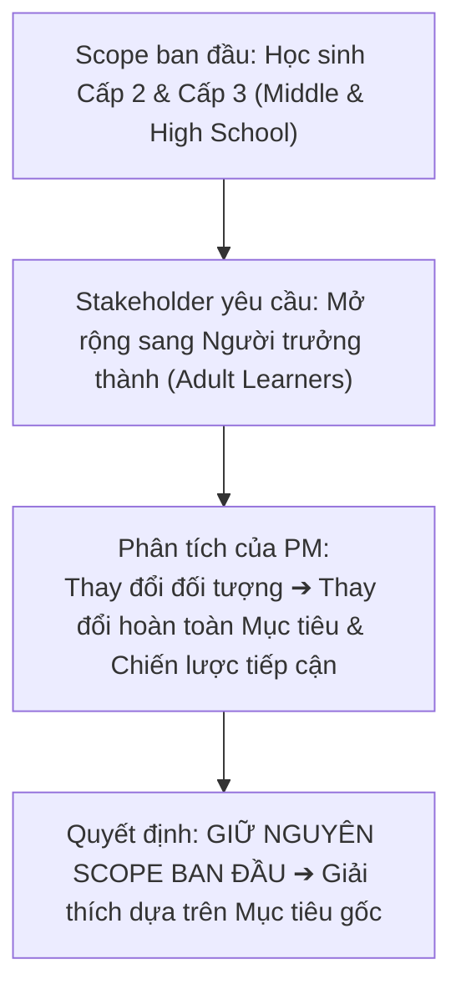

# Course 2: Project Initiation - Starting a Successful Project
## Module 2 - Bài học: Torie - The Importance of Staying Within Scope

---

### 1. Giới thiệu Diễn giả & Bối cảnh
- **Diễn giả:** **Torie** – *Education Program Manager tại Google*.
- **Dự án thực tế:** Phụ trách chương trình **Applied Digital Skills** (giáo trình phổ cập kỹ năng số thực tế giúp người học ở nhiều lứa tuổi sẵn sàng cho thị trường lao động).

---

### 2. Tầm quan trọng của việc Tuân thủ Phạm vi (Staying Within Scope)
- **Đồng thuận từ đầu (Alignment):** Một bản Scope được định nghĩa chi tiết ngay từ ngày đầu giúp đảm bảo toàn bộ nhóm dự án và các Stakeholders cùng nhìn về một hướng (*on the same page*).
- **Phòng ngừa rủi ro:** Giúp ngăn chặn các bất đồng và sự cố tiềm ẩn có thể phát sinh trong quá trình triển khai.

---

### 3. Bài học Thực tế: Xử lý Yêu cầu Mở rộng Đối tượng (Case Study)

- **Tình huống:** Dự án hướng tới phổ cập kỹ năng số cho cộng đồng khó khăn (*underserved communities*), với phạm vi chốt ban đầu là **học sinh THCS và THPT**.
- **Thách thức:** Sau khi dự án khởi chạy, một số Stakeholders yêu cầu mở rộng thêm nhóm **người học trưởng thành (adult learners)**.
- **Cách xử lý của PM:**
  - Nhận diện rằng việc đổi đối tượng mục tiêu sẽ kéo theo sự thay đổi toàn diện về giáo trình, phương pháp truyền tải và mục tiêu cốt lõi.
  - **Quyết định:** Giữ nguyên phạm vi ban đầu (*Keep original scope*), viện dẫn lại văn bản cam kết mục tiêu gốc và giải thích rõ ràng cho Stakeholders.

---

### 4. Lời khuyên Thực hành Tốt nhất (Best Practices)
1. **Tài liệu hóa & Phê duyệt minh bạch:** Ghi lại toàn bộ chi tiết phạm vi dự án từ ban đầu, chia sẻ công khai và nhận sự đồng thuận chính thức từ mọi bên liên quan.
2. **Quy tắc điều chỉnh bắt buộc:** Trường hợp thực sự bắt buộc phải thay đổi Scope, PM phải lập tức đàm phán để **điều chỉnh tương ứng Thời gian (Timeline), Nhân lực (Resources) hoặc Ngân sách (Budget)**.
