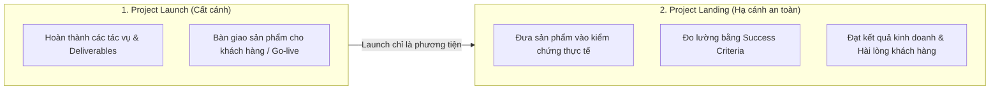

# Course 2: Project Initiation - Starting a Successful Project
## Module 2 - Bài học: Launching and Landing a Project

---

### 1. Khái niệm cốt lõi: Phân biệt "Launch" và "Landing"
Một sai lầm phổ biến của nhiều người là cho rằng dự án đã thành công ngay khi bàn giao sản phẩm cuối cùng cho khách hàng. Tại Google, quản lý dự án phân biệt rõ hai giai đoạn:

- **Project Launch (Cất cánh):** Hoàn tất việc xây dựng, hoàn thành các nhiệm vụ và bàn giao sản phẩm/dịch vụ ra thị trường.
- **Project Landing (Hạ cánh):** Thời điểm thực sự đo lường xem dự án có vận hành hiệu quả và đạt được kết quả mong đợi trong thực tế hay không thông qua **Success Criteria**.

---

### 2. Ẩn dụ Chuyến bay & Ví dụ Thực tế Dự án Plant Pals
- **Hình ảnh ẩn dụ:** Một phi công không chỉ cần biết cách đưa máy bay cất cánh rời khỏi mặt đất, điều quan trọng nhất là phải đưa máy bay hạ cánh an toàn xuống điểm đến.
- **Ví dụ tại Office Green:**
  - **Khi Launch:** Website đã hoạt động, catalog đã in, khách bắt đầu đặt hàng, doanh thu ban đầu tăng $\longrightarrow$ Trông có vẻ thành công rực rỡ trên giấy tờ (*success on paper*).
  - **Rủi ro nếu không Landing thành công:** Sau 2 tuần, cây cảnh để bàn bị héo úa, đổi màu khiến khách hàng bức xúc, hủy hợp đồng.
  - $\Longrightarrow$ **Bài học:** *Launch* chỉ là phương tiện để đi tới đích (*means to an end*). Thành công thực chất chỉ được công nhận sau khi dự án *Landing* thành công và đem lại giá trị bền vững.

---

### 3. Vai trò của Tiêu chí Thành công (Success Criteria)
- **Định nghĩa chuẩn cho Landing:** Vì "hạ cánh" là một khái niệm trừu tượng, PM cần cụ thể hóa nó thông qua **Success Criteria (Tiêu chí thành công)** ngay từ giai đoạn Khởi tạo (*Initiation*).
- **Kim chỉ nam đánh giá:** Success Criteria cung cấp các tiêu chuẩn định lượng và định tính rõ ràng để đo lường toàn diện hiệu quả thực tế của dự án sau ngày phát hành.
