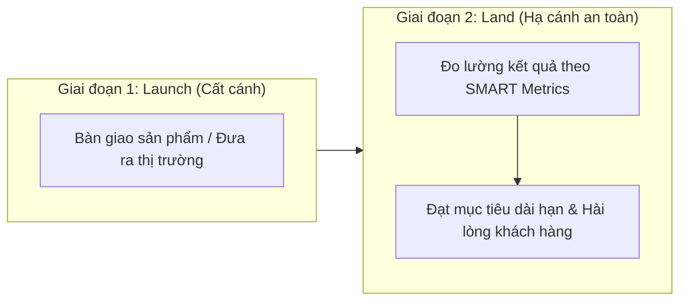

# Course 2: Project Initiation - Starting a Successful Project
## Module 2 - Bài đọc: Don't Forget to Land - Measuring Project Success

---

### 1. Triết lý Quản trị: "Launch First, Land Later"
Nhiều tổ chức thường tổ chức ăn mừng rất lớn vào ngày phát hành sản phẩm (*Project Launch*). Tuy nhiên, một Project Manager chuyên nghiệp luôn ghi nhớ: **Công việc chưa hề kết thúc khi sản phẩm mới chỉ bước ra thị trường.**

- **Mục tiêu tối thượng:** Không dừng lại ở việc phát hành sản phẩm (*Launch*), mà là đưa dự án **"hạ cánh" (*Landing*)** đạt được những giá trị đo lường thành công thực tế.

---

### 2. Ví dụ Điển hình: Dự án Giáo dục Tái chế Năng lượng

**Bối cảnh:** Bạn là PM của một tổ chức môi trường, được giao nhiệm vụ xây dựng chương trình giáo dục tái chế cho học sinh THCS.

| Giai đoạn | Hành động cụ thể | Ý nghĩa quản trị |
| :--- | :--- | :--- |
| **Project Launch** | Mất 1 năm nghiên cứu, biên soạn và bàn giao hoàn chỉnh bộ giáo trình đào tạo cho học khu (*school district*). | **Launch:** Sản phẩm đã hoàn thành và chuyển giao tới tay đối tác. |
| **Project Landing** | Tiến hành khảo sát, đo lường và theo dõi định kỳ trong suốt **5 năm tiếp theo** để kiểm chứng tỷ lệ tái chế của quận có thực sự tăng **$20\%$** hay không. | **Landing:** Chứng minh dự án đạt được tác động thực chất (*Real Impact*) đúng như mục tiêu ban đầu. |

---

### 3. Cạm bẫy "Launch and Forget" (Phát hành rồi Bỏ quên)
- **Định nghĩa sai lầm:** Xảy ra khi PM bàn giao sản phẩm, đối tác ký nhận nghiệm thu, và đội ngũ lập tức giải tán hoặc bỏ quên, không bao giờ quay lại đánh giá mức độ hài lòng của người dùng hay hiệu quả kinh doanh.
- **Hậu quả:** Dự án chỉ là "thành công ảo trên giấy tờ". Nếu không kiểm chứng sau ngày ra mắt, dự án mới chỉ dừng ở mức *Launch* mà chưa hề *Land*.

---

### 4. Bài học Rút ra cho Project Manager (Key Takeaway)
1. **Ăn mừng có chừng mực sau ngày Launch:** Bàn giao sản phẩm là một cột mốc đáng tự hào để thở phào nhẹ nhõm, nhưng hãy sẵn sàng cho chặng đường "Landing".
2. **Kỷ luật bám sát Metrics:** Thường xuyên họp với nhóm, gặp gỡ khách hàng, đối chiếu số liệu vận hành thực tế với bộ tiêu chuẩn **SMART Goals** và **Success Criteria** đã thiết lập từ giai đoạn Khởi tạo (*Initiation*).
3. **Giá trị của một Landing chuẩn xác:** Tạo ra sự đồng thuận tuyệt đối trong toàn tổ chức và mang lại tầm nhìn rõ ràng về thành công thực chất cho mọi thành viên.
