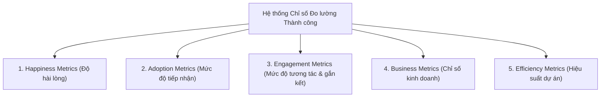

# Course 2: Project Initiation - Starting a Successful Project
## Module 2 - Bài học: Defining Success Criteria

---

### 1. Định nghĩa Tiêu chí Thành công (Success Criteria)
- **Định nghĩa:** Tiêu chí thành công (*Success Criteria*) là tập hợp các chi tiết, tiêu chuẩn và chỉ số định lượng cụ thể dùng để đánh giá toàn diện xem dự án có hoàn thành mục tiêu và đáp ứng kỳ vọng của các bên liên quan sau khi bàn giao hay không.
- **Giá trị cốt lõi:** Định hình rõ cho toàn đội ngũ biết chính xác: *"Làm thế nào để biết dự án đã hoàn thành THÀNH CÔNG?"* chứ không chỉ đơn thuần là bàn giao xong tính năng ra ngoài thị trường.

---

### 2. Các Nhóm Chỉ số Đo lường Thành công (Success Metrics)

| Nhóm chỉ số | Mục đích đo lường | Ví dụ minh họa (Dự án Plant Pals) |
| :--- | :--- | :--- |
| **1. Happiness Metrics** | Đo thái độ, sự hài lòng và cảm nhận về độ dễ sử dụng của người dùng (thông qua bảng khảo sát). | Đạt tỷ lệ hài lòng khách hàng (**CSAT $\ge 85\%$**) trong vòng 3 tháng đầu sau khi ra mắt. |
| **2. Adoption Metrics** | Đo lường mức độ người dùng tiếp nhận và bắt đầu sử dụng sản phẩm/dịch vụ mới. | Số lượng khách hàng doanh nghiệp đăng ký sử dụng dịch vụ Plant Pals trong tháng đầu. |
| **3. Engagement Metrics** | Đo tần suất và mức độ tương tác, gắn bó lâu dài của khách hàng theo thời gian. | Số lượng khách hàng **tái ký hợp đồng (renew)** dịch vụ định kỳ, để lại đánh giá tích cực hoặc giới thiệu khách hàng mới. |
| **4. Business Metrics** | Đo lường tác động tài chính trực tiếp: doanh số, doanh thu, tăng trưởng thị phần. | Doanh thu công ty tăng trưởng thêm **5%** trước thời điểm kết thúc năm tài chính. |
| **5. Efficiency Metrics** | Đo lường hiệu quả vận hành nội bộ của nhóm dự án. | Tỷ lệ hoàn thành công việc đúng tiến độ kế hoạch, mức độ bám sát ngân sách. |

---

### 3. Quy trình Thiết lập & Quản trị Tiêu chí Thành công

1. **Phỏng vấn và thống nhất với Stakeholders:**
   - *Ai là người có thẩm quyền cao nhất ra phán quyết dự án thành công hay không?*
   - *Thành công của dự án sẽ được căn cứ trên những thước đo cụ thể nào?*
2. **Thiết lập Khung thông tin chuẩn cho từng Tiêu chí:**
   - Mỗi Success Criterion trên tài liệu bắt buộc phải có đủ 3 yếu tố:
     $$\text{Phương pháp đo lường (How)} \quad\vert\quad \text{Tần suất đo (How often)} \quad\vert\quad \text{Người chịu trách nhiệm (Who)}$$
3. **Lựa chọn Công cụ theo dõi phù hợp:**
   - **Business Metrics:** Bảng tính (Spreadsheets) hoặc Dashboard trực quan hóa dữ liệu.
   - **Happiness Metrics:** Hệ thống gửi email khảo sát tự động kèm cơ chế khuyến khích phản hồi.
   - **Efficiency Metrics:** Phần mềm quản lý dự án (PM tools) để theo dõi tiến độ công việc và checklist.
4. **Ký duyệt (Sign-off) & Duy trì tính minh bạch:**
   - Lấy xác nhận phê duyệt chính thức (*Sign-off*) từ Key Stakeholders.
   - Công khai và truyền thông xuyên suốt tài liệu này cho toàn đội ngũ để mọi thành viên nắm rõ và ưu tiên các nỗ lực mang lại tác động lớn nhất.
