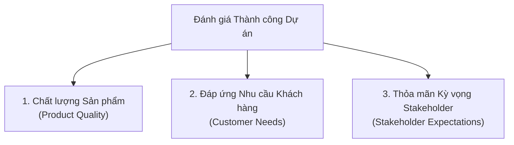
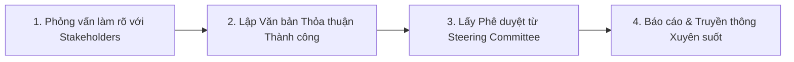

# Course 2: Project Initiation - Starting a Successful Project
## Module 2 - Bài đọc: Tracking and Communicating Success Criteria

---

### 1. 3 Trụ cột Đánh giá Thành công Toàn diện của Dự án
Để đảm bảo dự án "hạ cánh" (*Landing*) thành công, Project Manager cần theo dõi và quản lý chặt chẽ 3 khía cạnh:

---

### 2. Các Bộ Chỉ số Theo dõi Chi tiết

#### A. Chỉ số Đo lường Chất lượng Sản phẩm (Product Quality Metrics)
Được kiểm soát thông qua **Bảng kiểm tra yêu cầu sản phẩm (Product Requirements Checklist)** nhằm đảm bảo không bỏ sót bất kỳ tính năng cốt lõi nào:
- **Thực thi yêu cầu ưu tiên:** Mức độ hoàn thành các tính năng bắt buộc (*Priority requirements*).
- **Kiểm soát lỗi kỹ thuật:** Số lượng sự cố, lỗi hoặc khiếm khuyết phần mềm (*Technical issues / Defects*).
- **Tỷ lệ hoàn thiện tính năng:** Đo lường phần trăm (%) các tính năng được phát hành thành công ở cuối dự án so với cam kết ban đầu (*Percentage of features delivered/released*).
- *Ví dụ:* Một phần mềm soạn thảo văn bản bắt buộc phải đạt chuẩn về nhập liệu, định dạng, lưu trữ và in ấn.

#### B. Chỉ số Đo lường Khách hàng & Mục tiêu Chiến lược (User & Business Metrics)
Gắn liền với bài toán kinh doanh (*Business Case*) và lý do cốt lõi hình thành nên dự án:
- **User Adoption (Mức độ tiếp nhận):** Theo dõi số lượng người dùng mới và doanh số bán hàng (*Sales data*).
- **User Engagement (Mức độ gắn kết):** Đánh giá tần suất và cách thức người dùng tương tác với các tính năng mới theo thời gian.
- **Satisfaction (Độ hài lòng):** Đo lường sự thỏa mãn của khách hàng và các bên liên quan thông qua các đợt khảo sát định kỳ (*Surveys*).

---

### 3. Quy trình Tài liệu hóa, Đồng thuận & Truyền thông (Align & Communicate)

1. **Đặt câu hỏi định hình:**
   - *Ai là người có tiếng nói cuối cùng phán quyết dự án thành công hay thất bại?*
   - *Những tiêu chuẩn định lượng nào sẽ được đưa vào đo lường?*
   - *Sự thành công của dự án dựa trên những yếu tố then chốt nào?*
2. **Ký kết Thỏa thuận chung (Mutual Agreement):**
   - Trình duyệt bộ tiêu chí thành công cho **Ban chỉ đạo (*Steering Committee*)** hoặc các **Key Stakeholders** xem xét và phê duyệt chính thức.
3. **Truyền thông liên tục để ngăn chặn rủi ro:**
   - Dự án luôn đối mặt với biến động. Việc liên tục báo cáo và duy trì tính minh bạch đối với Success Criteria giúp:
     - Ngăn ngừa hiện tượng phình to phạm vi (**Scope Creep**).
     - Loại trừ rủi ro **Lệch pha kỳ vọng (Failed Expectations)** vào thời điểm bàn giao cuối cùng.

---

### 4. Bài học Rút ra (Key Takeaway)
- Success Criteria phải được **văn bản hóa ngay từ giai đoạn Khởi tạo (Upfront documentation)** và liên tục được đối chiếu, báo cáo trong suốt quá trình triển khai dự án.
