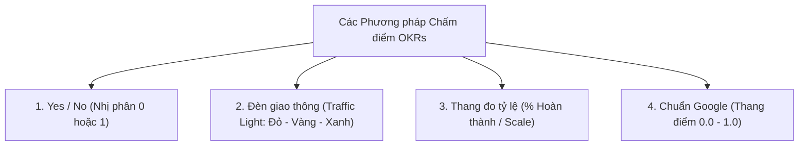
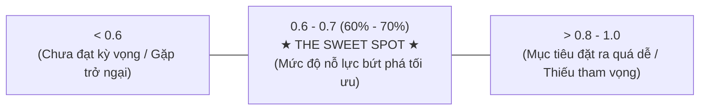

# Course 2: Project Initiation - Starting a Successful Project
## Module 2 - Bài đọc: Using OKRs to Evaluate Progress

---

### 1. Vai trò của OKRs trong Đánh giá Tiến độ Dự án
- OKRs (*Objectives and Key Results*) không chỉ định hình mục tiêu mà còn là công cụ chuẩn mực giúp Project Manager định lượng, truyền thông và đo lường mức độ hoàn thành **Tiêu chí Thành công (Success Criteria)**.
- **2 Yêu cầu Bắt buộc khi Triển khai OKRs:**
  1. **Chia sẻ minh bạch (Share OKRs):** Công khai văn bản OKRs cho toàn bộ nhóm và các bên liên quan qua tài liệu số, cuộc họp hoặc trang nội bộ.
  2. **Gắn trách nhiệm giải trình (Assign Owners):** Mỗi Key Result bắt buộc phải có một **Chủ sở hữu (Owner)** duy nhất chịu trách nhiệm theo dõi và thực thi.

---

### 2. Các Phương pháp Chấm điểm OKRs (OKR Scoring Methods)

| Phương pháp | Cách thức chấm điểm | Ví dụ minh họa |
| :--- | :--- | :--- |
| **Yes / No (0 hoặc 1)** | Đạt = 1, Chưa đạt = 0. Phù hợp cho các đầu việc hoàn thành hoặc không hoàn thành. | *Key Result:* "Ra mắt chiến dịch tiếp thị widget mới" $\longrightarrow$ Đã ra mắt: 1, Chưa ra mắt: 0. |
| **Traffic Light** | - **Đỏ (Red):** Chưa có tiến triển. - **Vàng (Yellow):** Tiến triển một phần. - **Xanh (Green):** Hoàn thành mục tiêu. | Đánh giá nhanh tình trạng sức khỏe của từng Key Result trong báo cáo tổng quan. |
| **Scale / Percentage** | Tính điểm theo tỷ lệ hoàn thành công việc. | *Key Result:* "Ra mắt 6 tính năng mới", thực tế hoàn thành 3 tính năng $\longrightarrow$ Điểm: **0.5 (hoặc 50%)**. |
| **Chuẩn Google (0.0 – 1.0)** | Chấm điểm từng KR từ 0.0 đến 1.0, sau đó tính **điểm trung bình** cho toàn bộ Objective. | Điểm trung bình cả quý đạt 0.65 $\longrightarrow$ Hoàn thành xuất sắc mục tiêu kéo giãn. |

---

### 3. Vùng Điểm Chuẩn Lý tưởng tại Google (The Sweet Spot: 0.6 – 0.7)

Triết lý OKR tại Google gắn liền với các **Mục tiêu kéo giãn (Stretch Goals)**:

- **Điểm dưới 0.6 (< 60%):** Đội ngũ chưa phát huy tối đa năng lực hoặc đang vướng phải các rào cản nghiêm trọng cần tháo gỡ.
- **Điểm từ 0.6 đến 0.7 (60% – 70% - "The Sweet Spot"):** Đây là mức điểm hoàn hảo chứng minh đội ngũ đã đặt mục tiêu đầy tham vọng và nỗ lực hết mình để đạt kết quả bứt phá.
- **Điểm trên 0.8 đến 1.0 (> 80%):** Dấu hiệu cảnh báo mục tiêu được thiết lập quá an toàn, thiếu tính thử thách (*not ambitious enough*).

---

### 4. Lịch trình Kiểm tra & Rà soát (Checkpoints)
- **Hàng tháng (Monthly Check-ins):** Tổ chức họp rà soát tiến độ OKR định kỳ để phát hiện sớm các khúc mắc và kịp thời điều chỉnh kế hoạch.
- **Cuối mỗi Quý (End of Quarter):** Chấm điểm chính thức toàn bộ OKRs, tổng kết thành tựu đạt được và chia sẻ báo cáo minh bạch cho Senior Leaders và Stakeholders.
