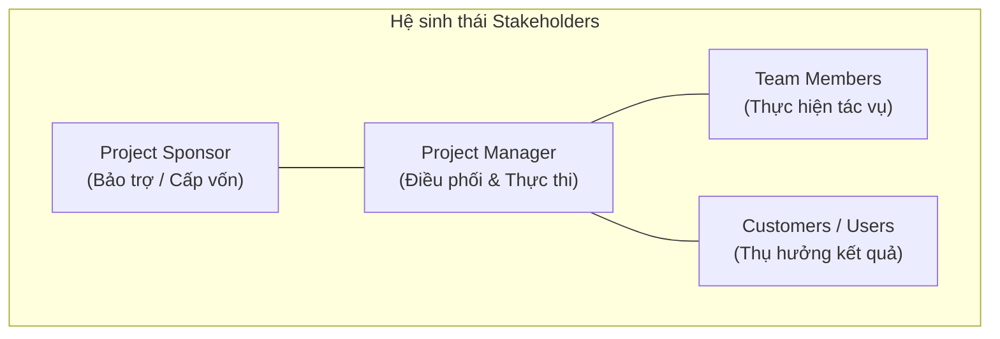

# Course 2: Project Initiation - Starting a Successful Project
## Module 3 - Bài học: Introduction: Working Effectively with Stakeholders

---

### 1. Tổng quan & Kết nối Kiến thức
- **Ôn tập Module trước:** Đã nắm vững cách xác định phạm vi (*Project Scope: In-scope vs. Out-of-scope*), thiết lập mục tiêu chuẩn SMART/OKRs, và phân biệt giữa **Khởi chạy dự án (Launching - Bắt đầu)** với **Hạ cánh dự án (Landing - Hoàn thành thành công)**.
- **Trọng tâm Module 3:** Đi sâu vào yếu tố cốt lõi quyết định sự thành bại của dự án — **Các bên liên quan (Stakeholders)** và phương pháp làm việc hiệu quả với họ.

---

### 2. Định nghĩa & Vai trò của Stakeholders
- **Stakeholders là ai?** Là những cá nhân hoặc nhóm người **quan tâm đến (*interested in*)** và **chịu ảnh hưởng bởi (*affected by*)** sự hoàn thành cũng như mức độ thành công của dự án.
- **Các nhóm vai trò chính trong dự án:**
  - **Project Sponsor (Nhà tài trợ dự án):** Người cấp ngân sách, bảo trợ thẩm quyền và định hướng chiến lược.
  - **Customers (Khách hàng / Người thụ hưởng):** Người sử dụng sản phẩm hoặc hưởng lợi trực tiếp từ kết quả dự án.
  - **Team Members (Thành viên nhóm dự án):** Những người trực tiếp thực thi các hạng mục công việc.
  - **Project Manager (Quản lý dự án):** Người điều phối, kết nối, giám sát tiến độ và đảm bảo dự án "hạ cánh" an toàn, đạt mục tiêu.

---

### 3. Các Công cụ & Kỹ thuật Trọng tâm trong Module 3
Module này sẽ trang bị các công cụ quản trị các bên liên quan thực chiến:
- **Stakeholder Mapping & Analysis (Bản đồ hóa & Phân tích các bên liên quan):** Phân loại mức độ quan tâm (*Interest*) và quyền lực/ảnh hưởng (*Power/Influence*) của từng bên để có chiến lược tương tác phù hợp.
- **RACI Chart (Ma trận RACI):** Công cụ phân định rõ 4 mức độ trách nhiệm:
  - **R - Responsible:** Người trực tiếp thực hiện công việc.
  - **A - Accountable:** Người chịu trách nhiệm giải trình cuối cùng (duy nhất 1 người).
  - **C - Consulted:** Người được tham vấn ý kiến chuyên môn hai chiều.
  - **I - Informed:** Người cần được thông báo/cập nhật thông tin một chiều.
- **Mục đích:** Xóa bỏ sự nhập nhằng về quyền hạn (*ownership*), tối ưu luồng giao tiếp và hạn chế xung đột trong quá trình khởi tạo dự án.
