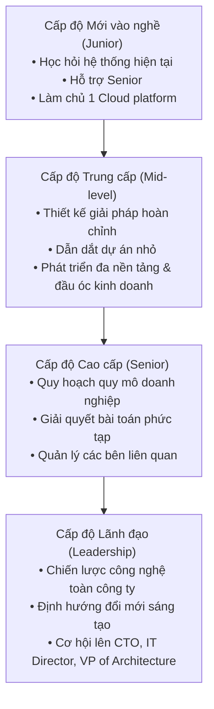

# Cơ hội và Lộ trình Sự nghiệp của Kiến trúc sư Hệ thống (Career Path: Opportunities for Systems Architect)

Tài liệu này tóm tắt lộ trình phát triển sự nghiệp, các hướng chuyên môn hóa và chiến lược tăng tốc để trở thành một Kiến trúc sư Hệ thống chuyên nghiệp từ nhiều xuất phát điểm khác nhau.

---

## 1. Xu hướng tiến hóa của vai trò Kiến trúc sư
*   Vai trò của kiến trúc sư hiện đại đang chuyển dịch mạnh mẽ từ **thực thi kỹ thuật thuần túy** sang **mang lại giá trị chiến lược cho doanh nghiệp**.
*   Kiến trúc sư phối hợp chặt chẽ với các nhà lãnh đạo doanh nghiệp (C-suite) để phân tích bài toán hoàn vốn (ROI), trải nghiệm khách hàng và lợi thế cạnh tranh.

## 2. Bốn hướng Chuyên môn hóa Tăng trưởng cao
1.  **Kiến trúc Đám mây (Cloud Architecture)**: Hướng đi dẫn đầu với quy mô thị trường đám mây toàn cầu dự kiến vượt mốc 800 tỷ USD.
2.  **Kiến trúc Hệ thống AI/ML (AI & Machine Learning Systems)**: Hướng đi mang lại mức thu nhập hàng đầu do sự bùng nổ của các ứng dụng AI.
3.  **Kiến trúc Bảo mật (Security Architecture)**: Nhu cầu tăng mạnh nhằm đối phó với các mối đe dọa an ninh mạng ngày càng phức tạp.
4.  **Chuyên gia Đa đám mây (Multi-cloud Expertise)**: Làm chủ đồng thời các nền tảng lớn (AWS, Azure, GCP) để tối ưu hóa chi phí và hiệu năng cho doanh nghiệp.

## 3. Lộ trình Phát triển Sự nghiệp (Roadmap)

## 4. Các Tuyến đường chuyển dịch Ngành (Transition Paths)
*   **Từ lập trình viên (Development Track)**: Lập trình viên $\rightarrow$ Senior Developer $\rightarrow$ Tech Lead $\rightarrow$ Systems Architect. (Trọng tâm: Mẫu thiết kế, khả năng mở rộng, kỹ năng cộng tác).
*   **Từ vận hành/hạ tầng (Operations Track)**: SysAdmin $\rightarrow$ DevOps Engineer $\rightarrow$ Infrastructure Architect $\rightarrow$ Systems Architect. (Trọng tâm: Di chuyển lên cloud, tự động hóa, khả năng giám sát hệ thống).
*   **Từ nghiệp vụ/tư vấn (Business/Consulting Track)**: Business Analyst $\rightarrow$ Technical BA $\rightarrow$ Solution Architect $\rightarrow$ Systems Architect. (Trọng tâm: Thu thập yêu cầu, quản lý các bên liên quan, phân tích ROI).

## 5. Chiến lược Tăng tốc Sự nghiệp

### Kế hoạch hành động theo thời gian
*   **Năm 1 - 2**: Làm chủ 1 nền tảng đám mây lớn, rèn luyện kỹ năng viết tài liệu kỹ thuật, học cách giao tiếp bằng ngôn ngữ kinh doanh và tìm kiếm người cố vấn (mentor).
*   **Năm 3 - 5**: Mở rộng kỹ năng đa nền tảng, dẫn dắt các dự án quy mô trung bình, tương tác trực tiếp với các bên liên quan và xác định hướng chuyên môn hóa cụ thể.
*   **Năm 5 - 8**: Tập trung vào tầm nhìn quy mô doanh nghiệp lớn (Enterprise perspective), thúc đẩy đổi mới sáng tạo, cố vấn cho cấp dưới và giao tiếp trực tiếp với ban điều hành (executives).

### Quy tắc Học tập 70-20-10
*   **70% thời gian**: Thực hành trực tiếp công việc thiết kế kiến trúc hệ thống (hands-on).
*   **20% thời gian**: Nghiên cứu, học hỏi công nghệ mới.
*   **10% thời gian**: Cố vấn và chia sẻ kiến thức cho người khác (mentoring).

### Hành động tạo tác động lớn (High-impact actions)
Dẫn dắt các dự án liên chức năng, giải quyết các bài toán kỹ thuật phức tạp khó gỡ, xây dựng các mẫu kiến trúc có thể tái sử dụng trong doanh nghiệp, và xây dựng uy tín cá nhân là *"người luôn tìm ra giải pháp vận hành hệ thống thành công"*.
