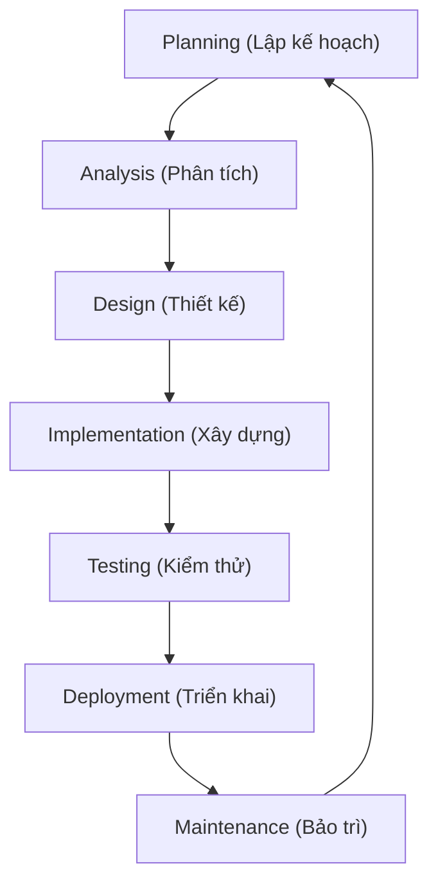

# Tóm tắt: Cơ bản về Hệ thống (Systems Fundamentals)

Tài liệu này tóm tắt các thành phần cốt lõi của một hệ thống và quy trình Vòng đời Phát triển Hệ thống (SDLC).

---

## 1. Các thành phần cốt lõi của Hệ thống (Key Components of a System)
Một hệ thống hoạt động hiệu quả nhờ sự phối hợp của các thành phần cơ bản sau:

1. **Đầu vào (Input):** Các tài nguyên (dữ liệu, vật liệu, năng lượng) cần thiết để hệ thống hoạt động.
   * *Ví dụ:* Hệ thống ngân hàng sử dụng dữ liệu giao dịch của khách hàng làm đầu vào.
2. **Quy trình xử lý (Process):** Quá trình biến đổi diễn ra bên trong hệ thống nhằm biến các tài nguyên đầu vào thành kết quả có nghĩa.
   * *Ví dụ:* Tính toán lương, các khoản khấu trừ thuế, bảo hiểm xã hội.
3. **Đầu ra (Output):** Kết quả hoặc sản phẩm cuối cùng của hệ thống (báo cáo, dịch vụ, sản phẩm vật lý).
   * *Ví dụ:* Phiếu lương (payslips) và các lệnh chuyển tiền lương.
4. **Phản hồi (Feedback):** Thông tin về đầu ra của hệ thống được sử dụng để điều chỉnh hoặc cải tiến hoạt động trong tương lai, giúp hệ thống đi đúng hướng.
5. **Kiểm soát (Control):** Các cơ chế giám sát và định hướng hiệu suất hệ thống để đảm bảo hệ thống hoạt động đúng như mong đợi và đạt được mục tiêu.
6. **Môi trường (Environment):** Tất cả các yếu tố bên ngoài ranh giới hệ thống nhưng có thể ảnh hưởng đến cách hệ thống vận hành (điều kiện kinh tế, quy định pháp luật, xu hướng công nghệ, nhu cầu khách hàng).
7. **Ranh giới (Boundary):** Đường ranh giới phân tách hệ thống với môi trường bên ngoài của nó.

---

## 2. Vòng đời Phát triển Hệ thống (System Development Lifecycle - SDLC)
SDLC cung cấp một cách tiếp cận có cấu trúc để lên kế hoạch, phát triển, triển khai và bảo trì hệ thống. Quy trình này bắt đầu từ việc thấu hiểu vấn đề hoặc cơ hội cần giải quyết:

* **Planning (Lập kế hoạch):** Xác định phạm vi, mục tiêu và đánh giá tính khả thi của hệ thống.
* **Analysis (Phân tích):** Tìm hiểu chi tiết các nhu cầu của người dùng và các giới hạn, rào cản của hệ thống hiện tại.
* **Design (Thiết kế):** Phác thảo kiến trúc, sơ đồ cơ sở dữ liệu, giao diện và cách hệ thống mới sẽ đáp ứng các nhu cầu được phân tích.
* **Implementation (Xây dựng/Cài đặt):** Tiến hành viết code, lắp đặt phần cứng và thiết lập cấu hình hệ thống.
* **Testing (Kiểm thử):** Đảm bảo hệ thống hoạt động chính xác, không có lỗi nghiêm trọng trước khi phát hành.
* **Deployment (Triển khai):** Phát hành hệ thống để đưa vào sử dụng thực tế.
* **Maintenance (Bảo trì):** Hỗ trợ kỹ thuật, khắc phục sự cố phát sinh, và cập nhật tính năng mới liên tục.

---

## 3. Ví dụ thực tế: Nền tảng Mua sắm Trực tuyến (Online Shopping Platform)

Hệ thống của một nền tảng thương mại điện tử được tổ chức như sau:

* **Input (Đầu vào):** Thông tin khách hàng, sản phẩm được chọn, thông tin thanh toán.
* **Process (Xử lý):** Xác thực đơn hàng, xử lý giao dịch thanh toán, cập nhật số lượng tồn kho.
* **Output (Đầu ra):** Xác nhận đơn hàng thành công, hóa đơn, thông tin vận chuyển (shipping details).
* **Feedback (Phản hồi):** Đánh giá/phản hồi của khách hàng (reviews), dữ liệu về thời gian giao hàng thực tế.
* **Control (Kiểm soát):** Quy tắc xác thực thanh toán hợp lệ, hệ thống kiểm tra và phát hiện gian lận (fraud checks).
* **Environment (Môi trường):** Hệ thống của nhà cung cấp nguồn hàng, dịch vụ chuyển phát nhanh bên thứ ba, điều kiện cạnh tranh của thị trường.
