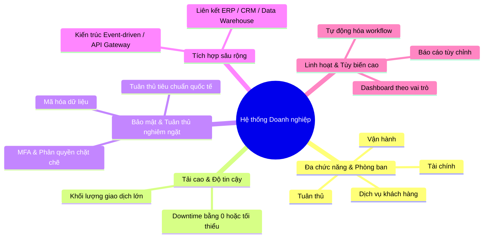

# Tóm tắt: Nhu cầu Kỹ thuật của Giải pháp Doanh nghiệp (Technical Needs of an Enterprise Solution)

Tài liệu này tóm tắt các chia sẻ từ chuyên gia về cách cân bằng giữa độ phức tạp và yêu cầu nghiệp vụ, cũng như những đặc trưng cốt lõi phân biệt một hệ thống doanh nghiệp (enterprise application) với các ứng dụng quy mô nhỏ.

---

## 1. Cân bằng giữa Độ phức tạp và Yêu cầu Nghiệp vụ
Việc thiết kế hệ thống luôn phải đối mặt với cuộc chiến chống lại sự thiết kế quá đà (over-engineering). Phương pháp tiếp cận tối ưu bao gồm:

### Nguyên lý YAGNI (You Aren't Gonna Need It)
* **Ý nghĩa:** Bạn sẽ không cần đến nó đâu. Tránh việc cố gắng xây dựng mọi kịch bản tưởng tượng trong tương lai, vì điều đó chỉ tạo ra những "quái vật công nghệ" cồng kềnh và không thể bảo trì.
* **3 câu hỏi bộ lọc để kiểm soát yêu cầu:**
  1. *Yêu cầu này đã được stakeholder xác nhận hay chúng ta đang tự phỏng đoán?* (Nếu là phỏng đoán $\rightarrow$ gác lại).
  2. *Chi phí của việc thêm tính năng này sau này so với việc xây dựng nó ngay bây giờ là bao nhiêu?* (Thông thường, phát triển gia tăng - incrementally - sẽ dễ dàng và thực tế hơn).
  3. *Giải pháp đơn giản nhất để giải quyết vấn đề thực tế hiện tại là gì?*

> [!TIP]
> **Quy tắc số 3 (Rule of Three):** Đừng vội vàng trừu tượng hóa (abstract) mã nguồn cho đến khi bạn nhìn thấy cùng một mẫu thiết kế (pattern) lặp lại ít nhất 3 lần. Điều này giúp bạn có đủ thông tin thực tế để thiết kế lớp trừu tượng chính xác.

* **Ví dụ thực tế (API Gateway):** Yêu cầu ban đầu rất đơn giản: định tuyến (routing) và xác thực (authentication). Tuy nhiên, trong quá trình thiết kế, đội ngũ liên tục thêm các kịch bản "nếu - thì" (rate limiting, hỗ trợ GraphQL...). Thay vì mất cả năm để xây dựng bản thiết kế phức tạp đó, đội ngũ đã chọn giao bản tối giản (routing + auth) chỉ trong **6 tuần**. Chức năng giới hạn tần suất (rate limiting) được thêm vào ở các vòng lặp sau dựa trên nhu cầu sử dụng thực tế.

---

## 2. Điểm khác biệt của Ứng dụng Doanh nghiệp (Enterprise Applications)
Ứng dụng doanh nghiệp không chỉ lớn hơn về mặt kích thước; chúng được thiết kế đặc thù để hỗ trợ các hoạt động tối quan trọng (mission-critical operations), đảm bảo tuân thủ pháp lý và thúc đẩy giá trị doanh nghiệp:

* **Hỗ trợ tổ chức đa chức năng:** Phục vụ đồng thời nhiều bộ phận từ tài chính, vận hành, kiểm soát tuân thủ đến chăm sóc khách hàng.
* **Độ tin cậy và Khả năng tải cao:** Vận hành ổn định dưới áp lực dữ liệu khổng lồ. Trong ngành tài chính, chỉ vài giây ngừng hoạt động (downtime) cũng có thể dẫn đến hậu quả tài chính và pháp lý nghiêm trọng.
* **Bảo mật và Tuân thủ tối đa:** Phải bảo vệ dữ liệu nhạy cảm (thông tin khách hàng, báo cáo tài chính). Đòi hỏi các giải pháp mã hóa, xác thực đa yếu tố (MFA), phân quyền dựa trên vai trò nghiêm ngặt và tuân thủ các chứng chỉ bảo mật quốc gia/quốc tế.
* **Khả năng tích hợp sâu:** Không hoạt động cô lập. Hệ thống doanh nghiệp cần kết nối mượt mà với CRM, ERP, kho dữ liệu (Data Warehouse) và các dịch vụ bên thứ ba bằng cách sử dụng các kiến trúc hiện đại như Enterprise Service Bus (ESB), API Gateway và kiến trúc hướng sự kiện (event-driven design).
* **Tính cấu hình và linh hoạt (Configurability):** Cung cấp các công cụ tùy biến (dashboard theo vai trò, tự động hóa quy trình nghiệp vụ) để thích ứng với sự thay đổi của quy trình kinh doanh mà không cần phải viết lại code.
* **Quản trị và Vận hành liên tục:** Đòi hỏi đội ngũ chuyên trách giám sát hiệu năng, thực hiện cập nhật và đảm bảo tính liên tục của hoạt động kinh doanh (business continuity).
