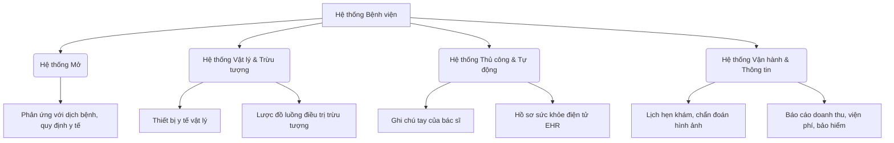

# Tóm tắt: Các loại Hệ thống (Types of Systems)

Tài liệu này tóm tắt các cách phân loại hệ thống phổ biến và ví dụ minh họa thực tế về cách kết hợp nhiều loại hệ thống trong cùng một tổ chức.

---

## 1. Phân loại các Hệ thống

Hệ thống được phân loại dựa trên đặc tính, cấu trúc, mức độ tương tác môi trường hoặc phương thức triển khai:

| Cặp phân loại | Hệ thống A | Hệ thống B | Mối quan hệ & Bài học thiết kế |
| :--- | :--- | :--- | :--- |
| **Vật lý vs. Trừu tượng** *(Physical vs. Abstract)* | **Vật lý (Physical):** Hữu hình, gồm con người, máy móc, trang thiết bị, vật liệu (ví dụ: mạng lưới giao thông, nhà máy sản xuất). | **Trừu tượng (Abstract):** Mang tính khái niệm, tồn tại dưới dạng mô hình, công thức, thuật toán (ví dụ: sơ đồ tổ chức, công thức tính lương). | Hệ thống trừu tượng thường dẫn dắt và định hình cách hoạt động của hệ thống vật lý. |
| **Mở vs. Khép kín** *(Open vs. Closed)* | **Mở (Open):** Tương tác với môi trường bên ngoài, nhận inputs, biến đổi và trả outputs ra lại môi trường (ví dụ: doanh nghiệp, trường học). | **Khép kín (Closed):** Tự chứa, cô lập hoàn toàn, không tương tác với môi trường ngoài (ví dụ: các thí nghiệm khoa học nghiêm ngặt). | Thiết kế hệ thống mở bắt buộc phải tính toán đến sự thay đổi của môi trường, các điểm tích hợp (integrations) và vòng phản hồi (feedback). |
| **Xác định vs. Xác suất** *(Deterministic vs. Probabilistic)* | **Xác định (Deterministic):** Vận hành hoàn toàn dự đoán được. Với một đầu vào cụ thể, luôn trả về cùng một đầu ra (ví dụ: máy tính bỏ túi, hàm code). | **Xác suất (Probabilistic):** Tồn tại yếu tố không chắc chắn, ngẫu nhiên hoặc chịu tác động bên ngoài khiến đầu ra có thể thay đổi (ví dụ: thời tiết, hành vi con người). | Hệ xác định dễ thiết kế và kiểm thử. Hệ xác suất yêu cầu các kỹ thuật phân tích rủi ro và lập kế hoạch linh hoạt. |
| **Thủ công vs. Tự động** *(Manual vs. Automated)* | **Thủ công (Manual):** Hoạt động dựa hoàn toàn vào sức người (ví dụ: hệ thống tủ tài liệu giấy tờ). | **Tự động (Automated):** Vận hành nhờ máy móc và phần mềm, giảm thiểu sự can thiệp của con người (ví dụ: ngân hàng trực tuyến, quét mã vạch). | Tự động hóa tăng tốc độ và giảm thiểu sai sót, nhưng chi phí thiết kế và xây dựng ban đầu cao hơn nhiều. |
| **Thông tin vs. Vận hành** *(Information vs. Operational)* | **Thông tin (Information):** Tập trung vào việc quản lý dữ liệu (lưu trữ, xử lý, phân tích, báo cáo dữ liệu như CRM, HRMS, dashboard). | **Vận hành (Operational):** Giải quyết các chức năng cốt lõi để duy trì hoạt động hàng ngày (ví dụ: dây chuyền sản xuất, xử lý đơn hàng, logistics). | Cải thiện hệ vận hành giúp giảm chi phí sản xuất; tối ưu hệ thông tin giúp đưa ra quyết định kinh doanh tốt hơn. |
| **Doanh nghiệp vs. Phòng ban** *(Enterprise vs. Departmental)* | **Doanh nghiệp (Enterprise):** Bao phủ toàn bộ tổ chức, tích hợp nhiều chức năng chéo giữa các phòng ban (ví dụ: hệ thống hoạch định tài nguyên ERP). | **Phòng ban (Departmental):** Giới hạn trong một phòng ban hay chức năng nghiệp vụ cụ thể (ví dụ: phần mềm quản lý kho, phần mềm tính lương). | Hệ doanh nghiệp cung cấp cái nhìn toàn cảnh nhưng phức tạp để xây dựng. Hệ phòng ban dễ quản lý nhưng dễ tạo ra các "ốc đảo thông tin" (silos) nếu thiếu liên kết. |
| **Thích ứng vs. Không thích ứng** *(Adaptive vs. Non-adaptive)* | **Thích ứng (Adaptive):** Có khả năng tự thay đổi, tiến hóa dựa trên phản hồi hoặc sự thay đổi của môi trường (ví dụ: AI học máy tự tối ưu). | **Không thích ứng (Non-adaptive):** Vận hành theo một quy trình cố định bất kể sự thay đổi của môi trường xung quanh. | Hệ thích ứng đem lại sự linh hoạt lâu dài nhưng đòi hỏi cấu trúc giám sát và thiết kế tinh vi hơn. |

---

## 2. Ứng dụng thực tế: Phân tích Hệ thống Bệnh viện (Hospital System)
Một tổ chức lớn như bệnh viện không bao giờ chỉ dùng một loại hệ thống duy nhất, mà là sự tổng hòa của nhiều loại hệ thống hoạt động cùng nhau:

Hiểu rõ các loại hệ thống này giúp các nhà phân tích và kiến trúc sư hệ thống dễ dàng định vị nguồn gốc của vấn đề phát sinh, biết được nơi nào cần cải tiến và lựa chọn công nghệ phù hợp.
