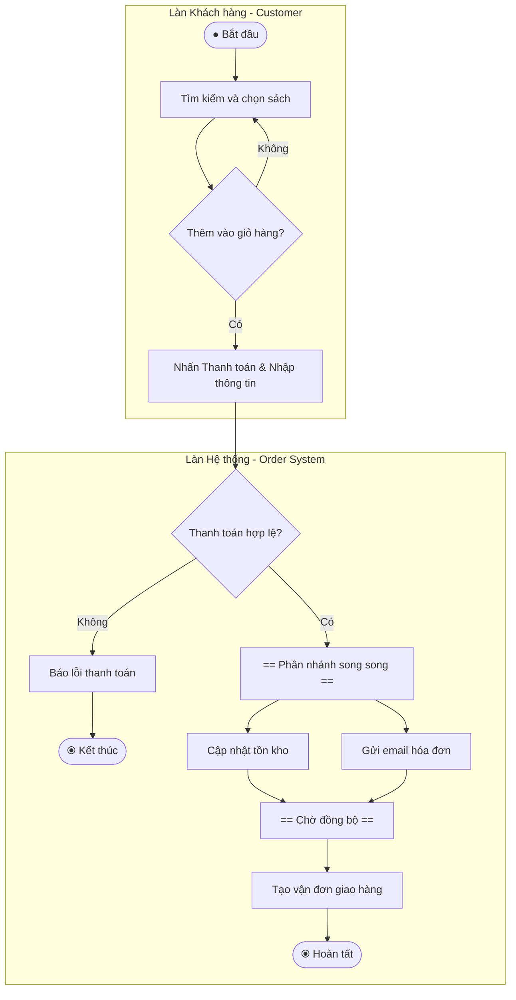
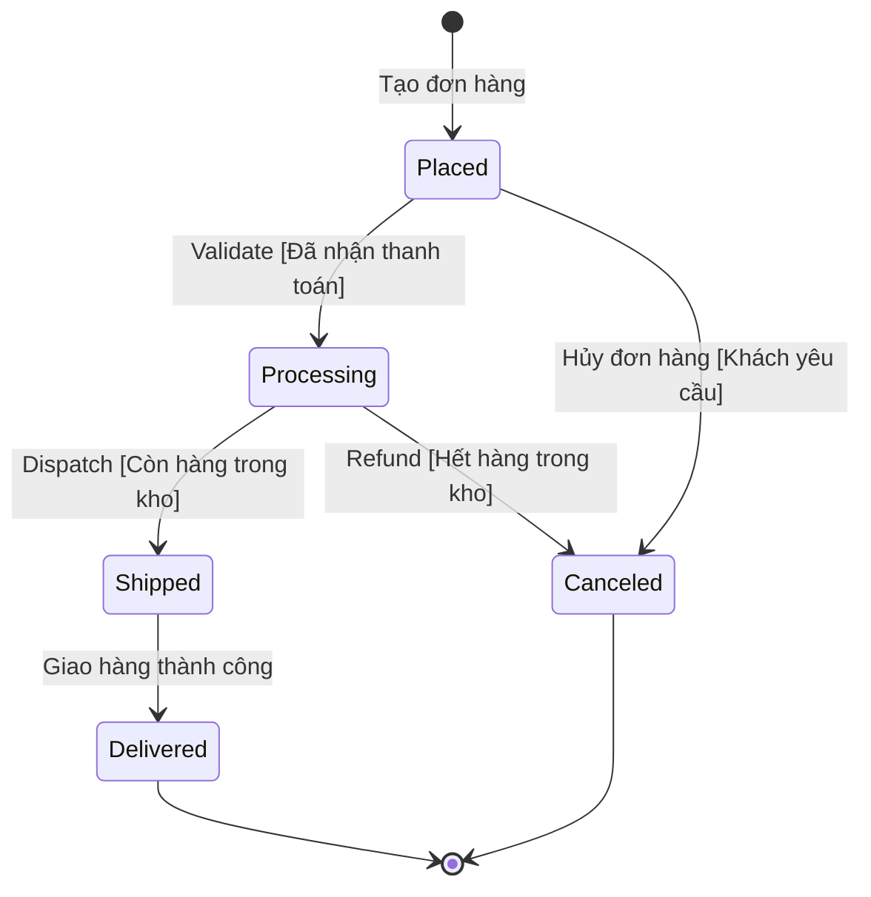

# Sơ đồ Hoạt động và Sơ đồ Trạng thái (Activity and State Diagrams)

Tài liệu này tổng hợp toàn bộ nội dung về hai loại sơ đồ hành vi động quan trọng trong UML: **Sơ đồ Hoạt động (Activity Diagram - Quy trình/Luồng công việc)** và **Sơ đồ Trạng thái (State Machine Diagram - Vòng đời của một đối tượng)**.

---

## 1. Sơ đồ Hoạt động (Activity Diagram) - Luồng Công việc & Tiến trình

Sơ đồ Hoạt động mô hình hóa các luồng hoạt động trong hệ thống, biểu diễn các quy trình nghiệp vụ, luồng công việc (workflows) hoặc kịch bản Use Case dưới dạng lưu đồ tiến trình.

### **a. Các thành phần chính của Sơ đồ Hoạt động:**
* **Nút Bắt đầu & Kết thúc (Start & End Nodes):**
  * *Bắt đầu (Initial Node):* Hình tròn đặc (`●`).
  * *Kết thúc (Final Node):* Hình tròn có viền ngoài chứa dấu chấm tròn bên trong (`⦿`).
* **Hành động / Tác vụ (Actions / Tasks):** Hình chữ nhật bo tròn góc, thể hiện một bước xử lý cụ thể (ví dụ: "Xác thực đơn hàng", "Giao hàng").
* **Chuyển tiếp (Transitions):** Mũi tên chỉ hướng luồng thực thi từ hoạt động này sang hoạt động tiếp theo.
* **Điểm quyết định / Rẽ nhánh (Decision Points):** Hình thoi (Diamond), chia luồng dựa trên điều kiện (ví dụ: "Thanh toán hợp lệ?" -> Đúng / Sai).
* **Thanh đồng bộ hóa (Forks & Joins):**
  * *Fork (Phân nhánh song song):* Thanh ngang/dọc màu đen đặc tách 1 luồng thành nhiều luồng chạy song song (ví dụ: vừa trừ kho vừa gửi email).
  * *Join (Hợp nhất luồng song song):* Hợp nhất nhiều luồng song song lại thành 1 luồng duy nhất khi tất cả tác vụ hoàn thành.
* **Phân làn trách nhiệm (Swimlanes):** Các làn phân chia theo chiều dọc/ngang để nhóm các hoạt động theo vai trò của tác nhân hoặc thành phần hệ thống (ví dụ: Khách hàng, Hệ thống thanh toán, Nhân viên kho).

---

## 2. Sơ đồ Trạng thái (State Machine Diagram) - Vòng đời Đối tượng

Sơ đồ Trạng thái tập trung vào **vòng đời của một đối tượng đơn lẻ**, biểu diễn cách đối tượng đó chuyển đổi giữa các trạng thái khác nhau khi phản hồi lại các sự kiện kích hoạt (events).

### **Các thành phần chính của Sơ đồ Trạng thái:**
* **Nút Trạng thái ban đầu & kết thúc:** Hình tròn đặc (Khởi tạo) và hình tròn có vòng đệm (Hoàn tất).
* **Trạng thái (States):** Hình chữ nhật bo tròn góc, thể hiện điều kiện hoặc tình trạng hiện tại của đối tượng (ví dụ: `Placed`, `Processing`, `Shipped`, `Canceled`).
* **Sự chuyển đổi trạng thái (Transitions):** Mũi tên nối giữa các trạng thái.
* **Sự kiện kích hoạt (Triggering Events):** Nhãn trên mũi tên chỉ ra sự kiện làm thay đổi trạng thái (ví dụ: `Validate`, `Cancel`, `Dispatch`).
* **Điều kiện bảo vệ (Guard Conditions):** Đặt trong dấu ngoặc vuông `[Condition]`, quy định điều kiện bắt buộc phải thỏa mãn để quá trình chuyển đổi trạng thái diễn ra (ví dụ: `[Còn hàng trong kho]`, `[Đã nhận tiền thanh toán]`).
* **Hành động kèm theo (Actions):** Các tác vụ được thực thi khi sự kiện xảy ra (ví dụ: `gửi_email_xác_nhận()`).

---

## 3. Quy trình Xây dựng Sơ đồ

### **Quy trình tạo Sơ đồ Hoạt động (Activity Diagram):**
1. **Xác định quy trình / Use Case:** Chọn quy trình cần mô hình hóa (ví dụ: "Quy trình xử lý đơn hàng").
2. **Liệt kê các hoạt động, quyết định & tác vụ song song:** Xác định các bước, điều kiện rẽ nhánh và các tác vụ có thể chạy đồng thời.
3. **Ánh xạ luồng tiến trình:** Nối các nút Start, End, Decision, Fork và Join.
4. **Áp dụng Swimlanes:** Phân làn trách nhiệm cho từng Actor/Hệ thống nếu cần làm rõ vai trò.
5. **Vẽ và xác thực:** Sử dụng công cụ UML (Lucidchart, draw.io) và kiểm chứng lại với các bên liên quan.

### **Quy trình tạo Sơ đồ Trạng thái (State Diagram):**
1. **Chọn đối tượng mục tiêu:** Xác định đối tượng có vòng đời phức tạp (ví dụ: Đối tượng `Order`).
2. **Xác định các trạng thái & Sự kiện kích hoạt:** Liệt kê các trạng thái có thể có và các event gây chuyển trạng thái.
3. **Thiết lập chuyển đổi, Guard Conditions & Actions:** Định rõ điều kiện trong `[...]` và hành động đi kèm.
4. **Vẽ sơ đồ:** Thể hiện rõ ràng các luồng chuyển đổi từ trạng thái đầu đến cuối.
5. **Đánh giá với đội ngũ kỹ thuật:** Xác nhận tính chính xác với logic code xử lý state.

---

## 4. Ví dụ Thực tế: Hệ thống Nhà sách Trực tuyến (Online Bookstore)

### **a. Sơ đồ Hoạt động (Activity Diagram) - Quy trình Đặt hàng với Swimlanes:**

---

### **b. Sơ đồ Trạng thái (State Machine Diagram) - Vòng đời Đơn hàng (`Order`):**

---

## 5. Lợi ích Cốt lõi
* **Rõ ràng và Dễ hiểu:** Activity Diagram đơn giản hóa quy trình kinh doanh phức tạp; State Diagram làm sáng tỏ vòng đời và các quy tắc chuyển đổi của đối tượng.
* **Tối ưu hóa Quy trình:** Activity Diagram giúp phát hiện các bước thừa thãi/nút thắt cổ chai; State Diagram phát hiện các trạng thái chuyển đổi bất hợp lý hoặc thiếu sót.
* **Xác thực Yêu cầu Sớm:** Đảm bảo luồng xử lý và quy tắc nghiệp vụ (Guard Conditions) chuẩn xác trước khi lập trình.
* **Định hướng Triển khai:** Hỗ trợ lập trình viên xây dựng kiến trúc máy trạng thái (State Pattern / State Machine) và luồng xử lý bất đồng bộ chuẩn xác.
