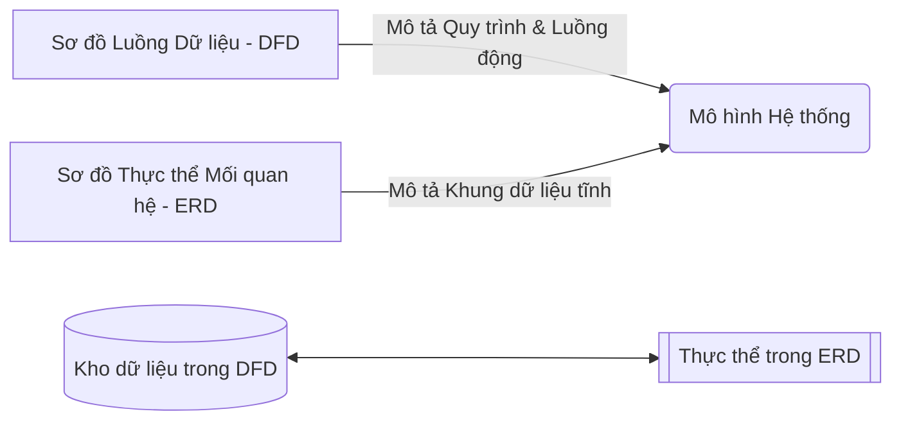

# Lựa chọn Phương pháp Mô hình hóa Hệ thống Phù hợp (DFD vs. ERD)

Tài liệu này tổng hợp nội dung đối thoại về cách lựa chọn và áp dụng các kỹ thuật mô hình hóa hệ thống để phản ánh hiệu quả các yêu cầu nghiệp vụ thông qua ví dụ thực tế **Hệ thống Thư viện Trực tuyến (Online Library System)**.

---

## 1. So sánh DFD và ERD

| Đặc điểm | Sơ đồ Luồng Dữ liệu (DFD) | Sơ đồ Mối quan hệ Thực thể (ERD) |
| :--- | :--- | :--- |
| **Trạng thái dữ liệu** | **Dữ liệu động (Data in motion)** | **Dữ liệu tĩnh (Data at rest)** |
| **Trọng tâm** | Quy trình, chức năng và luồng di chuyển, biến đổi của thông tin. | Cấu trúc dữ liệu, thực thể, thuộc tính và mối quan hệ lưu trữ. |
| **Câu hỏi chính cần trả lời** | Hệ thống thực hiện những công việc gì? Dữ liệu đi đâu và được biến đổi thế nào? | Hệ thống cần lưu trữ những thông tin gì? Chúng liên kết với nhau ra sao? |
| **Thành phần tương ứng** | Kho lưu trữ dữ liệu (Data Stores) trong DFD... | ...ánh xạ trực tiếp tới các Thực thể (Entities) trong ERD. |

---

## 2. Phân tích qua ví dụ: Hệ thống Thư viện Trực tuyến

### **a. Khía cạnh Quy trình (Áp dụng DFD)**
* **Các hoạt động động của người dùng:** Tìm kiếm sách, yêu cầu mượn/trả sách, thanh toán phí phạt quá hạn.
* **Lý do dùng DFD:** Các hoạt động này liên quan đến việc di chuyển dữ liệu (Ví dụ: thông tin thanh toán từ Độc giả truyền tới Cổng thanh toán), thay đổi trạng thái và ghi nhận vào kho lưu trữ.

### **b. Khía cạnh Cơ sở dữ liệu (Áp dụng ERD)**
* **Các thực thể cần quản lý:** Sách (Book), Độc giả (Patron), Giao dịch mượn trả (Transaction), Tiền phạt (Fine).
* **Mối quan hệ & Bản số (Cardinality):**
  * Mối quan hệ giữa **Độc giả (Patron)** và **Sách (Book)** về mặt khái niệm là **Nhiều-Nhiều (M:N)** vì một độc giả có thể mượn nhiều sách và một cuốn sách có thể được mượn bởi nhiều độc giả theo thời gian.

---

## 3. Sự bổ trợ lẫn nhau của DFD và ERD

DFD và ERD là hai góc nhìn bổ khuyết cho nhau để xây dựng một thiết kế hệ thống hoàn chỉnh:

---

## 4. Vai trò trong Giao tiếp và Quản trị Dự án
Việc sử dụng các mô hình trực quan như DFD và ERD mang lại lợi ích to lớn cho giao tiếp giữa các bên liên quan (Stakeholders):
* **Ngôn ngữ chung:** Làm cầu nối xóa bỏ rào cản giao tiếp giữa nhóm nghiệp vụ (Business) và nhóm kỹ thuật (Developers, DBA).
* **Đơn giản hóa:** Giúp làm trực quan các cấu trúc và luồng xử lý phức tạp dưới dạng sơ đồ logic dễ hiểu.
* **Phát hiện lỗi sớm:** Giúp phát hiện sớm các điểm mâu thuẫn hoặc thiếu sót trong yêu cầu nghiệp vụ trước khi tiến hành code, giảm thiểu rủi ro làm sai lệch thiết kế ban đầu.
