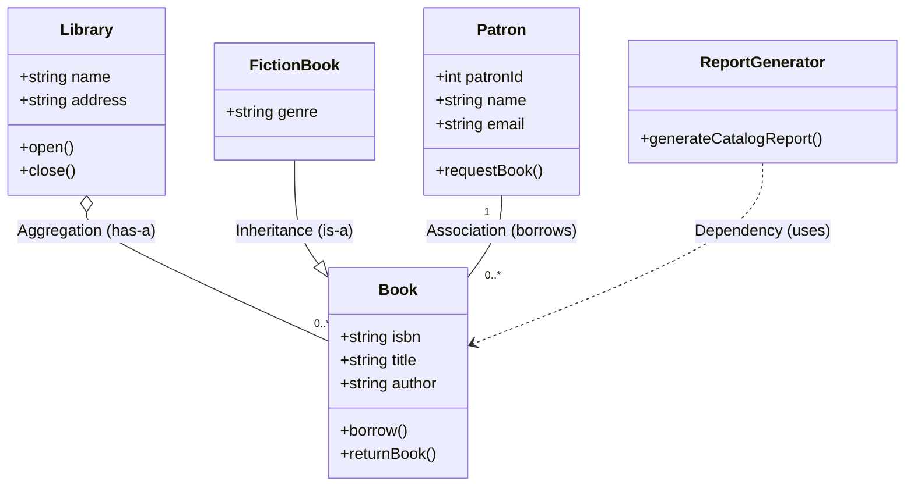
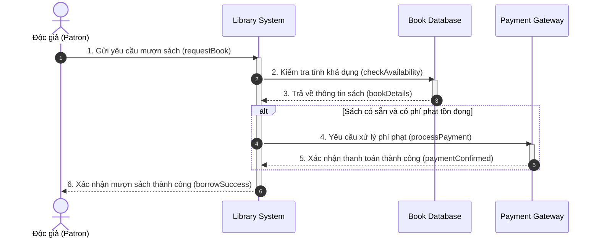

# Sơ đồ Lớp và Sơ đồ Tuần tự (Class and Sequence Diagrams)

Tài liệu này tổng hợp toàn bộ nội dung về hai loại sơ đồ cốt lõi trong UML: **Sơ đồ Lớp (Class Diagram - Kiến trúc tĩnh)** và **Sơ đồ Tuần tự (Sequence Diagram - Hành vi động)**.

---

## 1. Sơ đồ Lớp (Class Diagram) - Góc nhìn Tĩnh

Sơ đồ Lớp mô tả kiến trúc tĩnh của hệ thống, tập trung vào các lớp, thuộc tính, phương thức và mối quan hệ giữa chúng.

### **a. Cấu trúc một Lớp (Class)**
Một hình chữ nhật chia làm 3 phần:
1. **Tên lớp (Class Name):** Định danh lớp (ví dụ: `Book`, `Patron`).
2. **Thuộc tính (Attributes / Properties):** Dữ liệu của đối tượng (ví dụ: `isbn`, `title`, `author`).
3. **Phương thức (Operations / Methods):** Hành vi hoặc hàm xử lý (ví dụ: `borrow()`, `returnBook()`).

### **b. Các Mối quan hệ trong Sơ đồ Lớp:**
* **Association (Liên kết):** Đường nét liền biểu thị kết nối trực tiếp (ví dụ: `Patron` mượn `Book`).
* **Aggregation (Thu nạp - "Has-a"):** Hình thoi rỗng. Quan hệ sở hữu lỏng lẻo, đối tượng con vẫn tồn tại nếu đối tượng cha bị hủy (ví dụ: Thư viện chứa các cuốn sách).
* **Composition (Hợp thành - "Owns-a"):** Hình thoi đặc. Quan hệ sở hữu chặt chẽ, đối tượng con bị hủy nếu đối tượng cha bị hủy (ví dụ: Các bản sao sách gắn liền với bản ghi sách).
* **Inheritance (Kế thừa / Generalization - "Is-a"):** Mũi tên có đầu tam giác rỗng (ví dụ: `FictionBook` kế thừa từ `Book`).
* **Dependency (Phụ thuộc):** Đường nét đứt có mũi tên, chỉ ra một lớp tạm thời sử dụng một lớp khác (ví dụ: `ReportGenerator` phụ thuộc vào `Book`).
* **Multiplicity (Bản số):** Chỉ định số lượng thể hiện liên kết (ví dụ: `1`, `0..*`, `1..*`).

---

## 2. Sơ đồ Tuần tự (Sequence Diagram) - Góc nhìn Động

Sơ đồ Tuần tự mô hình hóa hành vi động của hệ thống, thể hiện cách các đối tượng tương tác theo trình tự thời gian (trục ngang là các đối tượng, trục dọc biểu diễn thời gian trôi từ trên xuống dưới).

### **Các thành phần chính:**
* **Đường sinh mệnh (Lifeline):** Đường thẳng đứng nét đứt dưới mỗi đối tượng, biểu diễn sự tồn tại của đối tượng qua thời gian.
* **Thanh kích hoạt (Activation Bar):** Hình chữ nhật hẹp trên đường sinh mệnh, biểu thị khoảng thời gian đối tượng đang thực hiện tác vụ.
* **Các loại thông điệp (Messages):**
  * **Đồng bộ (Synchronous Message):** Mũi tên nét liền đầu đặc (`->>`), người gửi chờ phản hồi trước khi tiếp tục.
  * **Bất đồng bộ (Asynchronous Message):** Mũi tên nét liền đầu hở (`-)`), người gửi tiếp tục công việc mà không cần chờ.
  * **Phản hồi (Return Message):** Mũi tên nét đứt (`-->>`), trả về dữ liệu hoặc quyền điều khiển.
* **Khung tương tác (Fragments):** Các khối điều kiện hoặc lặp lại (ví dụ: `alt` / `opt` cho rẽ nhánh điều kiện, `loop` cho vòng lặp).

---

## 3. Quy trình Xây dựng Sơ đồ

### **Quy trình tạo Sơ đồ Lớp (Class Diagram):**
1. **Xác định các lớp:** Dựa trên các thực thể nghiệp vụ của hệ thống (ví dụ: `Book`, `Patron`).
2. **Định nghĩa thuộc tính và phương thức:** Gán chi tiết các trường dữ liệu và hàm cho từng lớp.
3. **Thiết lập mối quan hệ & Bản số:** Xác định Association, Aggregation, Composition, Inheritance và Multiplicity.
4. **Vẽ sơ đồ:** Sử dụng công cụ UML (Lucidchart, draw.io, Enterprise Architect).
5. **Xác thực:** Đánh giá lại với các bên liên quan để đảm bảo khớp yêu cầu.

### **Quy trình tạo Sơ đồ Tuần tự (Sequence Diagram):**
1. **Xác định Use Case / Kịch bản:** Chọn kịch bản cần biểu diễn (ví dụ: "Mượn sách").
2. **Liệt kê các đối tượng & Đường sinh mệnh:** Xác định các Actor và Object tham gia luồng.
3. **Ánh xạ chuỗi thông điệp:** Xác định thứ tự gọi hàm, thông điệp đồng bộ/bất đồng bộ và dữ liệu trả về.
4. **Vẽ sơ đồ:** Thể hiện luồng tương tác với trục thời gian từ trên xuống.
5. **Đánh giá với đội ngũ kỹ thuật:** Kiểm tra tính khả thi khi triển khai code/API.

---

## 4. Ví dụ Thực tế: Hệ thống Thư viện (Online Library System)

### **a. Sơ đồ Lớp (Class Diagram):**

---

### **b. Sơ đồ Tuần tự (Sequence Diagram) - Kịch bản Mượn sách:**

---

## 5. Lợi ích Cốt lõi
* **Độ chính xác và rõ ràng:** Class Diagram cung cấp bản thiết kế cấu trúc tĩnh; Sequence Diagram làm rõ thứ tự tương tác động.
* **Kiểm chứng yêu cầu sớm:** Phát hiện các liên kết thiếu hoặc luồng thông điệp bất hợp lý trước khi viết code.
* **Tính Module và Khả năng mở rộng:** Định hình kiến trúc hướng đối tượng (OOP) tái sử dụng tốt.
* **Tài liệu bàn giao chuẩn:** Hỗ trợ bảo trì và đào tạo thành viên mới hiệu quả.
